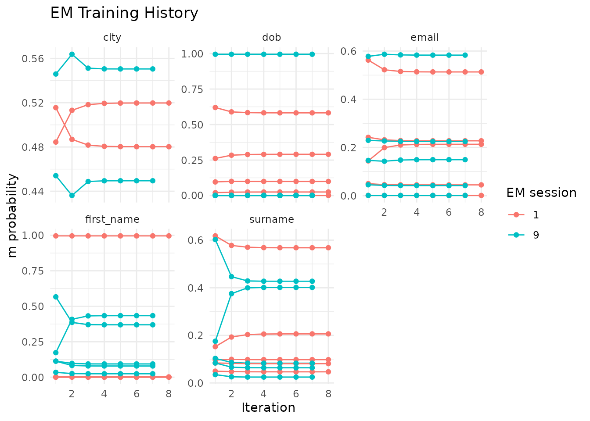
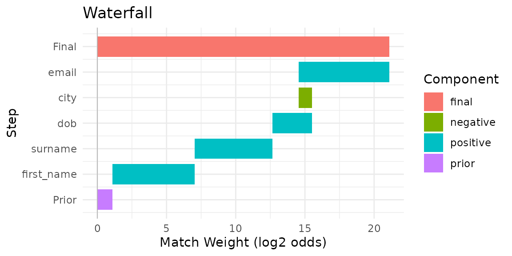

# Advanced Workflows

This vignette covers advanced `irelink` features for users who have
completed the Getting Started or Deduplication vignettes. All examples
use `fake_1000` and a shared in-memory DuckDB connection.

## Setup

Train a complete model on `fake_1000` that will be reused across
sections.

``` r
library(irelink)
#> 
#> Attaching package: 'irelink'
#> The following object is masked from 'package:base':
#> 
#>     months
library(ggplot2)

df <- fake_1000
con <- DBI::dbConnect(duckdb::duckdb())

spec <- il_spec() |>
  il_compare(first_name, cl_name()) |>
  il_compare(surname, cl_name()) |>
  il_compare(dob, cl_dob()) |>
  il_compare(city, cl_exact(term_frequency = TRUE)) |>
  il_compare(email, cl_email()) |>
  il_block_on(first_name) |>
  il_block_on(surname) |>
  il_block_on(city)

model <- il_model(df, spec = spec, con = con)
model <- il_estimate_prior(
  model,
  block_on(first_name, surname),
  block_on(email),
  recall = 0.6
)
model <- il_estimate_u(model, max_pairs = 1e5)
model <- il_estimate_em(model, block_on(first_name))
model <- il_estimate_em(model, block_on(dob))

pairs <- predict(model, threshold = 0.5)
clusters <- il_cluster(pairs, threshold = 0.85)
```

## Training diagnostics

[`il_training_history()`](http://christophertkenny.com/irelink/reference/il_training_history.md)
returns the m and u parameter estimates at each EM iteration across all
training sessions. Plot it to check whether parameters have converged:

``` r
hist <- il_training_history(model)
autoplot(hist)
```



A well-converged model shows stable values in the final iterations. If
estimates are still drifting, add more EM passes with different blocking
rules or expand the set of candidate pairs.

## Pair inspection

[`il_compare_records()`](http://christophertkenny.com/irelink/reference/il_compare_records.md)
scores a single pair of records against the spec without requiring a
full prediction pass. Use it to diagnose why a known match scores too
low or a non-match scores too high.

``` r
rec_a <- fake_1000[1, ]
rec_b <- fake_1000[5, ]

il_compare_records(rec_a, rec_b, spec = model$spec, con = con)
#> # A tibble: 1 × 5
#>   gamma_first_name gamma_surname gamma_dob gamma_city gamma_email
#>              <int>         <int>     <int>      <int>       <int>
#> 1                0             0         1          0           0
```

The gamma columns show the comparison level reached on each field.
Cross-reference these with `il_weights(model)` to read off the
match-weight contribution of each level.

For a visual breakdown of how per-field gamma values sum to an overall
match decision, draw a waterfall chart for any pair in the scored set:

``` r
autoplot(pairs, which = 1)
```



## Lazy prediction for large data

`predict(collect = FALSE)` keeps scored pairs in the database rather
than collecting them into R.
[`il_cluster()`](http://christophertkenny.com/irelink/reference/il_cluster.md)
detects the lazy reference and runs connected-components analysis
entirely in SQL, avoiding a costly round-trip for datasets where
materialising millions of rows would exhaust memory.

``` r
pairs_lazy <- predict(model, threshold = 0.5, collect = FALSE)
pairs_lazy
#> <il_compared_lazy> 1,903 pairs in table __il_predicted (threshold = 0.5)
```

Pass the lazy reference directly to
[`il_cluster()`](http://christophertkenny.com/irelink/reference/il_cluster.md):

``` r
clusters_lazy <- il_cluster(pairs_lazy, threshold = 0.85)
nrow(clusters_lazy)
#> [1] 892
```

[`autoplot()`](https://ggplot2.tidyverse.org/reference/autoplot.html)
and
[`il_waterfall()`](http://christophertkenny.com/irelink/reference/il_waterfall.md)
collect automatically when needed, so downstream analysis code is
unchanged. Use the lazy path any time candidate-pair counts exceed
available memory.

## Cluster diagnostics

[`il_graph_metrics()`](http://christophertkenny.com/irelink/reference/il_graph_metrics.md)
computes node-, edge-, and cluster-level summaries from the linkage
graph. Use it to spot over-generous thresholds (clusters that are too
large) or sparse connectivity (clusters with unexpectedly low density).

``` r
metrics <- il_graph_metrics(pairs, clusters)
```

The cluster table reports size and internal edge density (edges /
maximum possible edges for a cluster of that size):

``` r
metrics$clusters
#> # A tibble: 203 × 5
#>    cluster_id  n_nodes n_edges density cluster_centralisation
#>    <chr>         <int>   <int>   <dbl>                  <dbl>
#>  1 cluster_10        7      12   0.571                 0.367 
#>  2 cluster_142       7      13   0.619                 0.533 
#>  3 cluster_15        5       8   0.8                   0.333 
#>  4 cluster_252       8      28   0.982                 0.214 
#>  5 cluster_38        5      10   1                     0     
#>  6 cluster_409       4       6   1                     0     
#>  7 cluster_517       9      36   0.986                 0.179 
#>  8 cluster_550       8      25   0.893                 0.143 
#>  9 cluster_581       8      26   0.929                 0.0952
#> 10 cluster_684       2       1   1                    NA     
#> # ℹ 193 more rows
```

A high maximum cluster size combined with low density often indicates
that a transitive link is pulling unrelated entities together. Consider
raising the threshold in
[`predict()`](https://rdrr.io/r/stats/predict.html) or
[`il_cluster()`](http://christophertkenny.com/irelink/reference/il_cluster.md)
and re-checking the metrics.

The node table shows how many links each record participates in
(degree):

``` r
head(metrics$nodes)
#> # A tibble: 6 × 4
#>   unique_id cluster_id  degree node_centrality
#>   <chr>     <chr>        <int>           <dbl>
#> 1 164       cluster_164      7           1    
#> 2 168       cluster_164      7           1    
#> 3 165       cluster_164      7           1    
#> 4 166       cluster_164      6           0.857
#> 5 171       cluster_164      6           0.857
#> 6 167       cluster_164      7           1
```

Records with unusually high degree relative to their cluster size may be
acting as hubs that inflate the cluster beyond its true membership.

## Phonetic blocking

Standard equality blocking misses pairs where names are spelled
differently but sound alike — for example, “Smith” / “Smyth” or “Jon” /
“John”. Pass `.transform = il_soundex` to
[`il_block_on()`](http://christophertkenny.com/irelink/reference/il_block_on.md)
or
[`block_on()`](http://christophertkenny.com/irelink/reference/block_on.md)
to group names by phonetic code instead of exact spelling.

``` r
spec_phon <- il_spec() |>
  il_compare(first_name, cl_name()) |>
  il_compare(surname, cl_name()) |>
  il_compare(dob, cl_dob()) |>
  il_block_on(first_name, .transform = il_soundex) |>
  il_block_on(surname, .transform = il_soundex)
```

Use the same `.transform` argument when specifying the blocking rule for
an EM training pass:

``` r
model_phon <- il_model(df, spec = spec_phon, con = con)
model_phon <- il_estimate_u(model_phon, max_pairs = 1e5)
model_phon <- il_estimate_em(
  model_phon,
  block_on(first_name, .transform = il_soundex)
)
```

Phonetic blocking increases recall at the cost of more candidate pairs.
Use
[`il_count_pairs()`](http://christophertkenny.com/irelink/reference/il_count_pairs.md)
to check the volume trade-off before committing to a spec.

## Column transforms

The `transform` argument in
[`il_compare()`](http://christophertkenny.com/irelink/reference/il_compare.md)
applies a function to both values before scoring. Use it to normalise
case or strip whitespace before a similarity comparison:

``` r
spec_tr <- il_spec() |>
  il_compare(first_name, cl_jaro_winkler(0.9, 0.7), transform = tolower) |>
  il_compare(surname, cl_jaro_winkler(0.9, 0.7), transform = tolower) |>
  il_compare(dob, cl_exact()) |>
  il_block_on(first_name) |>
  il_block_on(surname)

model_tr <- il_model(df, spec = spec_tr, con = con)
model_tr <- il_estimate_u(model_tr, max_pairs = 1e5)
model_tr <- il_estimate_em(model_tr, block_on(surname))
```

`tolower`, `toupper`, and `trimws` are translated to SQL on DuckDB and
PostgreSQL, so the transform runs in-database at full speed. Custom R
functions work on the R-side path only. When saving a model with
[`il_save()`](http://christophertkenny.com/irelink/reference/il_save.md),
transforms are stored by name and restored on
[`il_load()`](http://christophertkenny.com/irelink/reference/il_load.md);
anonymous functions produce a warning on save.

## Incremental matching

[`il_find_matches()`](http://christophertkenny.com/irelink/reference/il_find_matches.md)
scores new records against the data already loaded into a trained model
without retraining. It applies the same blocking rules and comparison
spec:

``` r
new_df <- data.frame(
  first_name = c('Jhon', 'Alice'),
  surname    = c('Smith', 'Jones'),
  dob        = c('1990-01-15', '1985-06-20'),
  city       = c('London', 'Manchester'),
  email      = c(NA, 'ajones@example.com')
)

matches <- il_find_matches(model, new_df, threshold = 0.5)
matches
#> # A tibble: 0 × 4
#> # ℹ 4 variables: unique_id_l <chr>, unique_id_r <chr>, match_weight <dbl>,
#> #   match_probability <dbl>
```

Each row is a (new record, existing record) pair. `unique_id_l`
identifies the new record (auto-assigned starting from 1) and
`unique_id_r` identifies the matched record in the original dataset.

This pairs naturally with
[`il_load()`](http://christophertkenny.com/irelink/reference/il_load.md)
and
[`il_attach()`](http://christophertkenny.com/irelink/reference/il_attach.md):
load a saved model, attach it to the current database, and call
[`il_find_matches()`](http://christophertkenny.com/irelink/reference/il_find_matches.md)
for each incoming batch of new records.

## Cleanup

``` r
il_cleanup(model)
il_cleanup(model_phon)
il_cleanup(model_tr)
DBI::dbDisconnect(con, shutdown = TRUE)
```
