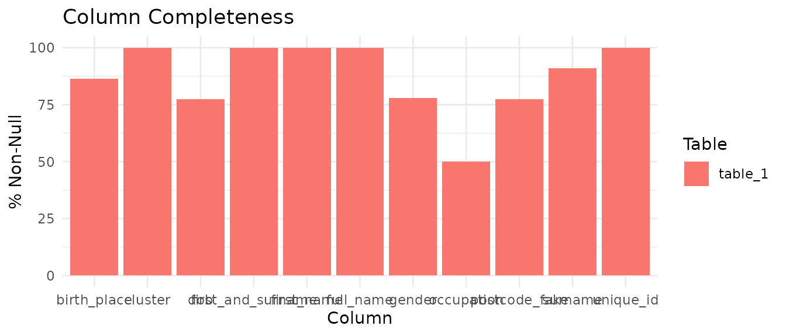
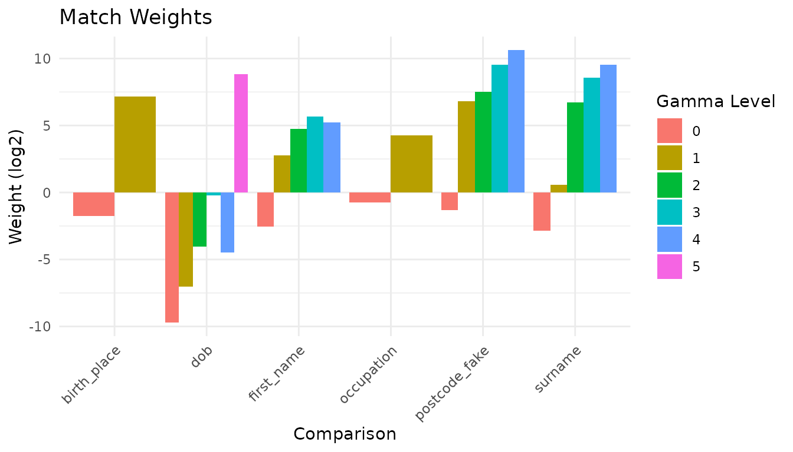
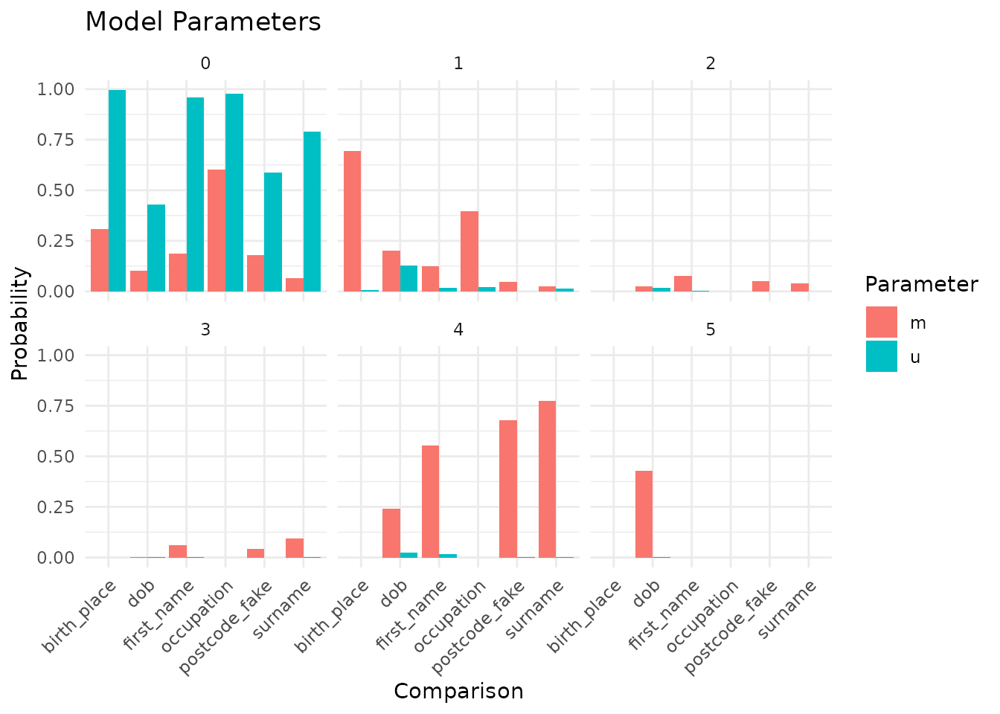
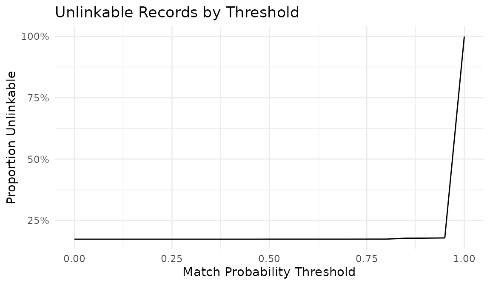
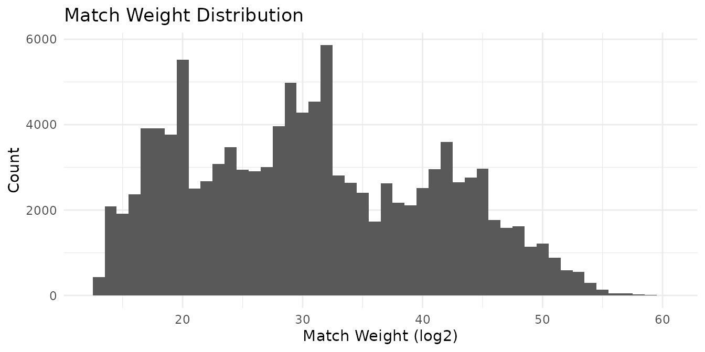
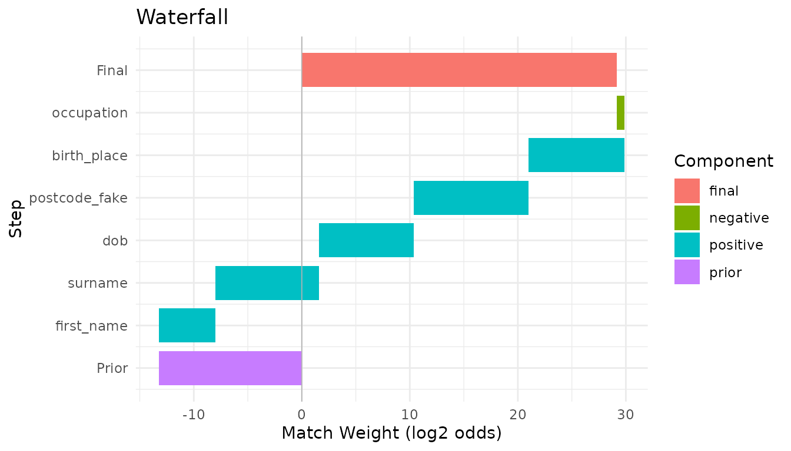
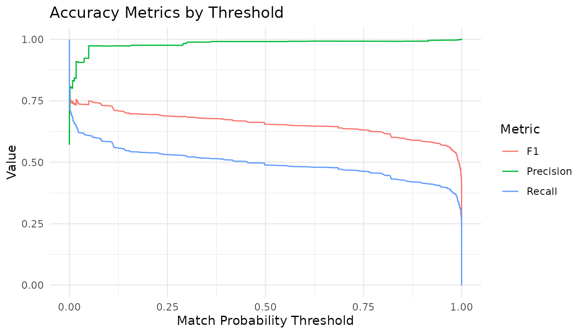
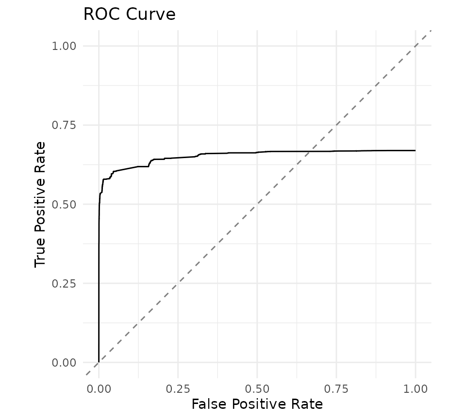
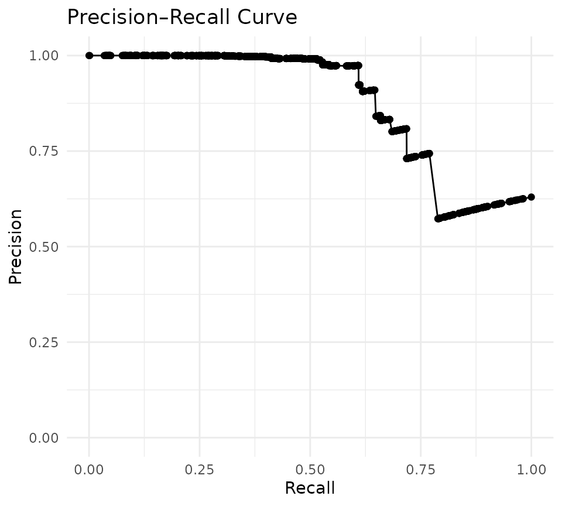

# Deduplicating 50k Synthetic Records

This vignette replicates the [Splink “Deduplicate 50k synthetic”
demo](https://moj-analytical-services.github.io/splink/demos/examples/duckdb/deduplicate_50k_synthetic.html)
using `irelink`. The data is based on historical persons scraped from
Wikidata, with duplicate records introduced alongside a variety of
realistic errors (typos, missing values, swapped fields). The `cluster`
column provides ground-truth entity labels for evaluation.

This vignette requires the
[nanoparquet](https://cran.r-project.org/package=nanoparquet) package to
read the remote Parquet file and will only compile when the package and
data URL are both available.

## Load the data

``` r
library(irelink)
#> 
#> Attaching package: 'irelink'
#> The following object is masked from 'package:base':
#> 
#>     months
library(ggplot2)

df
#> # A data frame: 50,578 × 11
#>    unique_id   cluster  full_name     first_and_surname first_name surname dob  
#>    <chr>       <chr>    <chr>         <chr>             <chr>      <chr>   <chr>
#>  1 Q2296770-1  Q2296770 thomas cliff… thomas chudleigh  thomas     chudle… 1630…
#>  2 Q2296770-2  Q2296770 thomas of ch… thomas chudleigh  thomas     chudle… 1630…
#>  3 Q2296770-3  Q2296770 tom 1st baro… tom chudleigh     tom        chudle… 1630…
#>  4 Q2296770-4  Q2296770 thomas 1st c… thomas chudleigh  thomas     chudle… 1630…
#>  5 Q2296770-5  Q2296770 thomas cliff… thomas chudleigh  thomas     chudle… 1630…
#>  6 Q2296770-6  Q2296770 thomas cliff… thomas chudleigh  thomas     chudle… 1630…
#>  7 Q2296770-7  Q2296770 tom baron ch… tom chudleigh     tom        chudle… 1630…
#>  8 Q2296770-8  Q2296770 tom clifford… tom chudleigh     tom        chudle… NA   
#>  9 Q2296770-9  Q2296770 thomas cliff… thomas chudleigh  thomas     chudle… 1630…
#> 10 Q2296770-10 Q2296770 thomas cliff… thomas chudleigh  thomas     chudle… NA   
#> # ℹ 50,568 more rows
#> # ℹ 4 more variables: birth_place <chr>, postcode_fake <chr>, gender <chr>,
#> #   occupation <chr>
```

## Profile the data

Profile completeness and value distributions to inform blocking and
comparison choices:

``` r
con <- DBI::dbConnect(duckdb::duckdb())
```

``` r
df |>
  il_completeness(con = con) |>
  autoplot()
```



``` r
il_profile(df, first_name, surname, dob, birth_place, con = con, top_n = 8)
#> # A tibble: 32 × 3
#>    column     value       n
#>    <chr>      <chr>   <dbl>
#>  1 first_name william  2780
#>  2 first_name john     2736
#>  3 first_name thomas   1448
#>  4 first_name george   1415
#>  5 first_name henry    1306
#>  6 first_name james    1265
#>  7 first_name sir      1262
#>  8 first_name charles  1216
#>  9 surname    NA       4515
#> 10 surname    baronet   615
#> # ℹ 22 more rows
```

## Choose blocking rules

``` r
il_suggest_blocking(df, con = con)
#> # A tibble: 10 × 6
#>    rule              n_distinct coverage   n_pairs pct_of_cartesian score
#>    <chr>                  <int>    <dbl>     <int>            <dbl> <dbl>
#>  1 cluster                 5156    1        303961           0.0238 1.000
#>  2 full_name              25573    0.999     87973           0.0069 0.999
#>  3 first_and_surname      20479    0.999    262393           0.0205 0.998
#>  4 first_name              4413    0.999  16372982           1.28   0.986
#>  5 surname                 6195    0.911    733085           0.0573 0.910
#>  6 birth_place             2373    0.863   4923790           0.385  0.860
#>  7 postcode_fake          12363    0.774    112172           0.0088 0.774
#>  8 dob                     8985    0.774   1549081           0.121  0.774
#>  9 occupation               453    0.5    12573944           0.983  0.495
#> 10 gender                     7    0.778 561648436          43.9    0.436
```

The `cumulative_pairs` column shows the total unique pairs across all
rules so far:

``` r
il_count_pairs(
  df,
  block_on(surname, dob),
  block_on(first_name, dob),
  block_on(first_name, surname),
  block_on(dob, birth_place),
  con = con
)
#> # A tibble: 4 × 4
#>   rule                 n_pairs cumulative_pairs pct_of_cartesian
#>   <chr>                  <dbl>            <dbl>            <dbl>
#> 1 surname & dob          62893            62893           0.0049
#> 2 first_name & dob       67757            92798           0.0073
#> 3 first_name & surname  243656           298602           0.0233
#> 4 dob & birth_place      66657           314273           0.0246
```

## Define the specification

Term-frequency adjustment is applied to `birth_place` and `occupation`
so common values (e.g., “London”) receive less weight than rare ones:

``` r
spec <- il_spec() |>
  il_compare(first_name, cl_name()) |>
  il_compare(surname, cl_name()) |>
  il_compare(dob, cl_dob()) |>
  il_compare(postcode_fake, cl_postcode()) |>
  il_compare(birth_place, cl_exact(term_frequency = TRUE)) |>
  il_compare(occupation, cl_exact(term_frequency = TRUE)) |>
  il_block_on(surname, dob) |>
  il_block_on(first_name, dob) |>
  il_block_on(first_name, surname) |>
  il_block_on(dob, birth_place)

spec
#> Linkage Specification
#>   Comparisons (6):
#>     first_name : levels
#>     surname : levels
#>     dob : levels
#>     postcode_fake : levels
#>     birth_place : exact
#>     occupation : exact
#>   Blocking rules (4, OR-ed):
#>     1. surname, dob
#>     2. first_name, dob
#>     3. first_name, surname
#>     4. dob, birth_place
```

## Train the model

``` r
model <- df |>
  il_model(spec = spec, con = con) |>
  il_estimate_prior(
    block_on(first_name, surname, dob),
    block_on(dob, postcode_fake),
    recall = 0.6
  ) |>
  il_estimate_u(max_pairs = 5e6) |>
  il_estimate_em(block_on(first_name, surname)) |>
  il_estimate_em(block_on(dob))
```

## Inspect the trained model

``` r
summary(model)
#> irelink Model
#>   Status: Trained
#>   Link type: dedupe
#>   Records: 50578
#>   Comparisons: 6
#>   Blocking rules: 4
#> 
#>   Parameters:
#>     prior: 0.0001053953
#>     comparisons: # A tibble: 25 × 4
#>      comparisons:    comparison gamma_level      m        u
#>      comparisons:    <chr>            <int>  <dbl>    <dbl>
#>      comparisons:  1 first_name           0 0.164  0.963   
#>      comparisons:  2 first_name           1 0.123  0.0179  
#>      comparisons:  3 first_name           2 0.0778 0.00287 
#>      comparisons:  4 first_name           3 0.0633 0.00126 
#>      comparisons:  5 first_name           4 0.571  0.0151  
#>      comparisons:  6 surname              0 0.137  0.985   
#>      comparisons:  7 surname              1 0.0200 0.0135  
#>      comparisons:  8 surname              2 0.0363 0.000346
#>      comparisons:  9 surname              3 0.0870 0.000230
#>      comparisons: 10 surname              4 0.719  0.000963
#>      comparisons: # ℹ 15 more rows
#>     history: 1                  , 1                  , 1                  , 1                  , 1                  , 1                  , 1                  , 1                  , 1                  , 1                  , 1                  , 1                  , 1                  , 1                  , 1                  , 1                  , 1                  , 1                  , 1                  , 1                  , 1                  , 1                  , 1                  , 1                  , 1                  , 1                  , 1                  , 1                  , 1                  , 1                  , 1                  , 1                  , 1                  , 1                  , 1                  , 1                  , 1                  , 1                  , 1                  , 1                  , 1                  , 1                  , 1                  , 1                  , 1                  , 1                  , 1                  , 1                  , 1                  , 1                  , first_name         , first_name         , first_name         , first_name         , first_name         , surname            , surname            , surname            , surname            , surname            , dob                , dob                , dob                , dob                , dob                , dob                , postcode_fake      , postcode_fake      , postcode_fake      , postcode_fake      , postcode_fake      , birth_place        , birth_place        , occupation         , occupation         , 0                  , 1                  , 2                  , 3                  , 4                  , 0                  , 1                  , 2                  , 3                  , 4                  , 0                  , 1                  , 2                  , 3                  , 4                  , 5                  , 0                  , 1                  , 2                  , 3                  , 4                  , 0                  , 1                  , 0                  , 1                  , 0.00099602163119068, 0.00099602163119068, 0.00099602163119068, 0.00099602163119068, 0.996015913475237  , 0.00099602163119068, 0.00099602163119068, 0.00099602163119068, 0.00099602163119068, 0.996015913475237  , 0.209265393661945  , 0.0181325839350556 , 0.00990817931331258, 0.00262866776117083, 0.241050283057609  , 0.519014892270908  , 0.296199736634881  , 0.0296061476602415 , 0.0423733536049908 , 0.0349334858881163 , 0.59688727621177   , 0.238731721577608  , 0.761268278422392  , 0.51683034573584   , 0.48316965426416   
#>      history: 1                   , 1                   , 1                   , 1                   , 1                   , 1                   , 1                   , 1                   , 1                   , 1                   , 1                   , 1                   , 1                   , 1                   , 1                   , 1                   , 1                   , 1                   , 1                   , 1                   , 1                   , 1                   , 1                   , 1                   , 1                   , 2                   , 2                   , 2                   , 2                   , 2                   , 2                   , 2                   , 2                   , 2                   , 2                   , 2                   , 2                   , 2                   , 2                   , 2                   , 2                   , 2                   , 2                   , 2                   , 2                   , 2                   , 2                   , 2                   , 2                   , 2                   , first_name          , first_name          , first_name          , first_name          , first_name          , surname             , surname             , surname             , surname             , surname             , dob                 , dob                 , dob                 , dob                 , dob                 , dob                 , postcode_fake       , postcode_fake       , postcode_fake       , postcode_fake       , postcode_fake       , birth_place         , birth_place         , occupation          , occupation          , 0                   , 1                   , 2                   , 3                   , 4                   , 0                   , 1                   , 2                   , 3                   , 4                   , 0                   , 1                   , 2                   , 3                   , 4                   , 5                   , 0                   , 1                   , 2                   , 3                   , 4                   , 0                   , 1                   , 0                   , 1                   , 0.000996019653102231, 0.000996019653102231, 0.000996019653102231, 0.000996019653102231, 0.996015921387591   , 0.000996019653102231, 0.000996019653102231, 0.000996019653102231, 0.000996019653102231, 0.996015921387591   , 0.35216154851247    , 0.07549730318609    , 0.0164644428937731  , 0.00268262918708981 , 0.199049836604305   , 0.354144239616272   , 0.528725038175835   , 0.0217373102550578  , 0.0310619739739517  , 0.0243391593563954  , 0.39413651823876    , 0.429238823924225   , 0.570761176075775   , 0.53843234877783    , 0.46156765122217    
#>      history: 1                   , 1                   , 1                   , 1                   , 1                   , 1                   , 1                   , 1                   , 1                   , 1                   , 1                   , 1                   , 1                   , 1                   , 1                   , 1                   , 1                   , 1                   , 1                   , 1                   , 1                   , 1                   , 1                   , 1                   , 1                   , 3                   , 3                   , 3                   , 3                   , 3                   , 3                   , 3                   , 3                   , 3                   , 3                   , 3                   , 3                   , 3                   , 3                   , 3                   , 3                   , 3                   , 3                   , 3                   , 3                   , 3                   , 3                   , 3                   , 3                   , 3                   , first_name          , first_name          , first_name          , first_name          , first_name          , surname             , surname             , surname             , surname             , surname             , dob                 , dob                 , dob                 , dob                 , dob                 , dob                 , postcode_fake       , postcode_fake       , postcode_fake       , postcode_fake       , postcode_fake       , birth_place         , birth_place         , occupation          , occupation          , 0                   , 1                   , 2                   , 3                   , 4                   , 0                   , 1                   , 2                   , 3                   , 4                   , 0                   , 1                   , 2                   , 3                   , 4                   , 5                   , 0                   , 1                   , 2                   , 3                   , 4                   , 0                   , 1                   , 0                   , 1                   , 0.000996018658828619, 0.000996018658828619, 0.000996018658828619, 0.000996018658828619, 0.996015925364686   , 0.000996018658828619, 0.000996018658828619, 0.000996018658828619, 0.000996018658828619, 0.996015925364686   , 0.426236047605293   , 0.141010666319439   , 0.0214637174345618  , 0.00254102867025416 , 0.149176568267593   , 0.25957197170286    , 0.654671721621641   , 0.0159824318615602  , 0.022786832117542   , 0.0178342222273131  , 0.288724792171943   , 0.581259281223782   , 0.418740718776218   , 0.621576734225421   , 0.378423265774579   
#>      history: 1                   , 1                   , 1                   , 1                   , 1                   , 1                   , 1                   , 1                   , 1                   , 1                   , 1                   , 1                   , 1                   , 1                   , 1                   , 1                   , 1                   , 1                   , 1                   , 1                   , 1                   , 1                   , 1                   , 1                   , 1                   , 4                   , 4                   , 4                   , 4                   , 4                   , 4                   , 4                   , 4                   , 4                   , 4                   , 4                   , 4                   , 4                   , 4                   , 4                   , 4                   , 4                   , 4                   , 4                   , 4                   , 4                   , 4                   , 4                   , 4                   , 4                   , first_name          , first_name          , first_name          , first_name          , first_name          , surname             , surname             , surname             , surname             , surname             , dob                 , dob                 , dob                 , dob                 , dob                 , dob                 , postcode_fake       , postcode_fake       , postcode_fake       , postcode_fake       , postcode_fake       , birth_place         , birth_place         , occupation          , occupation          , 0                   , 1                   , 2                   , 3                   , 4                   , 0                   , 1                   , 2                   , 3                   , 4                   , 0                   , 1                   , 2                   , 3                   , 4                   , 5                   , 0                   , 1                   , 2                   , 3                   , 4                   , 0                   , 1                   , 0                   , 1                   , 0.000996018181969274, 0.000996018181969274, 0.000996018181969274, 0.000996018181969274, 0.996015927272123   , 0.000996018181969274, 0.000996018181969274, 0.000996018181969274, 0.000996018181969274, 0.996015927272123   , 0.468590275567794   , 0.168910137976003   , 0.022435610216707   , 0.00227856887612759 , 0.123646724926715   , 0.214138682436654   , 0.715135598917673   , 0.0131922723959279  , 0.0188015101932719  , 0.0147116481617004  , 0.238158970331427   , 0.654520469410718   , 0.345479530589282   , 0.684581042816776   , 0.315418957183224   
#>      history: 1                   , 1                   , 1                   , 1                   , 1                   , 1                   , 1                   , 1                   , 1                   , 1                   , 1                   , 1                   , 1                   , 1                   , 1                   , 1                   , 1                   , 1                   , 1                   , 1                   , 1                   , 1                   , 1                   , 1                   , 1                   , 5                   , 5                   , 5                   , 5                   , 5                   , 5                   , 5                   , 5                   , 5                   , 5                   , 5                   , 5                   , 5                   , 5                   , 5                   , 5                   , 5                   , 5                   , 5                   , 5                   , 5                   , 5                   , 5                   , 5                   , 5                   , first_name          , first_name          , first_name          , first_name          , first_name          , surname             , surname             , surname             , surname             , surname             , dob                 , dob                 , dob                 , dob                 , dob                 , dob                 , postcode_fake       , postcode_fake       , postcode_fake       , postcode_fake       , postcode_fake       , birth_place         , birth_place         , occupation          , occupation          , 0                   , 1                   , 2                   , 3                   , 4                   , 0                   , 1                   , 2                   , 3                   , 4                   , 0                   , 1                   , 2                   , 3                   , 4                   , 5                   , 0                   , 1                   , 2                   , 3                   , 4                   , 0                   , 1                   , 0                   , 1                   , 0.000996018021855897, 0.000996018021855897, 0.000996018021855897, 0.000996018021855897, 0.996015927912577   , 0.000996018021855897, 0.000996018021855897, 0.000996018021855897, 0.000996018021855897, 0.996015927912577   , 0.489605592362929   , 0.172211537717188   , 0.0221794740443276  , 0.00215909095652122 , 0.114966305540678   , 0.198877999378356   , 0.735440959711198   , 0.0122537281345899  , 0.0174624026831397  , 0.0136630111432115  , 0.221179898327861   , 0.679132047100999   , 0.320867952899002   , 0.706627866873601   , 0.293372133126399   
#>      history: 1                   , 1                   , 1                   , 1                   , 1                   , 1                   , 1                   , 1                   , 1                   , 1                   , 1                   , 1                   , 1                   , 1                   , 1                   , 1                   , 1                   , 1                   , 1                   , 1                   , 1                   , 1                   , 1                   , 1                   , 1                   , 6                   , 6                   , 6                   , 6                   , 6                   , 6                   , 6                   , 6                   , 6                   , 6                   , 6                   , 6                   , 6                   , 6                   , 6                   , 6                   , 6                   , 6                   , 6                   , 6                   , 6                   , 6                   , 6                   , 6                   , 6                   , first_name          , first_name          , first_name          , first_name          , first_name          , surname             , surname             , surname             , surname             , surname             , dob                 , dob                 , dob                 , dob                 , dob                 , dob                 , postcode_fake       , postcode_fake       , postcode_fake       , postcode_fake       , postcode_fake       , birth_place         , birth_place         , occupation          , occupation          , 0                   , 1                   , 2                   , 3                   , 4                   , 0                   , 1                   , 2                   , 3                   , 4                   , 0                   , 1                   , 2                   , 3                   , 4                   , 5                   , 0                   , 1                   , 2                   , 3                   , 4                   , 0                   , 1                   , 0                   , 1                   , 0.000996017976660638, 0.000996017976660638, 0.000996017976660638, 0.000996017976660638, 0.996015928093358   , 0.000996017976660638, 0.000996017976660638, 0.000996017976660638, 0.000996017976660638, 0.996015928093358   , 0.497253947190391   , 0.171573261339367   , 0.0219843078261239  , 0.00212064126310481 , 0.112498427024229   , 0.194569415356785   , 0.741172801151927   , 0.0119886738698181  , 0.0170843613111009  , 0.0133670027556242  , 0.216387160911529   , 0.686079824081526   , 0.313920175918474   , 0.712909396477911   , 0.287090603522089   
#>      history: 1                   , 1                   , 1                   , 1                   , 1                   , 1                   , 1                   , 1                   , 1                   , 1                   , 1                   , 1                   , 1                   , 1                   , 1                   , 1                   , 1                   , 1                   , 1                   , 1                   , 1                   , 1                   , 1                   , 1                   , 1                   , 7                   , 7                   , 7                   , 7                   , 7                   , 7                   , 7                   , 7                   , 7                   , 7                   , 7                   , 7                   , 7                   , 7                   , 7                   , 7                   , 7                   , 7                   , 7                   , 7                   , 7                   , 7                   , 7                   , 7                   , 7                   , first_name          , first_name          , first_name          , first_name          , first_name          , surname             , surname             , surname             , surname             , surname             , dob                 , dob                 , dob                 , dob                 , dob                 , dob                 , postcode_fake       , postcode_fake       , postcode_fake       , postcode_fake       , postcode_fake       , birth_place         , birth_place         , occupation          , occupation          , 0                   , 1                   , 2                   , 3                   , 4                   , 0                   , 1                   , 2                   , 3                   , 4                   , 0                   , 1                   , 2                   , 3                   , 4                   , 5                   , 0                   , 1                   , 2                   , 3                   , 4                   , 0                   , 1                   , 0                   , 1                   , 0.000996017964389767, 0.000996017964389767, 0.000996017964389767, 0.000996017964389767, 0.996015928142441   , 0.000996017964389767, 0.000996017964389767, 0.000996017964389767, 0.000996017964389767, 0.996015928142441   , 0.499632111103923   , 0.171123004834598   , 0.021909475016494   , 0.00210951996811846 , 0.111826389285916   , 0.193399499790951   , 0.742729009788061   , 0.0119167158096179  , 0.0169817337594277  , 0.0132866368026011  , 0.215085903840292   , 0.687965873516223   , 0.312034126483777   , 0.714621297977746   , 0.285378702022254   
#>      history: 1                   , 1                   , 1                   , 1                   , 1                   , 1                   , 1                   , 1                   , 1                   , 1                   , 1                   , 1                   , 1                   , 1                   , 1                   , 1                   , 1                   , 1                   , 1                   , 1                   , 1                   , 1                   , 1                   , 1                   , 1                   , 8                   , 8                   , 8                   , 8                   , 8                   , 8                   , 8                   , 8                   , 8                   , 8                   , 8                   , 8                   , 8                   , 8                   , 8                   , 8                   , 8                   , 8                   , 8                   , 8                   , 8                   , 8                   , 8                   , 8                   , 8                   , first_name          , first_name          , first_name          , first_name          , first_name          , surname             , surname             , surname             , surname             , surname             , dob                 , dob                 , dob                 , dob                 , dob                 , dob                 , postcode_fake       , postcode_fake       , postcode_fake       , postcode_fake       , postcode_fake       , birth_place         , birth_place         , occupation          , occupation          , 0                   , 1                   , 2                   , 3                   , 4                   , 0                   , 1                   , 2                   , 3                   , 4                   , 0                   , 1                   , 2                   , 3                   , 4                   , 5                   , 0                   , 1                   , 2                   , 3                   , 4                   , 0                   , 1                   , 0                   , 1                   , 0.000996017961062821, 0.000996017961062821, 0.000996017961062821, 0.000996017961062821, 0.996015928155749   , 0.000996017961062821, 0.000996017961062821, 0.000996017961062821, 0.000996017961062821, 0.996015928155749   , 0.50032611150135    , 0.170955653562825   , 0.0218855117029895  , 0.00210641607268223 , 0.111644009732637   , 0.193082297427516   , 0.743150925597215   , 0.0118972099447559  , 0.0169539131259509  , 0.0132648483679675  , 0.214733102964111   , 0.688477133623402   , 0.311522866376598   , 0.715086191617472   , 0.284913808382528   
#>      history: 1                   , 1                   , 1                   , 1                   , 1                   , 1                   , 1                   , 1                   , 1                   , 1                   , 1                   , 1                   , 1                   , 1                   , 1                   , 1                   , 1                   , 1                   , 1                   , 1                   , 1                   , 1                   , 1                   , 1                   , 1                   , 9                   , 9                   , 9                   , 9                   , 9                   , 9                   , 9                   , 9                   , 9                   , 9                   , 9                   , 9                   , 9                   , 9                   , 9                   , 9                   , 9                   , 9                   , 9                   , 9                   , 9                   , 9                   , 9                   , 9                   , 9                   , first_name          , first_name          , first_name          , first_name          , first_name          , surname             , surname             , surname             , surname             , surname             , dob                 , dob                 , dob                 , dob                 , dob                 , dob                 , postcode_fake       , postcode_fake       , postcode_fake       , postcode_fake       , postcode_fake       , birth_place         , birth_place         , occupation          , occupation          , 0                   , 1                   , 2                   , 3                   , 4                   , 0                   , 1                   , 2                   , 3                   , 4                   , 0                   , 1                   , 2                   , 3                   , 4                   , 5                   , 0                   , 1                   , 2                   , 3                   , 4                   , 0                   , 1                   , 0                   , 1                   , 0.000996017960155862, 0.000996017960155862, 0.000996017960155862, 0.000996017960155862, 0.996015928159377   , 0.000996017960155862, 0.000996017960155862, 0.000996017960155862, 0.000996017960155862, 0.996015928159377   , 0.50052317880802    , 0.170902783072972   , 0.0218783779931571  , 0.00210555914670933 , 0.111594276782754   , 0.192995824196387   , 0.743265941582152   , 0.0118918932901878  , 0.016946329799349   , 0.0132589087856978  , 0.214636926542614   , 0.688616489446717   , 0.311383510553283   , 0.71521301663688    , 0.28478698336312    
#>      history: 1                   , 1                   , 1                   , 1                   , 1                   , 1                   , 1                   , 1                   , 1                   , 1                   , 1                   , 1                   , 1                   , 1                   , 1                   , 1                   , 1                   , 1                   , 1                   , 1                   , 1                   , 1                   , 1                   , 1                   , 1                   , 10                  , 10                  , 10                  , 10                  , 10                  , 10                  , 10                  , 10                  , 10                  , 10                  , 10                  , 10                  , 10                  , 10                  , 10                  , 10                  , 10                  , 10                  , 10                  , 10                  , 10                  , 10                  , 10                  , 10                  , 10                  , first_name          , first_name          , first_name          , first_name          , first_name          , surname             , surname             , surname             , surname             , surname             , dob                 , dob                 , dob                 , dob                 , dob                 , dob                 , postcode_fake       , postcode_fake       , postcode_fake       , postcode_fake       , postcode_fake       , birth_place         , birth_place         , occupation          , occupation          , 0                   , 1                   , 2                   , 3                   , 4                   , 0                   , 1                   , 2                   , 3                   , 4                   , 0                   , 1                   , 2                   , 3                   , 4                   , 5                   , 0                   , 1                   , 2                   , 3                   , 4                   , 0                   , 1                   , 0                   , 1                   , 0.000996017959907388, 0.000996017959907388, 0.000996017959907388, 0.000996017959907388, 0.996015928160371   , 0.000996017959907388, 0.000996017959907388, 0.000996017959907388, 0.000996017959907388, 0.996015928160371   , 0.500578413915015   , 0.170887151848901   , 0.0218763269980213  , 0.00210532310505067 , 0.11158065047499    , 0.192972133658022   , 0.743297451281912   , 0.0118904368741944  , 0.0169442523960245  , 0.0132572815874643  , 0.214610577860405   , 0.688654664559581   , 0.311345335440419   , 0.715247773478852   , 0.284752226521148   
#>      history: 1                   , 1                   , 1                   , 1                   , 1                   , 1                   , 1                   , 1                   , 1                   , 1                   , 1                   , 1                   , 1                   , 1                   , 1                   , 1                   , 1                   , 1                   , 1                   , 1                   , 1                   , 1                   , 1                   , 1                   , 1                   , 11                  , 11                  , 11                  , 11                  , 11                  , 11                  , 11                  , 11                  , 11                  , 11                  , 11                  , 11                  , 11                  , 11                  , 11                  , 11                  , 11                  , 11                  , 11                  , 11                  , 11                  , 11                  , 11                  , 11                  , 11                  , first_name          , first_name          , first_name          , first_name          , first_name          , surname             , surname             , surname             , surname             , surname             , dob                 , dob                 , dob                 , dob                 , dob                 , dob                 , postcode_fake       , postcode_fake       , postcode_fake       , postcode_fake       , postcode_fake       , birth_place         , birth_place         , occupation          , occupation          , 0                   , 1                   , 2                   , 3                   , 4                   , 0                   , 1                   , 2                   , 3                   , 4                   , 0                   , 1                   , 2                   , 3                   , 4                   , 5                   , 0                   , 1                   , 2                   , 3                   , 4                   , 0                   , 1                   , 0                   , 1                   , 0.000996017959839088, 0.000996017959839088, 0.000996017959839088, 0.000996017959839088, 0.996015928160644   , 0.000996017959839088, 0.000996017959839088, 0.000996017959839088, 0.000996017959839088, 0.996015928160644   , 0.500593792501675   , 0.170882675206344   , 0.0218757478572303  , 0.00210525807047788 , 0.111576904749228   , 0.192965621615045   , 0.743306112571122   , 0.0118900365609096  , 0.0169436813853467  , 0.0132568343091188  , 0.214603335173503   , 0.688665157574577   , 0.311334842425423   , 0.715257328969614   , 0.284742671030386   
#>      history: 1                   , 1                   , 1                   , 1                   , 1                   , 1                   , 1                   , 1                   , 1                   , 1                   , 1                   , 1                   , 1                   , 1                   , 1                   , 1                   , 1                   , 1                   , 1                   , 1                   , 1                   , 1                   , 1                   , 1                   , 1                   , 12                  , 12                  , 12                  , 12                  , 12                  , 12                  , 12                  , 12                  , 12                  , 12                  , 12                  , 12                  , 12                  , 12                  , 12                  , 12                  , 12                  , 12                  , 12                  , 12                  , 12                  , 12                  , 12                  , 12                  , 12                  , first_name          , first_name          , first_name          , first_name          , first_name          , surname             , surname             , surname             , surname             , surname             , dob                 , dob                 , dob                 , dob                 , dob                 , dob                 , postcode_fake       , postcode_fake       , postcode_fake       , postcode_fake       , postcode_fake       , birth_place         , birth_place         , occupation          , occupation          , 0                   , 1                   , 2                   , 3                   , 4                   , 0                   , 1                   , 2                   , 3                   , 4                   , 0                   , 1                   , 2                   , 3                   , 4                   , 5                   , 0                   , 1                   , 2                   , 3                   , 4                   , 0                   , 1                   , 0                   , 1                   , 0.000996017959820275, 0.000996017959820275, 0.000996017959820275, 0.000996017959820275, 0.996015928160719   , 0.000996017959820275, 0.000996017959820275, 0.000996017959820275, 0.000996017959820275, 0.996015928160719   , 0.500598058941482   , 0.170881414060188   , 0.0218755859109863  , 0.00210524013888217 , 0.111575873010534   , 0.192963827937927   , 0.743308498224047   , 0.0118899263027152  , 0.0169435241101085  , 0.013256711111561   , 0.214601340251568   , 0.688668047684981   , 0.311331952315019   , 0.715259961156493   , 0.284740038843507   
#>      history: 13                  , 13                  , 13                  , 13                  , 13                  , 13                  , 13                  , 13                  , 13                  , 13                  , 13                  , 13                  , 13                  , 13                  , 13                  , 13                  , 13                  , 13                  , 13                  , 13                  , 13                  , 13                  , 13                  , 13                  , 13                  , 1                   , 1                   , 1                   , 1                   , 1                   , 1                   , 1                   , 1                   , 1                   , 1                   , 1                   , 1                   , 1                   , 1                   , 1                   , 1                   , 1                   , 1                   , 1                   , 1                   , 1                   , 1                   , 1                   , 1                   , 1                   , first_name          , first_name          , first_name          , first_name          , first_name          , surname             , surname             , surname             , surname             , surname             , dob                 , dob                 , dob                 , dob                 , dob                 , dob                 , postcode_fake       , postcode_fake       , postcode_fake       , postcode_fake       , postcode_fake       , birth_place         , birth_place         , occupation          , occupation          , 0                   , 1                   , 2                   , 3                   , 4                   , 0                   , 1                   , 2                   , 3                   , 4                   , 0                   , 1                   , 2                   , 3                   , 4                   , 5                   , 0                   , 1                   , 2                   , 3                   , 4                   , 0                   , 1                   , 0                   , 1                   , 0.079341153441289   , 0.104696161252106   , 0.0758488372350446  , 0.0621355075564287  , 0.677978340515132   , 0.0327549723411198  , 0.0128009748781405  , 0.0321754818593966  , 0.0757421619288754  , 0.846526408992468   , 0.000995031018682078, 0.000995031018682078, 0.000995031018682078, 0.000995031018682078, 0.000995031018682078, 0.99502484490659    , 0.339779682167255   , 0.0291842422689995  , 0.0391816996401917  , 0.0302619391544999  , 0.561592436769054   , 0.252329579673288   , 0.747670420326712   , 0.555406767432772   , 0.444593232567228   
#>      history: 13                  , 13                  , 13                  , 13                  , 13                  , 13                  , 13                  , 13                  , 13                  , 13                  , 13                  , 13                  , 13                  , 13                  , 13                  , 13                  , 13                  , 13                  , 13                  , 13                  , 13                  , 13                  , 13                  , 13                  , 13                  , 2                   , 2                   , 2                   , 2                   , 2                   , 2                   , 2                   , 2                   , 2                   , 2                   , 2                   , 2                   , 2                   , 2                   , 2                   , 2                   , 2                   , 2                   , 2                   , 2                   , 2                   , 2                   , 2                   , 2                   , 2                   , first_name          , first_name          , first_name          , first_name          , first_name          , surname             , surname             , surname             , surname             , surname             , dob                 , dob                 , dob                 , dob                 , dob                 , dob                 , postcode_fake       , postcode_fake       , postcode_fake       , postcode_fake       , postcode_fake       , birth_place         , birth_place         , occupation          , occupation          , 0                   , 1                   , 2                   , 3                   , 4                   , 0                   , 1                   , 2                   , 3                   , 4                   , 0                   , 1                   , 2                   , 3                   , 4                   , 5                   , 0                   , 1                   , 2                   , 3                   , 4                   , 0                   , 1                   , 0                   , 1                   , 0.147131316189058   , 0.122537061492118   , 0.0791092723969945  , 0.0643862740284371  , 0.586836075893392   , 0.108896727536692   , 0.019141206460711   , 0.03703569428401    , 0.0894453267070459  , 0.745481045011541   , 0.000995029940704242, 0.000995029940704242, 0.000995029940704242, 0.000995029940704242, 0.000995029940704242, 0.995024850296479   , 0.380563772927033   , 0.0333531103009012  , 0.038918197504417   , 0.0305557549436264  , 0.516609164324022   , 0.278060102139218   , 0.721939897860782   , 0.587223151584184   , 0.412776848415816   
#>      history: 13                  , 13                  , 13                  , 13                  , 13                  , 13                  , 13                  , 13                  , 13                  , 13                  , 13                  , 13                  , 13                  , 13                  , 13                  , 13                  , 13                  , 13                  , 13                  , 13                  , 13                  , 13                  , 13                  , 13                  , 13                  , 3                   , 3                   , 3                   , 3                   , 3                   , 3                   , 3                   , 3                   , 3                   , 3                   , 3                   , 3                   , 3                   , 3                   , 3                   , 3                   , 3                   , 3                   , 3                   , 3                   , 3                   , 3                   , 3                   , 3                   , 3                   , first_name          , first_name          , first_name          , first_name          , first_name          , surname             , surname             , surname             , surname             , surname             , dob                 , dob                 , dob                 , dob                 , dob                 , dob                 , postcode_fake       , postcode_fake       , postcode_fake       , postcode_fake       , postcode_fake       , birth_place         , birth_place         , occupation          , occupation          , 0                   , 1                   , 2                   , 3                   , 4                   , 0                   , 1                   , 2                   , 3                   , 4                   , 0                   , 1                   , 2                   , 3                   , 4                   , 5                   , 0                   , 1                   , 2                   , 3                   , 4                   , 0                   , 1                   , 0                   , 1                   , 0.160791060197157   , 0.123180001531297   , 0.0781217159063528  , 0.0635651418550087  , 0.574342080510184   , 0.131257191964541   , 0.0198564844818484  , 0.0364555136852833  , 0.087571113780263   , 0.724859696088065   , 0.000995029773678375, 0.000995029773678375, 0.000995029773678375, 0.000995029773678375, 0.000995029773678375, 0.995024851131608   , 0.392834911308631   , 0.0353046088190844  , 0.0386154468700839  , 0.0301178343576424  , 0.503127198644558   , 0.287136328262273   , 0.712863671737727   , 0.591562682576427   , 0.408437317423573   
#>      history: 13                  , 13                  , 13                  , 13                  , 13                  , 13                  , 13                  , 13                  , 13                  , 13                  , 13                  , 13                  , 13                  , 13                  , 13                  , 13                  , 13                  , 13                  , 13                  , 13                  , 13                  , 13                  , 13                  , 13                  , 13                  , 4                   , 4                   , 4                   , 4                   , 4                   , 4                   , 4                   , 4                   , 4                   , 4                   , 4                   , 4                   , 4                   , 4                   , 4                   , 4                   , 4                   , 4                   , 4                   , 4                   , 4                   , 4                   , 4                   , 4                   , 4                   , first_name          , first_name          , first_name          , first_name          , first_name          , surname             , surname             , surname             , surname             , surname             , dob                 , dob                 , dob                 , dob                 , dob                 , dob                 , postcode_fake       , postcode_fake       , postcode_fake       , postcode_fake       , postcode_fake       , birth_place         , birth_place         , occupation          , occupation          , 0                   , 1                   , 2                   , 3                   , 4                   , 0                   , 1                   , 2                   , 3                   , 4                   , 0                   , 1                   , 2                   , 3                   , 4                   , 5                   , 0                   , 1                   , 2                   , 3                   , 4                   , 0                   , 1                   , 0                   , 1                   , 0.163644444898574   , 0.123285015715425   , 0.0778719179440993  , 0.0633743069266033  , 0.571824314515299   , 0.135979559075076   , 0.0199679072036008  , 0.0363011483140293  , 0.0871266789731957  , 0.720624706434098   , 0.000995029739575838, 0.000995029739575838, 0.000995029739575838, 0.000995029739575838, 0.000995029739575838, 0.995024851302121   , 0.395963789252983   , 0.0354164821821048  , 0.0384621337939694  , 0.0299818046049687  , 0.500175790165974   , 0.289810769314948   , 0.710189230685052   , 0.592360539573306   , 0.407639460426694   
#>      history: 13                  , 13                  , 13                  , 13                  , 13                  , 13                  , 13                  , 13                  , 13                  , 13                  , 13                  , 13                  , 13                  , 13                  , 13                  , 13                  , 13                  , 13                  , 13                  , 13                  , 13                  , 13                  , 13                  , 13                  , 13                  , 5                   , 5                   , 5                   , 5                   , 5                   , 5                   , 5                   , 5                   , 5                   , 5                   , 5                   , 5                   , 5                   , 5                   , 5                   , 5                   , 5                   , 5                   , 5                   , 5                   , 5                   , 5                   , 5                   , 5                   , 5                   , first_name          , first_name          , first_name          , first_name          , first_name          , surname             , surname             , surname             , surname             , surname             , dob                 , dob                 , dob                 , dob                 , dob                 , dob                 , postcode_fake       , postcode_fake       , postcode_fake       , postcode_fake       , postcode_fake       , birth_place         , birth_place         , occupation          , occupation          , 0                   , 1                   , 2                   , 3                   , 4                   , 0                   , 1                   , 2                   , 3                   , 4                   , 0                   , 1                   , 2                   , 3                   , 4                   , 5                   , 0                   , 1                   , 2                   , 3                   , 4                   , 0                   , 1                   , 0                   , 1                   , 0.164261391665381   , 0.123307753020695   , 0.0778168236276715  , 0.0633330708404071  , 0.571280960845845   , 0.13698654554006    , 0.019992879649622   , 0.0362694716720154  , 0.0870328143452897  , 0.719718288793013   , 0.000995029732147261, 0.000995029732147261, 0.000995029732147261, 0.000995029732147261, 0.000995029732147261, 0.995024851339264   , 0.396678453548399   , 0.0354202444113667  , 0.0384248591793355  , 0.0299505721797109  , 0.499525870681188   , 0.290454765892076   , 0.709545234107924   , 0.592547277355729   , 0.407452722644271   
#>      history: 13                  , 13                  , 13                  , 13                  , 13                  , 13                  , 13                  , 13                  , 13                  , 13                  , 13                  , 13                  , 13                  , 13                  , 13                  , 13                  , 13                  , 13                  , 13                  , 13                  , 13                  , 13                  , 13                  , 13                  , 13                  , 6                   , 6                   , 6                   , 6                   , 6                   , 6                   , 6                   , 6                   , 6                   , 6                   , 6                   , 6                   , 6                   , 6                   , 6                   , 6                   , 6                   , 6                   , 6                   , 6                   , 6                   , 6                   , 6                   , 6                   , 6                   , first_name          , first_name          , first_name          , first_name          , first_name          , surname             , surname             , surname             , surname             , surname             , dob                 , dob                 , dob                 , dob                 , dob                 , dob                 , postcode_fake       , postcode_fake       , postcode_fake       , postcode_fake       , postcode_fake       , birth_place         , birth_place         , occupation          , occupation          , 0                   , 1                   , 2                   , 3                   , 4                   , 0                   , 1                   , 2                   , 3                   , 4                   , 0                   , 1                   , 2                   , 3                   , 4                   , 5                   , 0                   , 1                   , 2                   , 3                   , 4                   , 0                   , 1                   , 0                   , 1                   , 0.164396380676981   , 0.123312760897904   , 0.0778047395739566  , 0.0633240695669633  , 0.571162049284195   , 0.137204659450806   , 0.0199988935206348  , 0.036262832301854   , 0.0870126139576134  , 0.719521000769091   , 0.000995029730516826, 0.000995029730516826, 0.000995029730516826, 0.000995029730516826, 0.000995029730516826, 0.995024851347416   , 0.396837119846147   , 0.0354199649394807  , 0.0384164844378467  , 0.0299436387974928  , 0.499382791979033   , 0.290600196105799   , 0.709399803894201   , 0.592589825954886   , 0.407410174045114   
#>      history: 13                  , 13                  , 13                  , 13                  , 13                  , 13                  , 13                  , 13                  , 13                  , 13                  , 13                  , 13                  , 13                  , 13                  , 13                  , 13                  , 13                  , 13                  , 13                  , 13                  , 13                  , 13                  , 13                  , 13                  , 13                  , 7                   , 7                   , 7                   , 7                   , 7                   , 7                   , 7                   , 7                   , 7                   , 7                   , 7                   , 7                   , 7                   , 7                   , 7                   , 7                   , 7                   , 7                   , 7                   , 7                   , 7                   , 7                   , 7                   , 7                   , 7                   , first_name          , first_name          , first_name          , first_name          , first_name          , surname             , surname             , surname             , surname             , surname             , dob                 , dob                 , dob                 , dob                 , dob                 , dob                 , postcode_fake       , postcode_fake       , postcode_fake       , postcode_fake       , postcode_fake       , birth_place         , birth_place         , occupation          , occupation          , 0                   , 1                   , 2                   , 3                   , 4                   , 0                   , 1                   , 2                   , 3                   , 4                   , 0                   , 1                   , 2                   , 3                   , 4                   , 5                   , 0                   , 1                   , 2                   , 3                   , 4                   , 0                   , 1                   , 0                   , 1                   , 0.164425990976497   , 0.123313856097387   , 0.0778020873516388  , 0.063322096170423   , 0.571135969404054   , 0.137252232415357   , 0.0200003092913096  , 0.0362614039643853  , 0.0870082150048084  , 0.71947783932414    , 0.000995029730158982, 0.000995029730158982, 0.000995029730158982, 0.000995029730158982, 0.000995029730158982, 0.995024851349205   , 0.39687205112627    , 0.0354198419483551  , 0.0384146344621173  , 0.0299421123549376  , 0.499351360108321   , 0.290632388234087   , 0.709367611765913   , 0.592599297936919   , 0.407400702063081   
#>      history: 13                  , 13                  , 13                  , 13                  , 13                  , 13                  , 13                  , 13                  , 13                  , 13                  , 13                  , 13                  , 13                  , 13                  , 13                  , 13                  , 13                  , 13                  , 13                  , 13                  , 13                  , 13                  , 13                  , 13                  , 13                  , 8                   , 8                   , 8                   , 8                   , 8                   , 8                   , 8                   , 8                   , 8                   , 8                   , 8                   , 8                   , 8                   , 8                   , 8                   , 8                   , 8                   , 8                   , 8                   , 8                   , 8                   , 8                   , 8                   , 8                   , 8                   , first_name          , first_name          , first_name          , first_name          , first_name          , surname             , surname             , surname             , surname             , surname             , dob                 , dob                 , dob                 , dob                 , dob                 , dob                 , postcode_fake       , postcode_fake       , postcode_fake       , postcode_fake       , postcode_fake       , birth_place         , birth_place         , occupation          , occupation          , 0                   , 1                   , 2                   , 3                   , 4                   , 0                   , 1                   , 2                   , 3                   , 4                   , 0                   , 1                   , 2                   , 3                   , 4                   , 5                   , 0                   , 1                   , 2                   , 3                   , 4                   , 0                   , 1                   , 0                   , 1                   , 0.164432486620134   , 0.123314095172066   , 0.0778015053637344  , 0.0633216632645061  , 0.571130249579559   , 0.137262637676496   , 0.0200006334436789  , 0.0362610930160442  , 0.0870072528610119  , 0.719468383002769   , 0.000995029730080486, 0.000995029730080486, 0.000995029730080486, 0.000995029730080486, 0.000995029730080486, 0.995024851349598   , 0.396879720729119   , 0.0354198111705355  , 0.0384142277978943  , 0.0299417771975879  , 0.499344463104863   , 0.290639469118286   , 0.709360530881714   , 0.592601386744455   , 0.407398613255545   
#>      history: 13                  , 13                  , 13                  , 13                  , 13                  , 13                  , 13                  , 13                  , 13                  , 13                  , 13                  , 13                  , 13                  , 13                  , 13                  , 13                  , 13                  , 13                  , 13                  , 13                  , 13                  , 13                  , 13                  , 13                  , 13                  , 9                   , 9                   , 9                   , 9                   , 9                   , 9                   , 9                   , 9                   , 9                   , 9                   , 9                   , 9                   , 9                   , 9                   , 9                   , 9                   , 9                   , 9                   , 9                   , 9                   , 9                   , 9                   , 9                   , 9                   , 9                   , first_name          , first_name          , first_name          , first_name          , first_name          , surname             , surname             , surname             , surname             , surname             , dob                 , dob                 , dob                 , dob                 , dob                 , dob                 , postcode_fake       , postcode_fake       , postcode_fake       , postcode_fake       , postcode_fake       , birth_place         , birth_place         , occupation          , occupation          , 0                   , 1                   , 2                   , 3                   , 4                   , 0                   , 1                   , 2                   , 3                   , 4                   , 0                   , 1                   , 2                   , 3                   , 4                   , 5                   , 0                   , 1                   , 2                   , 3                   , 4                   , 0                   , 1                   , 0                   , 1                   , 0.16443391116818    , 0.123314147409582   , 0.077801377708078   , 0.0633215683179705  , 0.57112899539619    , 0.13726491619183    , 0.0200007062855516  , 0.0362610250242873  , 0.0870070421133447  , 0.719466310384986   , 0.000995029730063273, 0.000995029730063273, 0.000995029730063273, 0.000995029730063273, 0.000995029730063273, 0.995024851349684   , 0.396881403088445   , 0.0354198041537333  , 0.0384141385516252  , 0.0299417036786137  , 0.499342950527583   , 0.290641023325623   , 0.709358976674377   , 0.59260184575921    , 0.40739815424079
```

``` r
autoplot(model)
```



``` r
autoplot(model, type = 'parameters')
```



``` r
autoplot(il_unlinkables(model))
```



## Predict

``` r
predictions <- predict(model, threshold = 0.5)
predictions
#> # A tibble: 111,985 × 12
#>    unique_id_l unique_id_r match_weight match_probability gamma_first_name
#>  * <chr>       <chr>              <dbl>             <dbl>            <int>
#>  1 Q3285335-1  Q3285335-3          42.4             1.000                4
#>  2 Q4423153-1  Q4423153-9          47.7             1.000                4
#>  3 Q4423153-3  Q4423153-9          47.7             1.000                4
#>  4 Q4423153-4  Q4423153-9          47.7             1.000                4
#>  5 Q4423153-10 Q4423153-9          47.7             1.000                4
#>  6 Q6098180-1  Q6098180-7          32.6             1.000                4
#>  7 Q6098180-3  Q6098180-7          32.6             1.000                4
#>  8 Q6098180-5  Q6098180-7          32.6             1.000                4
#>  9 Q6098180-6  Q6098180-7          32.6             1.000                4
#> 10 Q28094247-1 Q28094247-2         43.3             1.000                4
#> # ℹ 111,975 more rows
#> # ℹ 7 more variables: gamma_surname <int>, gamma_dob <int>,
#> #   gamma_postcode_fake <int>, gamma_birth_place <int>, gamma_occupation <int>,
#> #   tf_adj_birth_place <dbl>, tf_adj_occupation <dbl>
```

``` r
autoplot(predictions)
```



``` r
autoplot(predictions, which = 1)
```



## Cluster

``` r
clusters <- il_cluster(predictions, threshold = 0.95)
clusters
#> # A tibble: 36,996 × 2
#>    unique_id    cluster_id         
#>    <chr>        <chr>              
#>  1 Q13360050-4  cluster_Q13360050-1
#>  2 Q8013413-2   cluster_Q8013413-1 
#>  3 Q21460307-4  cluster_Q21460307-1
#>  4 Q27924885-2  cluster_Q27924885-1
#>  5 Q13360050-3  cluster_Q13360050-1
#>  6 Q6225175-5   cluster_Q6225175-1 
#>  7 Q16026131-14 cluster_Q16026131-1
#>  8 Q8019882-5   cluster_Q8019882-1 
#>  9 Q16043465-3  cluster_Q16043465-1
#> 10 Q708101-4    cluster_Q708101-1  
#> # ℹ 36,986 more rows
```

## Evaluate against ground truth

``` r
acc <- il_accuracy(model, labels_col = 'cluster')
acc
#> # A tibble: 2,020 × 8
#>    threshold     tp     fp    fn    tn precision recall    f1
#>        <dbl>  <int>  <int> <int> <int>     <dbl>  <dbl> <dbl>
#>  1  2.11e-10 303961 178777     0     0     0.630  1     0.773
#>  2  1.37e- 9 298359 178777  5602     0     0.625  0.982 0.764
#>  3  2.25e- 9 298288 178777  5673     0     0.625  0.981 0.764
#>  4  6.75e- 9 298068 178777  5893     0     0.625  0.981 0.763
#>  5  7.79e- 9 296951 178777  7010     0     0.624  0.977 0.762
#>  6  8.54e- 9 294780 178777  9181     0     0.622  0.970 0.758
#>  7  1.07e- 8 293425 178777 10536     0     0.621  0.965 0.756
#>  8  1.45e- 8 293385 178777 10576     0     0.621  0.965 0.756
#>  9  3.36e- 8 293383 178777 10578     0     0.621  0.965 0.756
#> 10  4.37e- 8 292699 178777 11262     0     0.621  0.963 0.755
#> # ℹ 2,010 more rows
```

``` r
autoplot(acc)
```



``` r
autoplot(il_roc(model, labels_col = 'cluster'))
```



``` r
autoplot(il_precision_recall(model, labels_col = 'cluster'))
```



### Error inspection

``` r
errors <- il_errors(model, labels_col = 'cluster', threshold = 0.999)
errors[errors$error_type == 'false_positive', ]
#> # A tibble: 21 × 6
#>    unique_id_l unique_id_r match_weight match_probability true_label error_type 
#>    <chr>       <chr>              <dbl>             <dbl> <lgl>      <chr>      
#>  1 Q17627000-1 Q24845632-8         24.3             1.000 FALSE      false_posi…
#>  2 Q48818396-2 Q48818466-1         27.3             1.000 FALSE      false_posi…
#>  3 Q336670-3   Q3784946-1          27.1             1.000 FALSE      false_posi…
#>  4 Q3568485-5  Q3568487-2          32.3             1.000 FALSE      false_posi…
#>  5 Q3568485-5  Q3568487-1          32.3             1.000 FALSE      false_posi…
#>  6 Q48818396-1 Q48818466-2         27.3             1.000 FALSE      false_posi…
#>  7 Q17627000-3 Q24845632-8         24.3             1.000 FALSE      false_posi…
#>  8 Q336670-3   Q3784946-2          27.1             1.000 FALSE      false_posi…
#>  9 Q17627000-1 Q24845632-6         26.2             1.000 FALSE      false_posi…
#> 10 Q48818396-1 Q48818466-1         27.3             1.000 FALSE      false_posi…
#> # ℹ 11 more rows
```

Some false negatives will be because the true pair was never generated
by any blocking rule:

``` r
errors <- il_errors(model, labels_col = 'cluster', threshold = 0.5)
errors[errors$error_type == 'false_negative', ]
#> # A tibble: 155,460 × 6
#>    unique_id_l  unique_id_r match_weight match_probability true_label error_type
#>    <chr>        <chr>              <dbl>             <dbl> <lgl>      <chr>     
#>  1 Q18670709-10 Q18670709-3         12.0             0.298 TRUE       false_neg…
#>  2 Q1294602-18  Q1294602-5          12.0             0.298 TRUE       false_neg…
#>  3 Q16198685-1  Q16198685-…         12.0             0.298 TRUE       false_neg…
#>  4 Q7345526-1   Q7345526-8          12.0             0.298 TRUE       false_neg…
#>  5 Q7345526-3   Q7345526-8          12.0             0.298 TRUE       false_neg…
#>  6 Q7345526-4   Q7345526-8          12.0             0.298 TRUE       false_neg…
#>  7 Q5363139-11  Q5363139-21         12.0             0.298 TRUE       false_neg…
#>  8 Q733999-1    Q733999-5           12.0             0.298 TRUE       false_neg…
#>  9 Q733999-2    Q733999-5           12.0             0.298 TRUE       false_neg…
#> 10 Q16198685-10 Q16198685-8         12.0             0.298 TRUE       false_neg…
#> # ℹ 155,450 more rows
```

## Cleanup

``` r
il_cleanup(model)
DBI::dbDisconnect(con, shutdown = TRUE)
```
