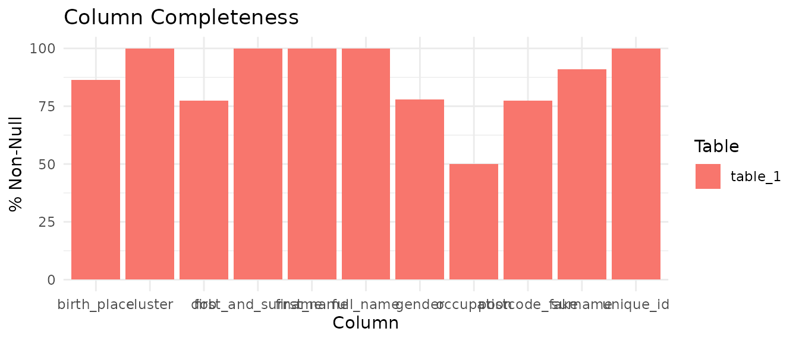
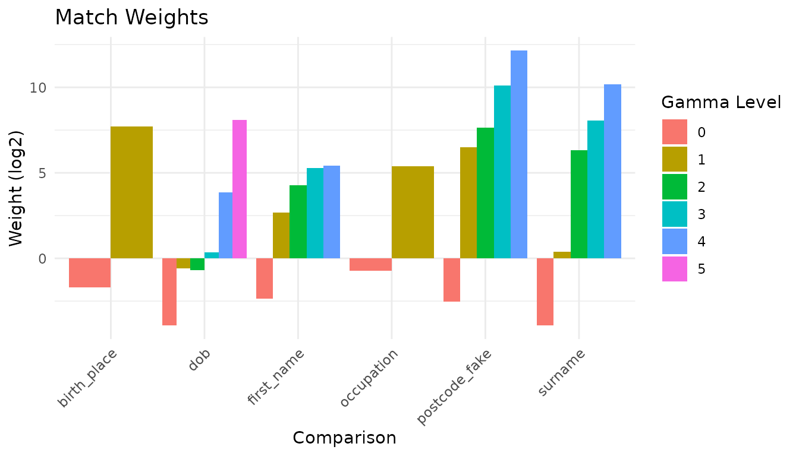
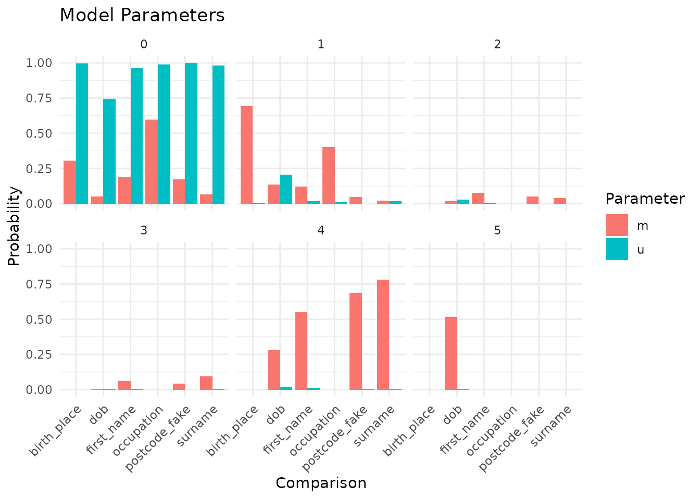
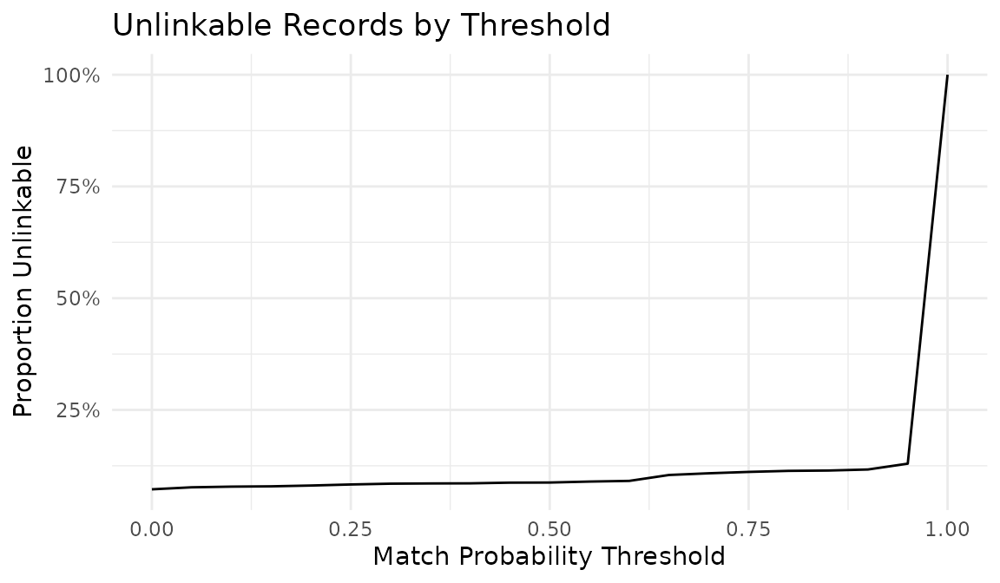
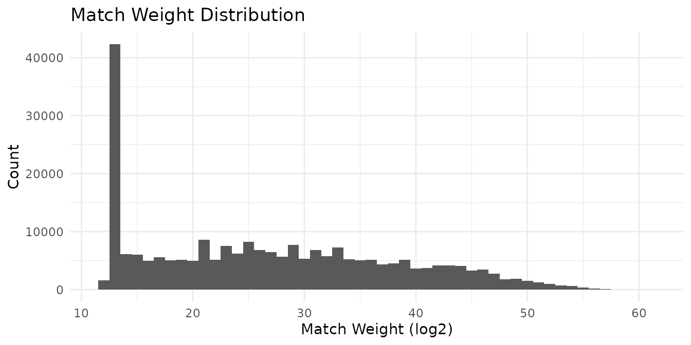
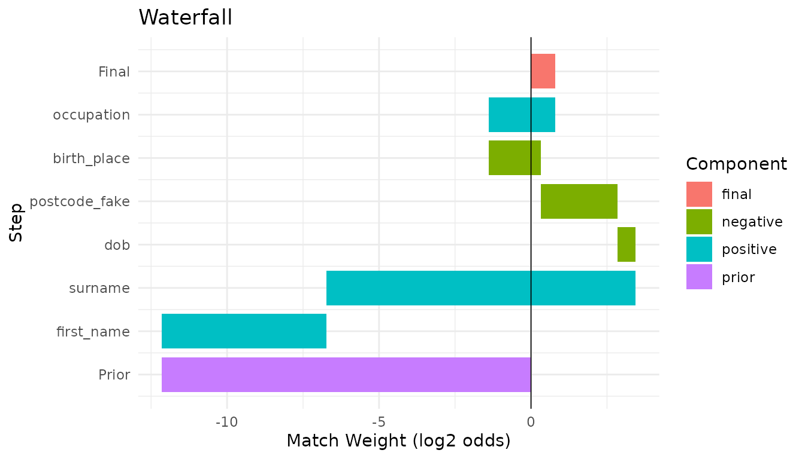
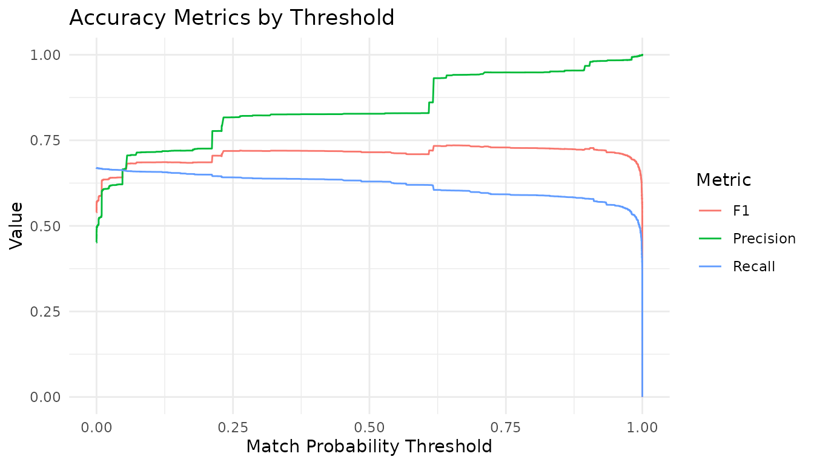
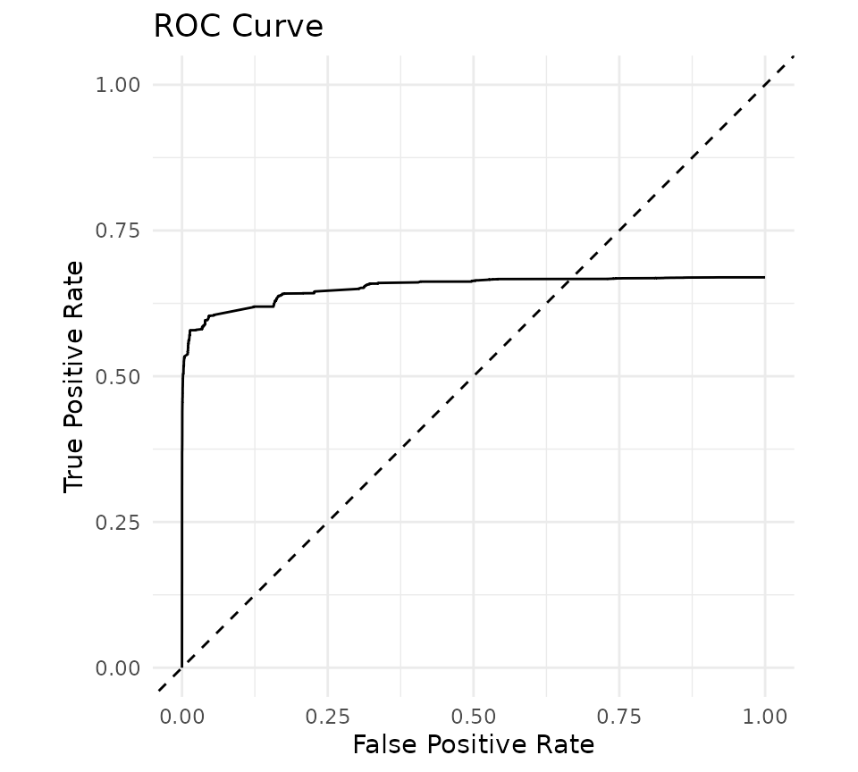
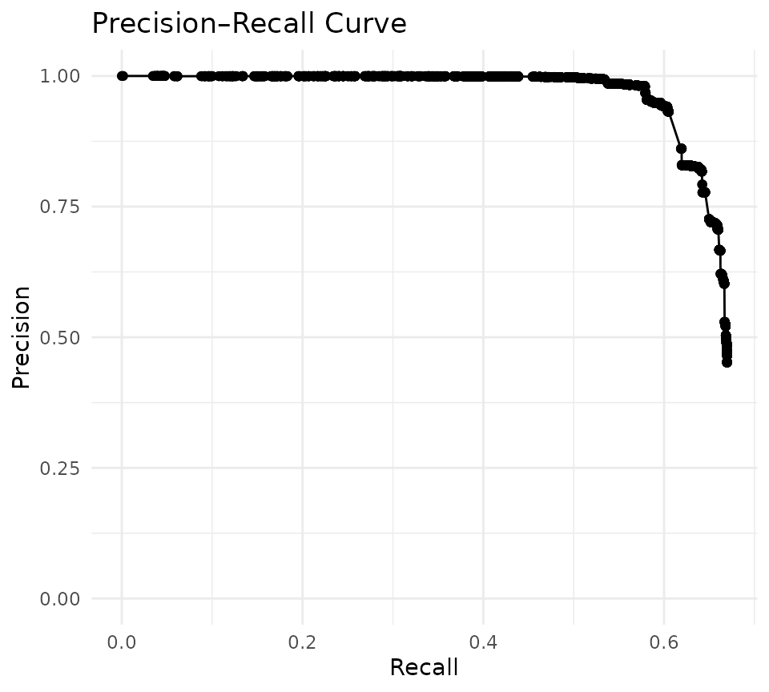

# Deduplicating 50k Synthetic Records

This vignette reproduces the [Splink “Deduplicate 50k synthetic”
demo](https://moj-analytical-services.github.io/splink/demos/examples/duckdb/deduplicate_50k_synthetic.html)
in `irelink`. The data is based on historical people scraped from
Wikidata and includes duplicate records with realistic errors such as
typos, missing values, and swapped fields. The `cluster` column provides
the ground-truth entity labels used in evaluation.

This vignette requires
[nanoparquet](https://cran.r-project.org/package=nanoparquet) to read
the remote Parquet file and only compiles when the package and the data
URL are both available.

## Load the data

``` r

library(irelink)
#> 
#> Attaching package: 'irelink'
#> The following object is masked from 'package:base':
#> 
#>     months
library(ggplot2)

df
#> # A data frame: 50,578 × 11
#>    unique_id   cluster  full_name     first_and_surname first_name surname dob  
#>    <chr>       <chr>    <chr>         <chr>             <chr>      <chr>   <chr>
#>  1 Q2296770-1  Q2296770 thomas cliff… thomas chudleigh  thomas     chudle… 1630…
#>  2 Q2296770-2  Q2296770 thomas of ch… thomas chudleigh  thomas     chudle… 1630…
#>  3 Q2296770-3  Q2296770 tom 1st baro… tom chudleigh     tom        chudle… 1630…
#>  4 Q2296770-4  Q2296770 thomas 1st c… thomas chudleigh  thomas     chudle… 1630…
#>  5 Q2296770-5  Q2296770 thomas cliff… thomas chudleigh  thomas     chudle… 1630…
#>  6 Q2296770-6  Q2296770 thomas cliff… thomas chudleigh  thomas     chudle… 1630…
#>  7 Q2296770-7  Q2296770 tom baron ch… tom chudleigh     tom        chudle… 1630…
#>  8 Q2296770-8  Q2296770 tom clifford… tom chudleigh     tom        chudle… NA   
#>  9 Q2296770-9  Q2296770 thomas cliff… thomas chudleigh  thomas     chudle… 1630…
#> 10 Q2296770-10 Q2296770 thomas cliff… thomas chudleigh  thomas     chudle… NA   
#> # ℹ 50,568 more rows
#> # ℹ 4 more variables: birth_place <chr>, postcode_fake <chr>, gender <chr>,
#> #   occupation <chr>
```

## Profile the data

Use completeness and value distributions to choose blocking rules and
comparisons:

``` r

con <- DBI::dbConnect(duckdb::duckdb())
#> duckdb keeps downloaded extensions and secrets in a temporary directory:
#> ℹ /tmp/RtmpkjmB9k/duckdb
#> This is removed when the R session ends.
#> • Extensions are re-downloaded each session.
#> • Secrets are lost.
#> ℹ Run duckdb(shared_home = TRUE) (or create ~/.duckdb) to keep them (suitable for most users).
#> ℹ Run duckdb(shared_home = FALSE) to accept the temporary directory (and silence this message).
#> ℹ See ?duckdb_storage for details and alternatives.
```

``` r

df |>
  il_completeness(con = con) |>
  autoplot()
```



``` r

il_profile(df, first_name, surname, dob, birth_place, con = con, top_n = 8)
#> # A tibble: 32 × 3
#>    column     value       n
#>    <chr>      <chr>   <dbl>
#>  1 first_name william  2780
#>  2 first_name john     2736
#>  3 first_name thomas   1448
#>  4 first_name george   1415
#>  5 first_name henry    1306
#>  6 first_name james    1265
#>  7 first_name sir      1262
#>  8 first_name charles  1216
#>  9 surname    NA       4515
#> 10 surname    baronet   615
#> # ℹ 22 more rows
```

## Choose blocking rules

``` r

il_suggest_blocking(df, con = con)
#> # A tibble: 10 × 6
#>    rule              n_distinct coverage   n_pairs pct_of_cartesian score
#>    <chr>                  <int>    <dbl>     <int>            <dbl> <dbl>
#>  1 cluster                 5156    1        303961           0.0238 1.000
#>  2 full_name              25573    0.999     87973           0.0069 0.999
#>  3 first_and_surname      20479    0.999    262393           0.0205 0.998
#>  4 first_name              4413    0.999  16372982           1.28   0.986
#>  5 surname                 6195    0.911    733085           0.0573 0.910
#>  6 birth_place             2373    0.863   4923790           0.385  0.860
#>  7 postcode_fake          12363    0.774    112172           0.0088 0.774
#>  8 dob                     8985    0.774   1549081           0.121  0.774
#>  9 occupation               453    0.5    12573944           0.983  0.495
#> 10 gender                     7    0.778 561648436          43.9    0.436
```

The `cumulative_pairs` column shows the total number of unique pairs
produced so far:

``` r

il_count_pairs(
  df,
  block_on(surname, dob),
  block_on(first_name, dob),
  block_on(first_name, surname),
  block_on(dob, birth_place),
  con = con
)
#> # A tibble: 4 × 4
#>   rule                 n_pairs cumulative_pairs pct_of_cartesian
#>   <chr>                  <dbl>            <dbl>            <dbl>
#> 1 surname & dob          62893            62893           0.0049
#> 2 first_name & dob       67757            92798           0.0073
#> 3 first_name & surname  243656           298602           0.0233
#> 4 dob & birth_place      66657           314273           0.0246
```

## Define the specification

Apply term-frequency adjustment to `birth_place` and `occupation` so
common values such as “London” receive less weight than rare ones:

``` r

spec <- il_spec() |>
  il_compare(first_name, cl_name()) |>
  il_compare(surname, cl_name()) |>
  il_compare(dob, cl_dob()) |>
  il_compare(postcode_fake, cl_postcode()) |>
  il_compare(birth_place, cl_exact(term_frequency = TRUE)) |>
  il_compare(occupation, cl_exact(term_frequency = TRUE)) |>
  il_block_on(first_name ~ il_substr(1, 3), surname ~ il_substr(1, 4)) |>
  il_block_on(surname, dob) |>
  il_block_on(first_name, dob) |>
  il_block_on(postcode_fake, first_name) |>
  il_block_on(postcode_fake, surname) |>
  il_block_on(dob, birth_place) |>
  il_block_on(postcode_fake ~ il_substr(1, 3), dob) |>
  il_block_on(postcode_fake ~ il_substr(1, 3), first_name) |>
  il_block_on(postcode_fake ~ il_substr(1, 3), surname) |>
  il_block_on(
    first_name ~ il_substr(1, 2),
    surname ~ il_substr(1, 2),
    dob ~ il_substr(1, 4)
  )

spec
#> Linkage Specification
#>   Comparisons (6):
#>     first_name : levels
#>     surname : levels
#>     dob : levels
#>     postcode_fake : levels
#>     birth_place : exact
#>     occupation : exact
#>   Blocking rules (10, OR-ed):
#>     1. first_name [il_substr(1,3)], surname [il_substr(1,4)]
#>     2. surname, dob
#>     3. first_name, dob
#>     4. postcode_fake, first_name
#>     5. postcode_fake, surname
#>     6. dob, birth_place
#>     7. postcode_fake [il_substr(1,3)], dob
#>     8. postcode_fake [il_substr(1,3)], first_name
#>     9. postcode_fake [il_substr(1,3)], surname
#>     10. first_name [il_substr(1,2)], surname [il_substr(1,2)], dob [il_substr(1,4)]
```

## Train the model

``` r

model <- df |>
  il_model(spec = spec, con = con) |>
  il_estimate_prior(
    block_on(first_name, surname, dob),
    block_on(dob, postcode_fake),
    recall = 0.6
  ) |>
  il_estimate_u(max_pairs = 5e6) |>
  il_estimate_em(block_on(first_name, surname)) |>
  il_estimate_em(block_on(dob))
#> EM trained: dob, postcode_fake, birth_place, and occupation | skipped (blocked
#> on): first_name and surname
#> EM trained: first_name, surname, postcode_fake, birth_place, and occupation |
#> skipped (blocked on): dob
```

## Inspect the trained model

``` r

summary(model)
#> irelink Model
#>   Status: Trained
#>   Link type: dedupe
#>   Records: 50578
#>   Comparisons: 6
#>   Blocking rules: 10
#> 
#>   Parameters:
#>     prior: 0.0003631005
#>     comparisons: # A tibble: 25 × 4
#>      comparisons:    comparison gamma_level      m        u
#>      comparisons:    <chr>            <int>  <dbl>    <dbl>
#>      comparisons:  1 first_name           0 0.177  0.963   
#>      comparisons:  2 first_name           1 0.123  0.0180  
#>      comparisons:  3 first_name           2 0.0772 0.00288 
#>      comparisons:  4 first_name           3 0.0628 0.00127 
#>      comparisons:  5 first_name           4 0.560  0.0152  
#>      comparisons:  6 surname              0 0.0572 0.981   
#>      comparisons:  7 surname              1 0.0224 0.0168  
#>      comparisons:  8 surname              2 0.0397 0.000430
#>      comparisons:  9 surname              3 0.0951 0.000285
#>      comparisons: 10 surname              4 0.785  0.00120 
#>      comparisons: # ℹ 15 more rows
#>     u_estimation: 5e+06
#>      u_estimation: FALSE
#>      u_estimation: NULL
#>      u_estimation: NULL
#>      u_estimation: 5000000
#>      u_estimation: 1
```

``` r

autoplot(model)
```



``` r

autoplot(model, type = 'parameters')
```



``` r

autoplot(il_unlinkables(model))
```



## Predict

``` r

predictions <- predict(model, threshold = 0.5)
predictions
#> # A tibble: 220,782 × 13
#>    unique_id_l  unique_id_r  gamma_first_name gamma_surname gamma_dob
#>  * <chr>        <chr>                   <int>         <int>     <int>
#>  1 Q19975322-15 Q19975322-18                4             0        -1
#>  2 Q14623871-2  Q14623871-9                 4            -1        -1
#>  3 Q18535641-1  Q18535641-3                 4             0         4
#>  4 Q6244750-1   Q6244750-8                  4             1         4
#>  5 Q6244750-2   Q6244750-8                  4             1         4
#>  6 Q6244750-3   Q6244750-8                  4             1         4
#>  7 Q16066258-4  Q16066258-8                 4             1         4
#>  8 Q4786204-1   Q4786204-15                 4             1         4
#>  9 Q16199114-7  Q16199114-8                 4            -1        -1
#> 10 Q15486486-16 Q15486486-17                4             3         4
#> # ℹ 220,772 more rows
#> # ℹ 8 more variables: gamma_postcode_fake <int>, gamma_birth_place <int>,
#> #   gamma_occupation <int>, match_weight <dbl>, tf_adj_birth_place <dbl>,
#> #   tf_adj_occupation <dbl>, total_match_weight <dbl>, match_probability <dbl>
```

``` r

autoplot(predictions)
```



``` r

autoplot(predictions, which = 1)
```



## Cluster

``` r

clusters <- il_cluster(predictions, threshold = 0.95)
clusters
#> # A tibble: 46,152 × 2
#>    unique_id    cluster_id          
#>    <chr>        <chr>               
#>  1 Q7177297-6   cluster_Q7177297-1  
#>  2 Q5312453-2   cluster_Q5312453-1  
#>  3 Q7173736-6   cluster_Q7173736-1  
#>  4 Q4423153-3   cluster_Q4423153-1  
#>  5 Q5362391-2   cluster_Q5362391-1  
#>  6 Q446283-5    cluster_Q446283-1   
#>  7 Q106265780-9 cluster_Q106265780-1
#>  8 Q55435263-8  cluster_Q55435263-1 
#>  9 Q6221791-6   cluster_Q6221791-1  
#> 10 Q17627027-13 cluster_Q17627027-1 
#> # ℹ 46,142 more rows
```

## Evaluate against ground truth

``` r

acc <- il_accuracy(model, labels_col = 'cluster')
acc
#> # A tibble: 3,526 × 16
#>     threshold     tp     fp     fn    tn fn_blocking_miss precision recall    f1
#>         <dbl>  <int>  <int>  <int> <int>            <int>     <dbl>  <dbl> <dbl>
#>  1    0       203544 247197 100417     0           100417     0.452  0.670 0.539
#>  2    4.22e-9 203544 247197 100417     0           100417     0.452  0.670 0.539
#>  3    2.53e-8 203544 247157 100417    40           100417     0.452  0.670 0.539
#>  4    3.44e-8 203544 247114 100417    83           100417     0.452  0.670 0.539
#>  5    7.24e-8 203544 246732 100417   465           100417     0.452  0.670 0.540
#>  6    9.69e-8 203544 246732 100417   465           100417     0.452  0.670 0.540
#>  7    1.19e-7 203544 246683 100417   514           100417     0.452  0.670 0.540
#>  8    1.32e-7 203544 246682 100417   515           100417     0.452  0.670 0.540
#>  9    1.32e-7 203544 246682 100417   515           100417     0.452  0.670 0.540
#> 10    1.56e-7 203544 246682 100417   515           100417     0.452  0.670 0.540
#> # ℹ 3,516 more rows
#> # ℹ 7 more variables: f2 <dbl>, f0_5 <dbl>, specificity <dbl>, npv <dbl>,
#> #   accuracy <dbl>, p4 <dbl>, phi <dbl>
```

When you use `labels_col`, the evaluation derives all true duplicate
pairs from the ground-truth cluster column. Some true pairs may never be
generated by the blocking rules. Those pairs count as false negatives at
every threshold. As a result, the maximum recall in the accuracy, ROC,
and precision-recall plots is the blocking recall:

``` r

acc0 <- acc[acc$threshold == min(acc$threshold), ]
acc0$tp / (acc0$tp + acc0$fn)
#> [1] 0.6696385
```

``` r

autoplot(acc)
```



``` r

autoplot(il_roc(model, labels_col = 'cluster'))
```



``` r

autoplot(il_precision_recall(model, labels_col = 'cluster'))
```



### Error inspection

``` r

errors <- il_errors(model, labels_col = 'cluster', threshold = 0.999)
errors[errors$error_type == 'false_positive', ]
#> # A tibble: 128 × 6
#>    unique_id_l unique_id_r match_weight match_probability true_label error_type 
#>    <chr>       <chr>              <dbl>             <dbl> <lgl>      <chr>      
#>  1 Q3568485-2  Q3568487-2          38.9             1.000 FALSE      false_posi…
#>  2 Q15176618-6 Q8005070-2          22.4             1.000 FALSE      false_posi…
#>  3 Q15176618-8 Q8005070-4          22.8             1.000 FALSE      false_posi…
#>  4 Q4088004-3  Q545038-1           22.6             1.000 FALSE      false_posi…
#>  5 Q3568485-9  Q3568487-1          38.9             1.000 FALSE      false_posi…
#>  6 Q15176618-6 Q8005070-1          22.4             1.000 FALSE      false_posi…
#>  7 Q15176618-8 Q8005070-1          22.8             1.000 FALSE      false_posi…
#>  8 Q4798602-9  Q4799999-1          23.1             1.000 FALSE      false_posi…
#>  9 Q28054162-5 Q6252444-19         23.7             1.000 FALSE      false_posi…
#> 10 Q336670-3   Q3784946-2          36.3             1.000 FALSE      false_posi…
#> # ℹ 118 more rows
```

Some false negatives occur because the true pair was never generated by
any blocking rule:

``` r

errors <- il_errors(model, labels_col = 'cluster', threshold = 0.5)
errors[errors$error_type == 'false_negative', ]
#> # A tibble: 112,573 × 6
#>    unique_id_l  unique_id_r match_weight match_probability true_label error_type
#>    <chr>        <chr>              <dbl>             <dbl> <lgl>      <chr>     
#>  1 Q18527799-7  Q18527799-8         9.68           0.229   TRUE       false_neg…
#>  2 Q28094321-10 Q28094321-…        11.1            0.449   TRUE       false_neg…
#>  3 Q5236742-14  Q5236742-18         7.72           0.0711  TRUE       false_neg…
#>  4 Q2331144-10  Q2331144-11        10.1            0.286   TRUE       false_neg…
#>  5 Q1721559-14  Q1721559-16         8.97           0.154   TRUE       false_neg…
#>  6 Q264269-18   Q264269-3           4.15           0.00642 TRUE       false_neg…
#>  7 Q12177029-1  Q12177029-…         9.23           0.179   TRUE       false_neg…
#>  8 Q6138068-14  Q6138068-15         9.18           0.174   TRUE       false_neg…
#>  9 Q5661841-12  Q5661841-6         11.3            0.485   TRUE       false_neg…
#> 10 Q65665593-12 Q65665593-8        11.3            0.485   TRUE       false_neg…
#> # ℹ 112,563 more rows
```

## Cleanup

``` r

il_cleanup(model)
DBI::dbDisconnect(con, shutdown = TRUE)
```

`il_cleanup(model)` is model-scoped. If an interactive run failed before
you kept the model object, call `il_cleanup_all(con)` to remove all
`irelink` tables from the connection before disconnecting.
