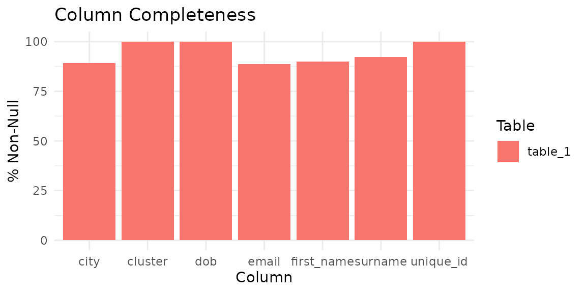
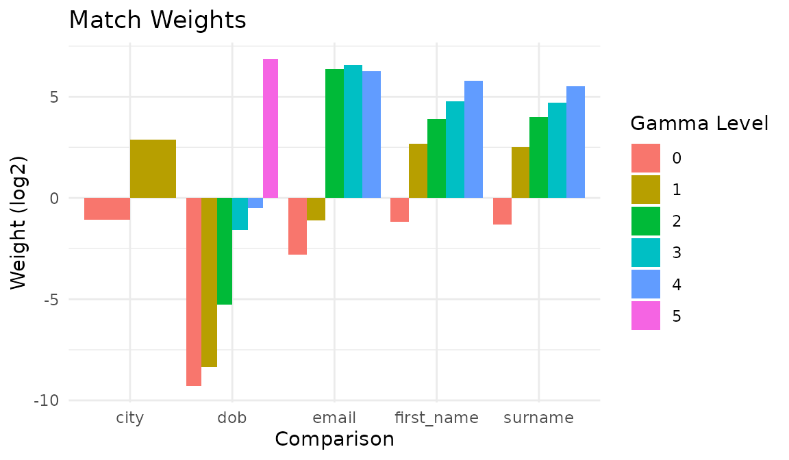
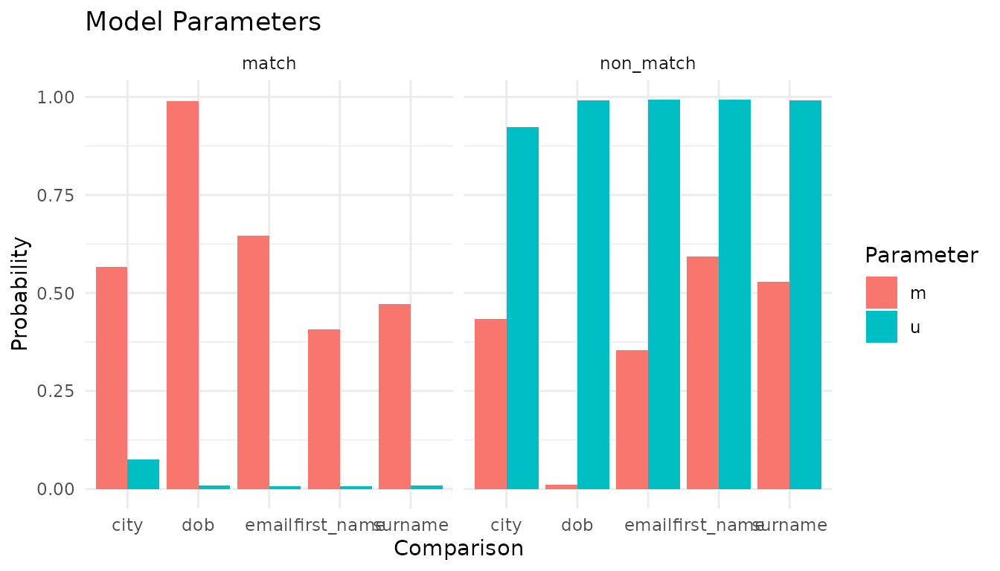
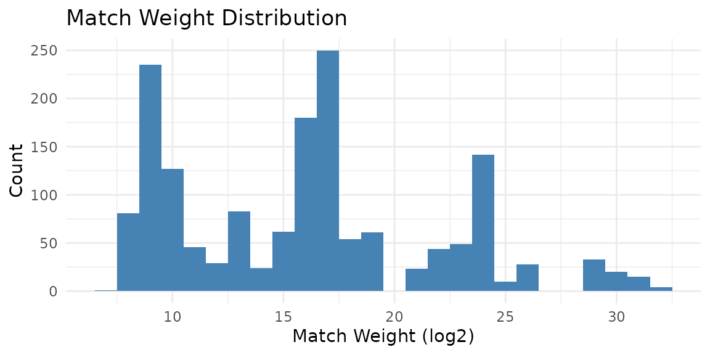
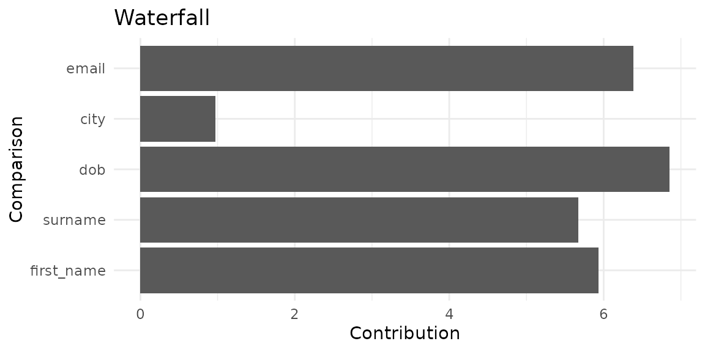
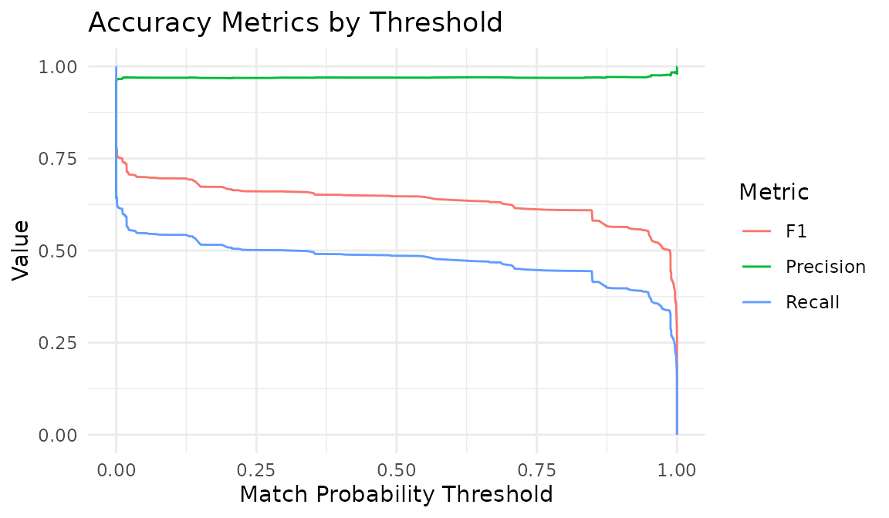
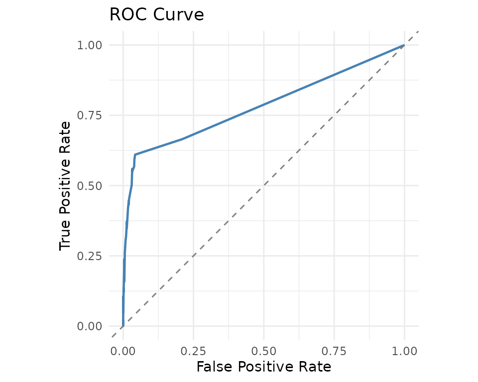
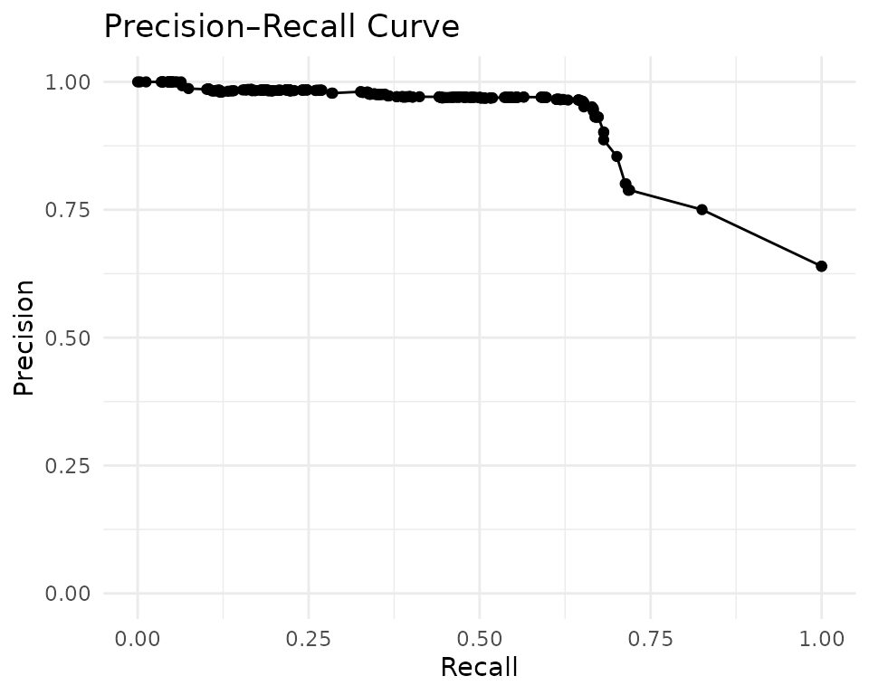
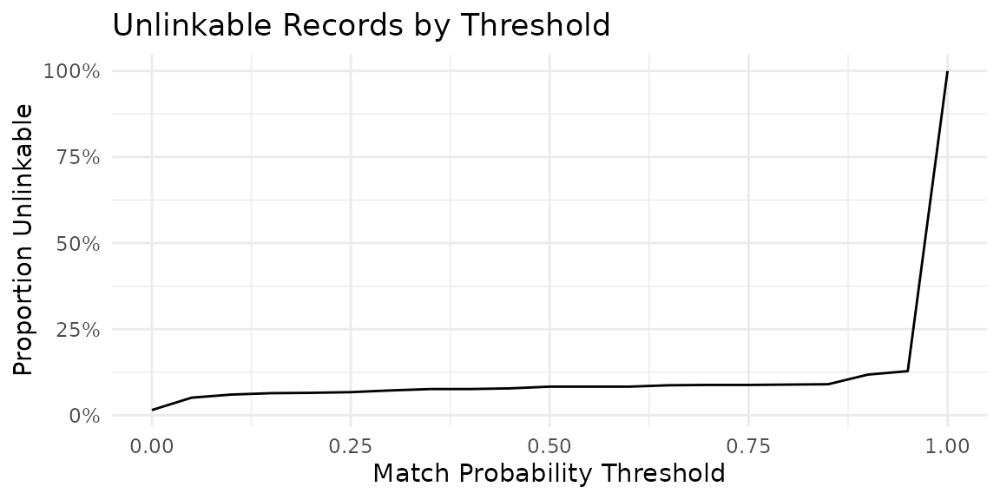

# Deduplication with Evaluation

This vignette walks through a complete deduplication workflow on the
`fake_1000` dataset, including model training, prediction, clustering,
and evaluation against ground-truth labels. The dataset is the primary
demo data from the Python
[splink](https://github.com/moj-analytical-services/splink) library. It
contains 1,000 records representing 181 unique people, each with varying
numbers of duplicate entries corrupted with typos, missing values, and
other realistic data-quality issues.

## Setup

``` r

library(irelink)
#> 
#> Attaching package: 'irelink'
#> The following object is masked from 'package:base':
#> 
#>     months
library(ggplot2)
```

## Explore the data

``` r

df <- fake_1000
head(df)
#> # A tibble: 6 × 7
#>   unique_id first_name surname dob        city   email                   cluster
#>       <int> <chr>      <chr>   <chr>      <chr>  <chr>                     <int>
#> 1         0 Julia      NA      2015-10-29 London hannah88@powers.com           0
#> 2         1 Julia      Taylor  2015-07-31 London hannah88@powers.com           0
#> 3         2 Julia      Taylor  2016-01-27 London hannah88@powers.com           0
#> 4         3 Julia      Taylor  2015-10-29 NA     hannah88opowersc@m            0
#> 5         4 oNah       Watson  2008-03-23 Bolton matthew78@ballard-mcdo…       1
#> 6         5 Noah       Watson  2008-03-23 Bolton matthew78@ballard-mcdo…       1
```

The `cluster` column is the ground truth: records sharing the same
cluster value refer to the same person. There are 181 unique entities
across 1000 records. Note that missing values appear as `NA`, reflecting
real-world data-quality challenges.

Before building a model, profile the data to understand its completeness
and value distributions:

``` r

con <- DBI::dbConnect(duckdb::duckdb())
comp <- il_completeness(df, con = con)
comp
#> # A tibble: 7 × 5
#>   table   column     n_total n_non_null pct_non_null
#>   <chr>   <chr>        <int>      <int>        <dbl>
#> 1 table_1 unique_id     1000       1000        100  
#> 2 table_1 first_name    1000        900         90  
#> 3 table_1 surname       1000        923         92.3
#> 4 table_1 dob           1000       1000        100  
#> 5 table_1 city          1000        891         89.1
#> 6 table_1 email         1000        888         88.8
#> 7 table_1 cluster       1000       1000        100
```

``` r

autoplot(comp)
```



Check column value distributions to inform blocking and comparison
choices:

``` r

il_profile(df[, c('first_name', 'surname', 'city')], con = con, top_n = 5)
#> # A tibble: 15 × 3
#>    column     value          n
#>    <chr>      <chr>      <dbl>
#>  1 first_name NA           100
#>  2 first_name George        22
#>  3 first_name Harry         18
#>  4 first_name Ivy           18
#>  5 first_name Noah          17
#>  6 surname    NA            77
#>  7 surname    Taylor        41
#>  8 surname    Jones         30
#>  9 surname    Brown         26
#> 10 surname    Thomas        18
#> 11 city       London       257
#> 12 city       NA           109
#> 13 city       Birmingham    36
#> 14 city       Leeds         33
#> 15 city       Sheffield     31
```

## Choose blocking rules

[`il_suggest_blocking()`](http://christophertkenny.com/irelink/reference/il_suggest_blocking.md)
enumerates columns and ranks them as blocking keys. A good blocking key
has high `n_distinct` (narrow blocks, fewer pairs) and high `coverage`
(few missing values):

``` r

il_suggest_blocking(df, con = con)
#> # A tibble: 6 × 6
#>   rule       n_distinct coverage n_pairs pct_of_cartesian score
#>   <chr>           <int>    <dbl>   <int>            <dbl> <dbl>
#> 1 dob               394    1        1850            0.370 0.996
#> 2 cluster           181    1        2975            0.596 0.994
#> 3 surname           317    0.923    3278            0.656 0.917
#> 4 first_name        326    0.9      2372            0.475 0.896
#> 5 email             336    0.888    1603            0.321 0.885
#> 6 city              174    0.891   36905            7.39  0.825
```

The spec below uses `first_name`, `surname`, and `city`, which rank
among the top columns here.

## Define the specification

Choose comparisons and blocking rules. Names use Jaro-Winkler
similarity, dates of birth use the
[`cl_dob()`](http://christophertkenny.com/irelink/reference/cl_dob.md)
helper, and city uses exact matching with term-frequency adjustments:

``` r

spec <- il_spec() |>
  il_compare(first_name, cl_name()) |>
  il_compare(surname, cl_name()) |>
  il_compare(dob, cl_dob()) |>
  il_compare(city, cl_exact(term_frequency = TRUE)) |>
  il_compare(email, cl_email()) |>
  il_block_on(first_name) |>
  il_block_on(surname) |>
  il_block_on(city)

spec
#> Linkage Specification
#>   Comparisons (5):
#>     first_name : levels
#>     surname : levels
#>     dob : levels
#>     city : exact
#>     email : levels
#>   Blocking rules (3, OR-ed):
#>     1. first_name
#>     2. surname
#>     3. city
```

Estimate how many pairs each blocking rule generates:

``` r

il_count_pairs(
  df,
  block_on(first_name),
  block_on(surname),
  block_on(city),
  con = con
)
#> # A tibble: 3 × 4
#>   rule       n_pairs cumulative_pairs pct_of_cartesian
#>   <chr>        <dbl>            <dbl>            <dbl>
#> 1 first_name    2372             2372            0.475
#> 2 surname       3278             5042            1.01 
#> 3 city         36905            40793            8.17
```

## Train the model

``` r

model <- il_model(df, spec = spec, con = con)
```

Estimate the prior match probability using deterministic rules:

``` r

model <- il_estimate_prior(
  model,
  block_on(first_name, surname),
  block_on(email),
  recall = 0.6
)
```

Estimate u-probabilities from random pairs and m-probabilities via EM:

``` r

model <- il_estimate_u(model, max_pairs = 1e5)
model <- il_estimate_em(model, block_on(first_name))
#> EM trained: surname, dob, city, and
#> email | skipped (blocked on): first_name
model <- il_estimate_em(model, block_on(dob))
#> EM trained: first_name, surname, city, and
#> email | skipped (blocked on): dob
```

## Inspect the trained model

``` r

summary(model)
#> irelink Model
#>   Status: Trained
#>   Link type: dedupe
#>   Records: 1000
#>   Comparisons: 5
#>   Blocking rules: 3
#> 
#>   Parameters:
#>     prior: 0.5161334
#>     comparisons: # A tibble: 23 × 4
#>      comparisons:    comparison gamma_level      m       u
#>      comparisons:    <chr>            <int>  <dbl>   <dbl>
#>      comparisons:  1 first_name           0 0.355  0.967  
#>      comparisons:  2 first_name           1 0.110  0.0187 
#>      comparisons:  3 first_name           2 0.0278 0.00213
#>      comparisons:  4 first_name           3 0.0894 0.00370
#>      comparisons:  5 first_name           4 0.417  0.00852
#>      comparisons:  6 surname              0 0.346  0.966  
#>      comparisons:  7 surname              1 0.0941 0.0173 
#>      comparisons:  8 surname              2 0.0274 0.00189
#>      comparisons:  9 surname              3 0.0696 0.00295
#>      comparisons: 10 surname              4 0.463  0.0114 
#>      comparisons: # ℹ 13 more rows
#>     u_estimation: 1e+05
#>      u_estimation: FALSE
#>      u_estimation: NULL
#>      u_estimation: NULL
#>      u_estimation: 100000
#>      u_estimation: 1
```

The match weights chart shows the discriminative power of each
comparison:

``` r

autoplot(model)
```



The parameter chart shows the raw m and u probabilities:

``` r

autoplot(model, type = 'parameters')
```



## Save and reuse the model

Once you are satisfied with the parameters, save the model to disk. The
saved file stores the spec and trained parameters so you can re-apply
the model without retraining:

``` r

path <- tempfile(fileext = '.rds')
il_save(model, path)
```

Load and attach the saved model to the same or different data with
[`il_load()`](http://christophertkenny.com/irelink/reference/il_load.md)
and
[`il_attach()`](http://christophertkenny.com/irelink/reference/il_attach.md):

``` r

con2 <- DBI::dbConnect(duckdb::duckdb())
loaded <- il_load(path)
model2 <- il_attach(loaded, fake_1000, con = con2)
head(predict(model2, threshold = 0.85))
#> # A tibble: 6 × 11
#>   unique_id_l unique_id_r gamma_first_name gamma_surname gamma_dob gamma_city
#>         <int>       <int>            <int>         <int>     <int>      <int>
#> 1           0           3                4            -1         5          0
#> 2           1           3                4             4         2          0
#> 3           6          11                4             4         2          0
#> 4          10          11                4             4         2          0
#> 5          52          57                4             4         5          0
#> 6          54          57                4            -1         5          0
#> # ℹ 5 more variables: gamma_email <int>, match_weight <dbl>, tf_adj_city <dbl>,
#> #   total_match_weight <dbl>, match_probability <dbl>
DBI::dbDisconnect(con2, shutdown = TRUE)
```

This pattern supports the common production workflow: train once on a
representative sample, save the model, and re-apply as new data arrives.

## Predict and cluster

Score all candidate pairs and apply a probability threshold:

``` r

predictions <- predict(model, threshold = 0.5)
nrow(predictions)
#> [1] 2783
```

View the match-weight distribution:

``` r

autoplot(predictions)
```



Inspect how individual pairs are scored with a waterfall chart:

``` r

autoplot(predictions, which = 1)
```



Resolve pairwise links into entity clusters:

``` r

clusters <- il_cluster(predictions, threshold = 0.85)
head(clusters)
#> # A tibble: 6 × 2
#>   unique_id cluster_id 
#>   <chr>     <chr>      
#> 1 217       cluster_213
#> 2 439       cluster_438
#> 3 743       cluster_738
#> 4 797       cluster_792
#> 5 41        cluster_38 
#> 6 59        cluster_58
```

## Evaluate against ground truth

The `cluster` column in the original data provides ground-truth entity
labels. Convert these to pairwise labels for evaluation:

``` r

# Use the bundled clerical labels from splink
labels_raw <- fake_1000_labels

# Rename to match irelink's evaluation convention
labels <- data.frame(
  unique_id_l = labels_raw$unique_id_l,
  unique_id_r = labels_raw$unique_id_r,
  is_match = as.integer(labels_raw$clerical_match_score)
)

nrow(labels)
#> [1] 3176
sum(labels$is_match)
#> [1] 2031
```

### Accuracy metrics

``` r

acc <- il_accuracy(model, labels = labels)
acc
#> # A tibble: 419 × 16
#>     threshold    tp    fp    fn    tn fn_blocking_miss precision recall    f1
#>         <dbl> <int> <int> <int> <int>            <int>     <dbl>  <dbl> <dbl>
#>  1 0           1135   229   896   916              896     0.832  0.559 0.669
#>  2 0.00000183  1135   229   896   916              896     0.832  0.559 0.669
#>  3 0.00000353  1135   229   896   916              896     0.832  0.559 0.669
#>  4 0.00000498  1135   229   896   916              896     0.832  0.559 0.669
#>  5 0.00000512  1135   229   896   916              896     0.832  0.559 0.669
#>  6 0.00000960  1135   229   896   916              896     0.832  0.559 0.669
#>  7 0.00000986  1135   229   896   916              896     0.832  0.559 0.669
#>  8 0.0000139   1135   229   896   916              896     0.832  0.559 0.669
#>  9 0.0000255   1135   229   896   916              896     0.832  0.559 0.669
#> 10 0.0000268   1115   152   916   993              896     0.880  0.549 0.676
#> # ℹ 409 more rows
#> # ℹ 7 more variables: f2 <dbl>, f0_5 <dbl>, specificity <dbl>, npv <dbl>,
#> #   accuracy <dbl>, p4 <dbl>, phi <dbl>
```

``` r

autoplot(acc)
```



### ROC curve

``` r

roc <- il_roc(model, labels = labels)
autoplot(roc)
```



### Precision–recall curve

``` r

pr <- il_precision_recall(model, labels = labels)
autoplot(pr)
```



### Error inspection

Examine false positives and false negatives at a specific threshold:

``` r

errors <- il_errors(model, labels = labels, threshold = 0.85)
head(errors)
#> # A tibble: 6 × 6
#>   unique_id_l unique_id_r match_weight match_probability true_label error_type  
#>         <int>       <int>        <dbl>             <dbl> <lgl>      <chr>       
#> 1           4           7        17.1              1.000 FALSE      false_posit…
#> 2           4           8         8.89             0.998 FALSE      false_posit…
#> 3           4           9        14.7              1.000 FALSE      false_posit…
#> 4           4          10        12.2              1.000 FALSE      false_posit…
#> 5           5           7        19.0              1.000 FALSE      false_posit…
#> 6           5           8         8.89             0.998 FALSE      false_posit…
```

### Unlinkables

How many records cannot be linked at each threshold?

``` r

unlink <- il_unlinkables(model)
autoplot(unlink)
```



## Cleanup

``` r

il_cleanup(model)
DBI::dbDisconnect(con, shutdown = TRUE)
```

`il_cleanup(model)` is model-scoped. If an interactive run failed before
you kept the model object, call `il_cleanup_all(con)` to remove all
`irelink` tables from the connection before disconnecting.
