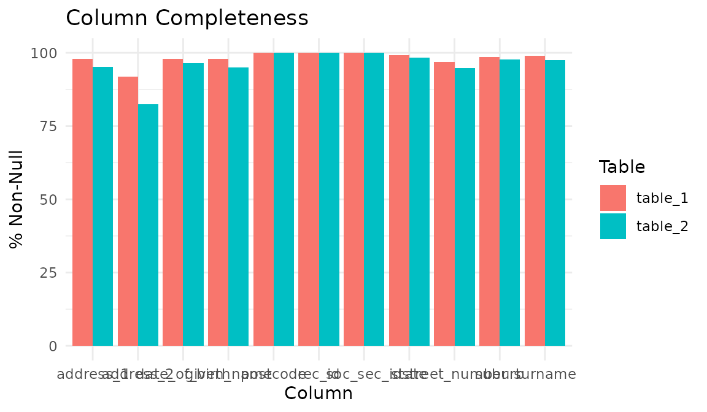
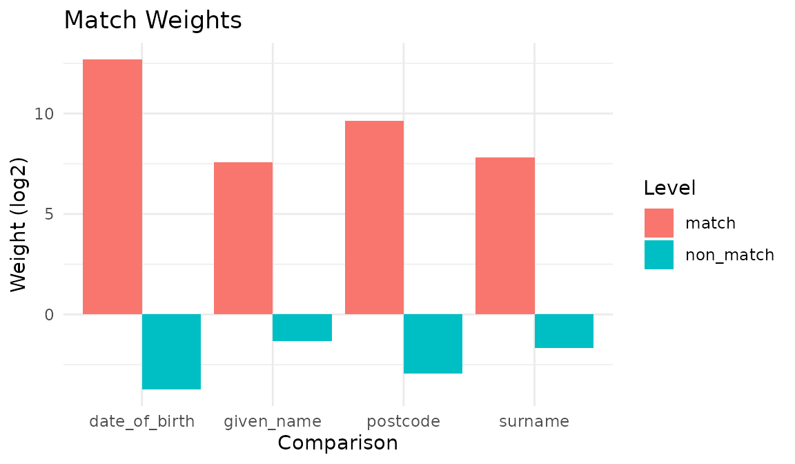
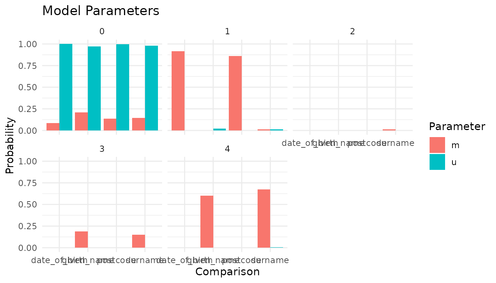
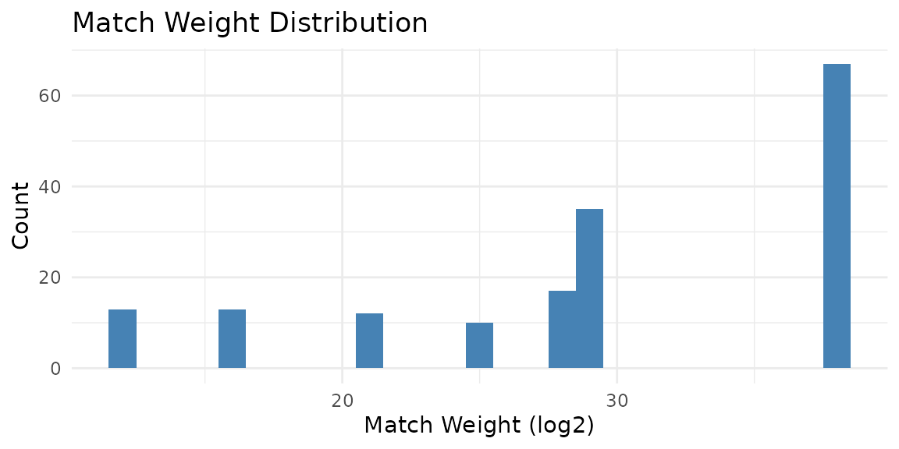
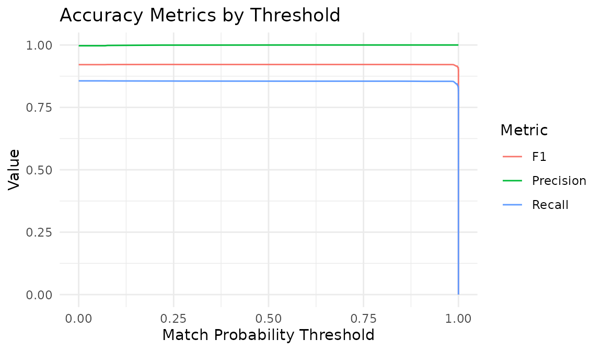
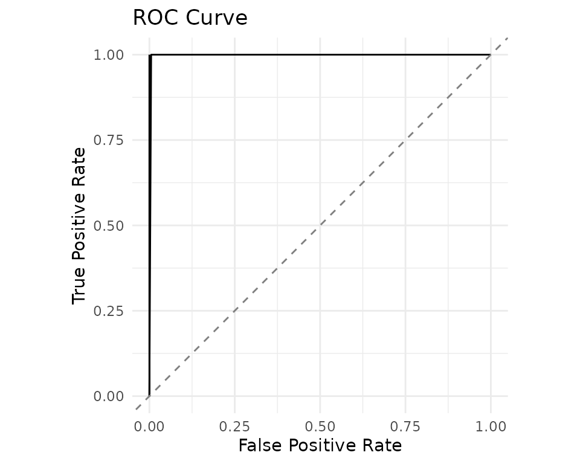
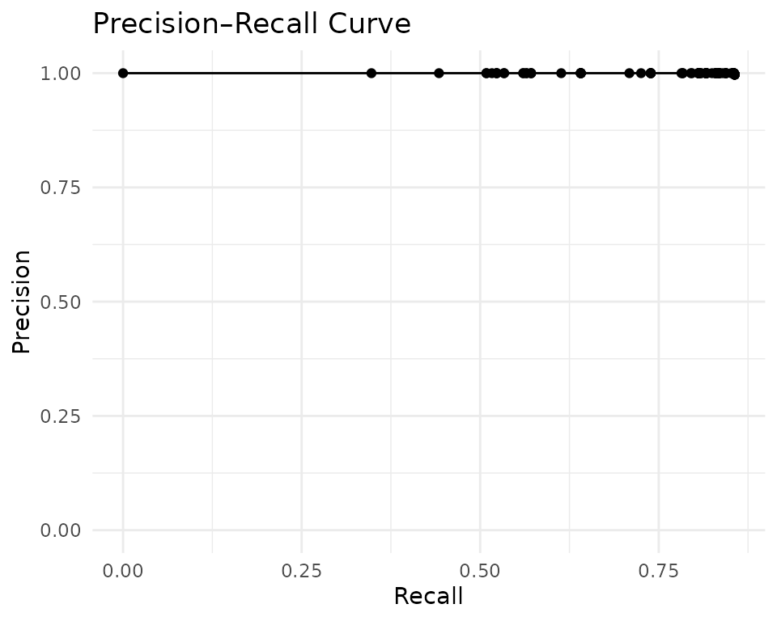

# Record Linkage Across Datasets

This vignette demonstrates linking records across two separate datasets
using the FEBRL (Freely Extensible Biomedical Record Linkage) benchmark
data. Dataset 4a contains 5,000 original records and dataset 4b contains
5,000 duplicates — one for each original — corrupted with typographical
errors, missing values, and transpositions. Ground truth is encoded in
the `rec_id` column: records sharing the same base number (e.g.,
`rec-1070-org` and `rec-1070-dup-0`) refer to the same entity.

## Setup

``` r
library(irelink)
#> 
#> Attaching package: 'irelink'
#> The following object is masked from 'package:base':
#> 
#>     months
library(ggplot2)
```

## Load the data

``` r
head(febrl4a)
#> # A tibble: 6 × 11
#>   rec_id    given_name surname street_number address_1 address_2 suburb postcode
#>   <chr>     <chr>      <chr>           <int> <chr>     <chr>     <chr>     <int>
#> 1 rec-1070… michaela   neumann             8 stanley … miami     winst…     4223
#> 2 rec-1016… courtney   painter            12 pinkerto… bega fla… richl…     4560
#> 3 rec-4405… charles    green              38 salkausk… kela      dapto      4566
#> 4 rec-1288… vanessa    parr              905 macquoid… broadbri… south…     2135
#> 5 rec-3585… mikayla    mallon…            37 randwick… avalind   hoppe…     4552
#> 6 rec-298-… blake      howie               1 cutlack … belmont … budge…     6017
#> # ℹ 3 more variables: state <chr>, date_of_birth <int>, soc_sec_id <int>
head(febrl4b)
#> # A tibble: 6 × 11
#>   rec_id    given_name surname street_number address_1 address_2 suburb postcode
#>   <chr>     <chr>      <chr>           <int> <chr>     <chr>     <chr>     <int>
#> 1 rec-561-… elton      NA                  3 light se… pinehill  winde…     3212
#> 2 rec-2642… mitchell   maxon              47 edkins s… lochaoair north…     3355
#> 3 rec-608-… NA         white              72 lambrigg… kelgoola  broad…     3159
#> 4 rec-3239… elk i      menzies             1 lyster p… NA        north…     2585
#> 5 rec-2886… NA         garang…            NA may maxw… springet… fores…     2342
#> 6 rec-4285… sophie     manson             14 elizabet… manorhou… gorok…     3465
#> # ℹ 3 more variables: state <chr>, date_of_birth <int>, soc_sec_id <int>
```

## Explore data quality

Check completeness across both tables. Table B has more missing values
due to the corruption process:

``` r
con <- DBI::dbConnect(duckdb::duckdb())
comp <- il_completeness(febrl4a, febrl4b, con = con)
comp
#> # A tibble: 22 × 5
#>    table   column        n_total n_non_null pct_non_null
#>    <chr>   <chr>           <int>      <int>        <dbl>
#>  1 table_1 rec_id           5000       5000        100  
#>  2 table_1 given_name       5000       4888         97.8
#>  3 table_1 surname          5000       4952         99.0
#>  4 table_1 street_number    5000       4842         96.8
#>  5 table_1 address_1        5000       4902         98.0
#>  6 table_1 address_2        5000       4580         91.6
#>  7 table_1 suburb           5000       4945         98.9
#>  8 table_1 postcode         5000       5000        100  
#>  9 table_1 state            5000       4950         99  
#> 10 table_1 date_of_birth    5000       4906         98.1
#> # ℹ 12 more rows
```

``` r
autoplot(comp)
```



## Define the specification

For linking (as opposed to deduplication), set `link_type = "link"` when
creating the model. Comparisons use name similarity, date-of-birth
matching, and postcode exact matching:

``` r
spec <- il_spec() |>
  il_compare(given_name, cl_name()) |>
  il_compare(surname, cl_name()) |>
  il_compare(date_of_birth, cl_exact()) |>
  il_compare(postcode, cl_exact()) |>
  il_block_on(surname) |>
  il_block_on(given_name)

spec
#> Linkage Specification
#>   Comparisons (4):
#>     given_name : levels
#>     surname : levels
#>     date_of_birth : exact
#>     postcode : exact
#>   Blocking rules (2, OR-ed):
#>     1. surname
#>     2. given_name
```

## Train the model

Create a link-type model with both tables:

``` r
model <- il_model(
  febrl4a, febrl4b,
  spec = spec,
  con = con,
  link_type = 'link'
)

model
#> irelink Model
#>   Status: Untrained
#>   Link type: link
#>   Records: 5000
#>   Records (right): 5000
#>   Comparisons: 4
#>   Blocking rules: 2
```

Estimate prior match probability, u-probabilities, and run EM:

``` r
model <- il_estimate_prior(
  model,
  block_on(given_name, surname),
  block_on(surname, suburb),
  recall = 0.6
)

model <- il_estimate_u(model, max_pairs = 1e5)
model <- il_estimate_em(model, block_on(surname))
#> EM trained: given_name, date_of_birth, and postcode | skipped (blocked on):
#> surname
model <- il_estimate_em(model, block_on(suburb))
#> EM trained: given_name, surname, date_of_birth,
#> and postcode
```

## Inspect the model

``` r
autoplot(model)
```



``` r
autoplot(model, type = 'parameters')
```



``` r
il_weights(model)
#> # A tibble: 14 × 5
#>    comparison    gamma_level  m_prob  u_prob weight
#>    <chr>               <int>   <dbl>   <dbl>  <dbl>
#>  1 given_name              0 0.199   0.972   -2.29 
#>  2 given_name              1 0.0128  0.0221  -0.786
#>  3 given_name              2 0.0129  0.00114  3.50 
#>  4 given_name              3 0.121   0.00114  6.72 
#>  5 given_name              4 0.655   0.00354  7.53 
#>  6 surname                 0 0.144   0.981   -2.77 
#>  7 surname                 1 0.00685 0.0120  -0.814
#>  8 surname                 2 0.0159  0.00123  3.69 
#>  9 surname                 3 0.178   0.00141  6.98 
#> 10 surname                 4 0.655   0.00427  7.26 
#> 11 date_of_birth           0 0.103   1.000   -3.29 
#> 12 date_of_birth           1 0.897   0.0002  12.1  
#> 13 postcode                0 0.166   0.999   -2.59 
#> 14 postcode                1 0.834   0.00124  9.39
```

## Predict and cluster

``` r
predictions <- predict(model, threshold = 0.5)
nrow(predictions)
#> [1] 4993
```

``` r
autoplot(predictions)
```



Cluster the pairs to resolve entities:

``` r
clusters <- il_cluster(predictions, threshold = 0.85)
head(clusters)
#> # A tibble: 6 × 2
#>   unique_id cluster_id  
#>   <chr>     <chr>       
#> 1 3173      cluster_1298
#> 2 2034      cluster_2034
#> 3 2071      cluster_2071
#> 4 1018      cluster_1018
#> 5 356       cluster_1654
#> 6 146       cluster_146
```

## Evaluate against ground truth

The `rec_id` column encodes ground truth. Extract entity IDs and build
pairwise labels:

``` r
# Extract entity number from rec_id (e.g., "rec-1070-org" -> "1070")
entity_a <- sub('^rec-(\\d+)-org$', '\\1', febrl4a$rec_id)
entity_b <- sub('^rec-(\\d+)-dup-\\d+$', '\\1', febrl4b$rec_id)

# Build id-entity lookup (unique_id auto-generated by il_model)
ids_a <- data.frame(unique_id = seq_len(nrow(febrl4a)), entity = entity_a)
ids_b <- data.frame(unique_id = seq_len(nrow(febrl4b)), entity = entity_b)

# True matches: same entity across tables
positives <- merge(ids_a, ids_b, by = 'entity')
names(positives) <- c('entity', 'unique_id_l', 'unique_id_r')
positives$is_match <- 1L
positives <- positives[, c('unique_id_l', 'unique_id_r', 'is_match')]

# Sample non-matching pairs
set.seed(42)
n_neg <- min(nrow(positives), 2000L)
neg_l <- sample(ids_a$unique_id, n_neg, replace = TRUE)
neg_r <- sample(ids_b$unique_id, n_neg, replace = TRUE)
ent_l <- ids_a$entity[match(neg_l, ids_a$unique_id)]
ent_r <- ids_b$entity[match(neg_r, ids_b$unique_id)]
negatives <- data.frame(
  unique_id_l = neg_l,
  unique_id_r = neg_r,
  is_match = ifelse(ent_l == ent_r, 1L, 0L)
)

labels <- rbind(positives, negatives)
nrow(labels)
#> [1] 7000
sum(labels$is_match)
#> [1] 5001
```

### Accuracy metrics

``` r
acc <- il_accuracy(model, labels = labels)
autoplot(acc)
```



### ROC and Precision–Recall

``` r
roc <- il_roc(model, labels = labels)
autoplot(roc)
```



``` r
pr <- il_precision_recall(model, labels = labels)
autoplot(pr)
```



## Cleanup

``` r
il_cleanup(model)
DBI::dbDisconnect(con, shutdown = TRUE)
```
