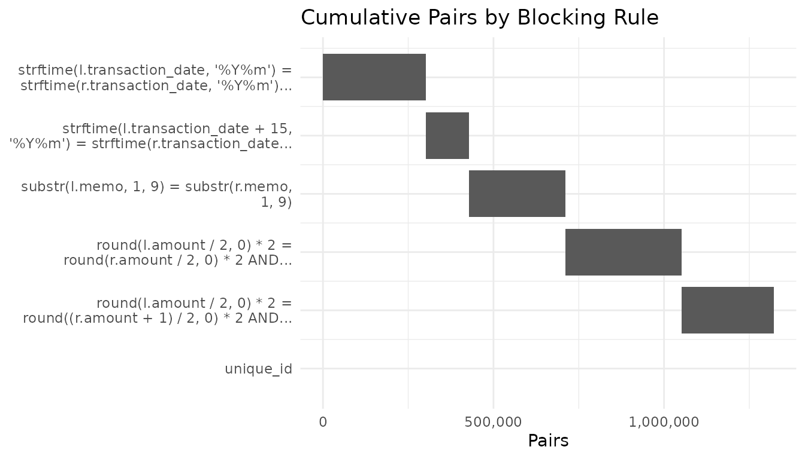
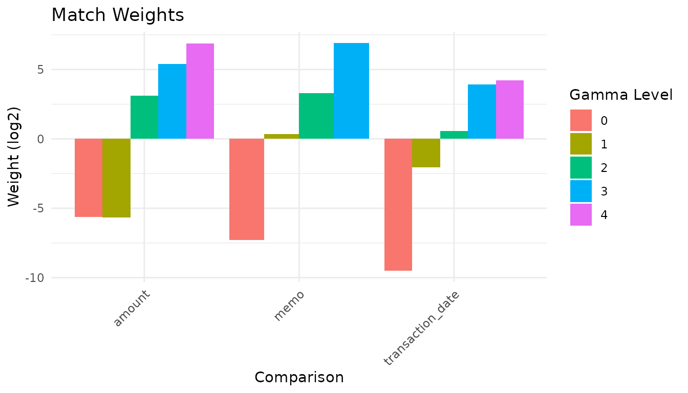
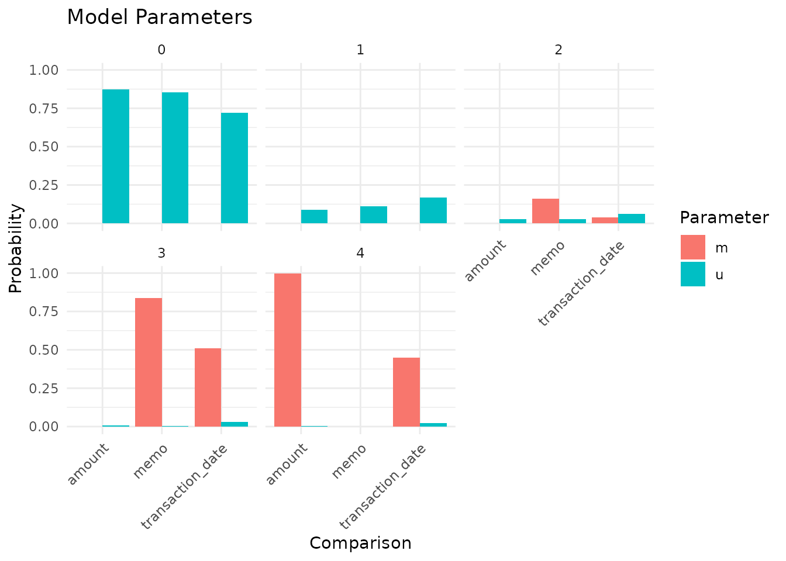
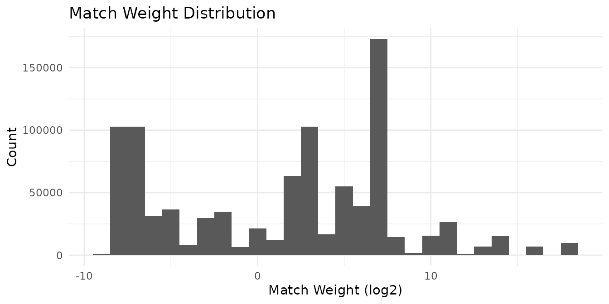
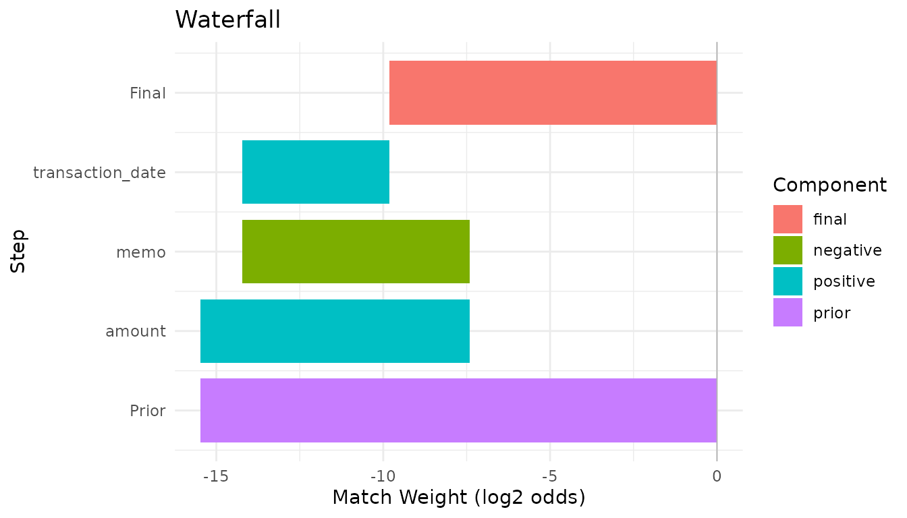
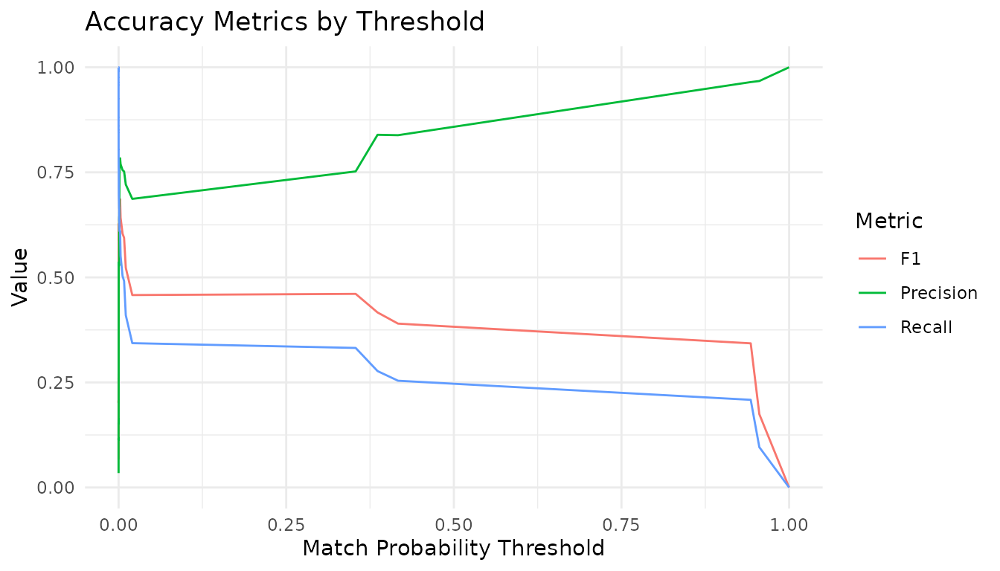

# Linking Banking Transactions

This vignette replicates the [Splink “Linking banking transactions”
demo](https://moj-analytical-services.github.io/splink/demos/examples/duckdb/transactions.html)
using `irelink`. It demonstrates two-table linking
(`link_type = "link"`), matching each outgoing payment in the origin
table to its corresponding incoming payment in the destination table.

The data is synthetic and designed to be challenging: amounts differ due
to fees and exchange-rate effects, dates shift by a few days, and memos
are sometimes truncated. Since every origin payment has exactly one
destination counterpart, the prior match probability is `1 / n_origin`.

This vignette requires the
[nanoparquet](https://cran.r-project.org/package=nanoparquet) package to
read the remote Parquet files and will only compile when the package and
data URLs are both available.

## Load the data

``` r
library(irelink)
#> 
#> Attaching package: 'irelink'
#> The following object is masked from 'package:base':
#> 
#>     months
library(ggplot2)

df_origin
#> # A data frame: 45,326 × 5
#>    ground_truth memo            transaction_date  amount unique_id
#>           <dbl> <chr>           <date>             <dbl>     <dbl>
#>  1            0 MATTHIAS C paym 2022-03-28          36.4         0
#>  2            1 M CORVINUS dona 2022-02-14         222.          1
#>  3            2 M C donation BG 2022-05-04         450.          2
#>  4            3 M C BGC         2022-03-03         208.          3
#>  5            4 M CORVINUS  CSH 2022-02-04          79.7         4
#>  6            5 M C  WRE        2022-03-26         835.          5
#>  7            6 M CORVINUS CSH  2022-05-01          66.7         6
#>  8            7 M C 1b097ab5 CH 2022-03-15       26246.          7
#>  9            8 M C  WRE        2022-03-26          92.8         8
#> 10            9 M C payment CHQ 2022-05-04         211.          9
#> # ℹ 45,316 more rows
df_destination
#> # A data frame: 45,326 × 5
#>    ground_truth memo                     transaction_date  amount unique_id
#>           <dbl> <chr>                    <date>             <dbl>     <dbl>
#>  1            0 "MATTHIAS C payment BGC" 2022-03-29          36.4         0
#>  2            1 "M CORVINUS BGC"         2022-02-16         222.          1
#>  3            2 "M C"                    2022-05-05         450.          2
#>  4            3 "M C payment"            2022-03-04         199.          3
#>  5            4 "M CORVINUS "            2022-02-05          79.7         4
#>  6            5 "M C "                   2022-03-27         835.          5
#>  7            6 "M CORVINUS dona"        2022-05-05          66.7         6
#>  8            7 "M C CHQ"                2022-03-27       25908.          7
#>  9            8 "M C  WRE"               2022-03-27          91.9         8
#> 10            9 "M C payment CHQ"        2022-05-17         212.          9
#> # ℹ 45,316 more rows
```

## Profile the data

``` r
con <- DBI::dbConnect(duckdb::duckdb())
```

``` r
il_profile(df_origin, memo, transaction_date, amount, con = con, top_n = 8)
#> # A tibble: 24 × 3
#>    column           value               n
#>    <chr>            <chr>           <dbl>
#>  1 memo             J B payment BGC    27
#>  2 memo             J B donation BG    25
#>  3 memo             J B money BGC      24
#>  4 memo             J B  BGC           21
#>  5 memo             J S money BGC      18
#>  6 memo             J P  BGC           18
#>  7 memo             A B money BGC      18
#>  8 memo             A M donation BG    17
#>  9 transaction_date 19122             696
#> 10 transaction_date 19119             693
#> # ℹ 14 more rows
```

## Choose blocking rules

Because corresponding records differ systematically — amounts change due
to fees, dates shift, memos are truncated — blocking rules must be
generous enough to capture true matches while still reducing the pair
space dramatically. The rules below use SQL expressions via `.where`:

``` r
counts <- il_count_pairs(
  df_origin,
  df_destination,
  # Same year-month, similar memo prefix, amount ratio within 30%
  block_on(
    .where = paste(
      "strftime(l.transaction_date, '%Y%m') = strftime(r.transaction_date, '%Y%m')",
      'AND substr(l.memo, 1, 3) = substr(r.memo, 1, 3)',
      'AND l.amount / r.amount > 0.7 AND l.amount / r.amount < 1.3'
    )
  ),
  # Same but offset by 15 days to catch month boundaries
  block_on(
    .where = paste(
      "strftime(l.transaction_date + 15, '%Y%m') = strftime(r.transaction_date, '%Y%m')",
      'AND substr(l.memo, 1, 3) = substr(r.memo, 1, 3)',
      'AND l.amount / r.amount > 0.7 AND l.amount / r.amount < 1.3'
    )
  ),
  # Memo prefix (first 9 characters)
  block_on(.where = 'substr(l.memo, 1, 9) = substr(r.memo, 1, 9)'),
  # Rounded amount + same week
  block_on(
    .where = paste(
      'round(l.amount / 2, 0) * 2 = round(r.amount / 2, 0) * 2',
      'AND yearweek(r.transaction_date) = yearweek(l.transaction_date)'
    )
  ),
  # Amount offset + week offset
  block_on(
    .where = paste(
      'round(l.amount / 2, 0) * 2 = round((r.amount + 1) / 2, 0) * 2',
      'AND yearweek(r.transaction_date) = yearweek(l.transaction_date + 4)'
    )
  ),
  # Ground-truth "cheat" rule for completeness
  block_on(unique_id),
  con = con,
  link_type = 'link'
)
counts
#> # A tibble: 6 × 4
#>   rule                                 n_pairs cumulative_pairs pct_of_cartesian
#>   <chr>                                  <dbl>            <dbl>            <dbl>
#> 1 strftime(l.transaction_date, '%Y%m'…  301614           301614           0.0147
#> 2 strftime(l.transaction_date + 15, '…  281675           428250           0.0208
#> 3 substr(l.memo, 1, 9) = substr(r.mem…  330510           710190           0.0346
#> 4 round(l.amount / 2, 0) * 2 = round(…  353563          1051372           0.0512
#> 5 round(l.amount / 2, 0) * 2 = round(…  352877          1321538           0.0643
#> 6 unique_id                              45326          1321565           0.0643
```

``` r
autoplot(counts)
```



## Define the specification

The `transaction_date` comparison is one-sided: payments can only
*arrive* after they are *sent*, so the comparison checks
`destination_date - origin_date` is between 0 and *N* days:

``` r
spec <- il_spec() |>
  il_compare(amount, cl_pct_diff(0.01, 0.03, 0.10, 0.30)) |>
  il_compare(memo, cl_levenshtein(2, 6, 10)) |>
  il_compare(
    transaction_date,
    cl_levels(
      cl_null(),
      cl_custom('(r.{col} - l.{col}) BETWEEN 0 AND 1'),
      cl_custom('(r.{col} - l.{col}) BETWEEN 0 AND 4'),
      cl_custom('(r.{col} - l.{col}) BETWEEN 0 AND 10'),
      cl_custom('(r.{col} - l.{col}) BETWEEN 0 AND 30'),
      cl_else()
    )
  ) |>
  il_block_on(
    .where = paste(
      "strftime(l.transaction_date, '%Y%m') = strftime(r.transaction_date, '%Y%m')",
      'AND substr(l.memo, 1, 3) = substr(r.memo, 1, 3)',
      'AND l.amount / r.amount > 0.7 AND l.amount / r.amount < 1.3'
    )
  ) |>
  il_block_on(
    .where = paste(
      "strftime(l.transaction_date + 15, '%Y%m') = strftime(r.transaction_date, '%Y%m')",
      'AND substr(l.memo, 1, 3) = substr(r.memo, 1, 3)',
      'AND l.amount / r.amount > 0.7 AND l.amount / r.amount < 1.3'
    )
  ) |>
  il_block_on(.where = 'substr(l.memo, 1, 9) = substr(r.memo, 1, 9)') |>
  il_block_on(
    .where = paste(
      'round(l.amount / 2, 0) * 2 = round(r.amount / 2, 0) * 2',
      'AND yearweek(r.transaction_date) = yearweek(l.transaction_date)'
    )
  ) |>
  il_block_on(
    .where = paste(
      'round(l.amount / 2, 0) * 2 = round((r.amount + 1) / 2, 0) * 2',
      'AND yearweek(r.transaction_date) = yearweek(l.transaction_date + 4)'
    )
  ) |>
  il_block_on(unique_id)

spec
#> Linkage Specification
#>   Comparisons (3):
#>     amount : pct_diff
#>     memo : levenshtein
#>     transaction_date : levels
#>   Blocking rules (6, OR-ed):
#>     1. WHERE strftime(l.transaction_date, '%Y%m') = strftime(r.transaction_date, '%Y%m') AND substr(l.memo, 1, 3) = substr(r.memo, 1, 3) AND l.amount / r.amount > 0.7 AND l.amount / r.amount < 1.3
#>     2. WHERE strftime(l.transaction_date + 15, '%Y%m') = strftime(r.transaction_date, '%Y%m') AND substr(l.memo, 1, 3) = substr(r.memo, 1, 3) AND l.amount / r.amount > 0.7 AND l.amount / r.amount < 1.3
#>     3. WHERE substr(l.memo, 1, 9) = substr(r.memo, 1, 9)
#>     4. WHERE round(l.amount / 2, 0) * 2 = round(r.amount / 2, 0) * 2 AND yearweek(r.transaction_date) = yearweek(l.transaction_date)
#>     5. WHERE round(l.amount / 2, 0) * 2 = round((r.amount + 1) / 2, 0) * 2 AND yearweek(r.transaction_date) = yearweek(l.transaction_date + 4)
#>     6. unique_id
```

## Train the model

``` r
model <- il_model(
  df_origin,
  df_destination,
  spec = spec,
  con = con,
  link_type = 'link'
)
model$params$prior <- 1 / nrow(df_origin)
model <- il_estimate_u(model, max_pairs = 1e6) |>
  il_estimate_em(block_on(memo)) |>
  il_estimate_em(block_on(amount))
```

## Inspect the trained model

``` r
summary(model)
#> irelink Model
#>   Status: Trained
#>   Link type: link
#>   Records: 45326
#>   Records (right): 45326
#>   Comparisons: 3
#>   Blocking rules: 6
#> 
#>   Parameters:
#>     prior: 2.206239e-05
#>     comparisons: # A tibble: 14 × 4
#>      comparisons:    comparison       gamma_level        m       u
#>      comparisons:    <chr>                  <int>    <dbl>   <dbl>
#>      comparisons:  1 amount                     0 0.000996 0.875  
#>      comparisons:  2 amount                     1 0.000996 0.0873 
#>      comparisons:  3 amount                     2 0.000996 0.0266 
#>      comparisons:  4 amount                     3 0.000996 0.00743
#>      comparisons:  5 amount                     4 0.996    0.00376
#>      comparisons:  6 memo                       0 0.000998 0.856  
#>      comparisons:  7 memo                       1 0.000998 0.111  
#>      comparisons:  8 memo                       2 0.160    0.0279 
#>      comparisons:  9 memo                       3 0.838    0.00486
#>      comparisons: 10 transaction_date           0 0.000998 0.719  
#>      comparisons: 11 transaction_date           1 0.000998 0.168  
#>      comparisons: 12 transaction_date           2 0.0374   0.0600 
#>      comparisons: 13 transaction_date           3 0.511    0.0313 
#>      comparisons: 14 transaction_date           4 0.449    0.0211 
#>     history: 1                   , 1                   , 1                   , 1                   , 1                   , 1                   , 1                   , 1                   , 1                   , 1                   , 1                   , 1                   , 1                   , 1                   , 1                   , 1                   , 1                   , 1                   , 1                   , 1                   , 1                   , 1                   , 1                   , 1                   , 1                   , 1                   , 1                   , 1                   , amount              , amount              , amount              , amount              , amount              , memo                , memo                , memo                , memo                , transaction_date    , transaction_date    , transaction_date    , transaction_date    , transaction_date    , 0                   , 1                   , 2                   , 3                   , 4                   , 0                   , 1                   , 2                   , 3                   , 0                   , 1                   , 2                   , 3                   , 4                   , 0.000998948158681853, 0.000998948158681853, 0.0384747146950892  , 0.139105158462948   , 0.820422230524599   , 0.000997064372667765, 0.000997064372667765, 0.000997064372667765, 0.997008806881997   , 0.000999393704102667, 0.00866549376895417 , 0.037405908820232   , 0.272971129192142   , 0.679958074514569   
#>      history: 1                   , 1                   , 1                   , 1                   , 1                   , 1                   , 1                   , 1                   , 1                   , 1                   , 1                   , 1                   , 1                   , 1                   , 2                   , 2                   , 2                   , 2                   , 2                   , 2                   , 2                   , 2                   , 2                   , 2                   , 2                   , 2                   , 2                   , 2                   , amount              , amount              , amount              , amount              , amount              , memo                , memo                , memo                , memo                , transaction_date    , transaction_date    , transaction_date    , transaction_date    , transaction_date    , 0                   , 1                   , 2                   , 3                   , 4                   , 0                   , 1                   , 2                   , 3                   , 0                   , 1                   , 2                   , 3                   , 4                   , 0.000998048145616519, 0.000998048145616519, 0.0395026735535225  , 0.281055865393828   , 0.677445364761417   , 0.000997043085866188, 0.000997043085866188, 0.000997043085866188, 0.997008870742402   , 0.000999020925270045, 0.0021490638978616  , 0.0329325071837529  , 0.462074985595928   , 0.501844422397187   
#>      history: 1                   , 1                   , 1                   , 1                   , 1                   , 1                   , 1                   , 1                   , 1                   , 1                   , 1                   , 1                   , 1                   , 1                   , 3                   , 3                   , 3                   , 3                   , 3                   , 3                   , 3                   , 3                   , 3                   , 3                   , 3                   , 3                   , 3                   , 3                   , amount              , amount              , amount              , amount              , amount              , memo                , memo                , memo                , memo                , transaction_date    , transaction_date    , transaction_date    , transaction_date    , transaction_date    , 0                   , 1                   , 2                   , 3                   , 4                   , 0                   , 1                   , 2                   , 3                   , 0                   , 1                   , 2                   , 3                   , 4                   , 0.000998044649898457, 0.000998044649898457, 0.0372994346817061  , 0.344953813395246   , 0.615750662623251   , 0.000997040110860837, 0.000997040110860837, 0.000997040110860837, 0.997008879667418   , 0.000998481485276969, 0.000998481485276969, 0.0268776426220919  , 0.509753374812477   , 0.461372019594877   
#>      history: 1                   , 1                   , 1                   , 1                   , 1                   , 1                   , 1                   , 1                   , 1                   , 1                   , 1                   , 1                   , 1                   , 1                   , 4                   , 4                   , 4                   , 4                   , 4                   , 4                   , 4                   , 4                   , 4                   , 4                   , 4                   , 4                   , 4                   , 4                   , amount              , amount              , amount              , amount              , amount              , memo                , memo                , memo                , memo                , transaction_date    , transaction_date    , transaction_date    , transaction_date    , transaction_date    , 0                   , 1                   , 2                   , 3                   , 4                   , 0                   , 1                   , 2                   , 3                   , 0                   , 1                   , 2                   , 3                   , 4                   , 0.000998044370213933, 0.000998044370213933, 0.0351962282636023  , 0.359597919588574   , 0.603209763407396   , 0.000997039830804811, 0.000997039830804811, 0.000997039830804811, 0.997008880507586   , 0.000998229327365734, 0.000998229327365734, 0.0223789761952769  , 0.519797627339546   , 0.455826937810446   
#>      history: 1                   , 1                   , 1                   , 1                   , 1                   , 1                   , 1                   , 1                   , 1                   , 1                   , 1                   , 1                   , 1                   , 1                   , 5                   , 5                   , 5                   , 5                   , 5                   , 5                   , 5                   , 5                   , 5                   , 5                   , 5                   , 5                   , 5                   , 5                   , amount              , amount              , amount              , amount              , amount              , memo                , memo                , memo                , memo                , transaction_date    , transaction_date    , transaction_date    , transaction_date    , transaction_date    , 0                   , 1                   , 2                   , 3                   , 4                   , 0                   , 1                   , 2                   , 3                   , 0                   , 1                   , 2                   , 3                   , 4                   , 0.000998044461288894, 0.000998044461288894, 0.0335709582946063  , 0.363166667440469   , 0.601266285342347   , 0.000997039890328329, 0.000997039890328329, 0.000997039890328329, 0.997008880329015   , 0.000998227837064012, 0.000998227837064012, 0.0192721801333842  , 0.522768310359393   , 0.455963053833095   
#>      history: 1                   , 1                   , 1                   , 1                   , 1                   , 1                   , 1                   , 1                   , 1                   , 1                   , 1                   , 1                   , 1                   , 1                   , 6                   , 6                   , 6                   , 6                   , 6                   , 6                   , 6                   , 6                   , 6                   , 6                   , 6                   , 6                   , 6                   , 6                   , amount              , amount              , amount              , amount              , amount              , memo                , memo                , memo                , memo                , transaction_date    , transaction_date    , transaction_date    , transaction_date    , transaction_date    , 0                   , 1                   , 2                   , 3                   , 4                   , 0                   , 1                   , 2                   , 3                   , 0                   , 1                   , 2                   , 3                   , 4                   , 0.000998044568090688, 0.000998044568090688, 0.032332732847146   , 0.36455560501917    , 0.601115572997502   , 0.000997039971162337, 0.000997039971162337, 0.000997039971162337, 0.997008880086513   , 0.000998228220243866, 0.000998228220243866, 0.0170707949977968  , 0.524224066731745   , 0.456708681829971   
#>      history: 1                   , 1                   , 1                   , 1                   , 1                   , 1                   , 1                   , 1                   , 1                   , 1                   , 1                   , 1                   , 1                   , 1                   , 7                   , 7                   , 7                   , 7                   , 7                   , 7                   , 7                   , 7                   , 7                   , 7                   , 7                   , 7                   , 7                   , 7                   , amount              , amount              , amount              , amount              , amount              , memo                , memo                , memo                , memo                , transaction_date    , transaction_date    , transaction_date    , transaction_date    , transaction_date    , 0                   , 1                   , 2                   , 3                   , 4                   , 0                   , 1                   , 2                   , 3                   , 0                   , 1                   , 2                   , 3                   , 4                   , 0.000998044655368875, 0.000998044655368875, 0.0313759881138033  , 0.365397054513321   , 0.601230868062138   , 0.000997040038319114, 0.000997040038319114, 0.000997040038319114, 0.997008879885043   , 0.000998228766961244, 0.000998228766961244, 0.0154476597700883  , 0.52519216801971    , 0.457363714676279   
#>      history: 1                   , 1                   , 1                   , 1                   , 1                   , 1                   , 1                   , 1                   , 1                   , 1                   , 1                   , 1                   , 1                   , 1                   , 8                   , 8                   , 8                   , 8                   , 8                   , 8                   , 8                   , 8                   , 8                   , 8                   , 8                   , 8                   , 8                   , 8                   , amount              , amount              , amount              , amount              , amount              , memo                , memo                , memo                , memo                , transaction_date    , transaction_date    , transaction_date    , transaction_date    , transaction_date    , 0                   , 1                   , 2                   , 3                   , 4                   , 0                   , 1                   , 2                   , 3                   , 0                   , 1                   , 2                   , 3                   , 4                   , 0.00099804472422452 , 0.00099804472422452 , 0.0306257330892027  , 0.366014527649938   , 0.601363649812411   , 0.000997040091442826, 0.000997040091442826, 0.000997040091442826, 0.997008879725672   , 0.000998229236066764, 0.000998229236066764, 0.0142086125639118  , 0.525914405622524   , 0.457880523341431   
#>      history: 1                   , 1                   , 1                   , 1                   , 1                   , 1                   , 1                   , 1                   , 1                   , 1                   , 1                   , 1                   , 1                   , 1                   , 9                   , 9                   , 9                   , 9                   , 9                   , 9                   , 9                   , 9                   , 9                   , 9                   , 9                   , 9                   , 9                   , 9                   , amount              , amount              , amount              , amount              , amount              , memo                , memo                , memo                , memo                , transaction_date    , transaction_date    , transaction_date    , transaction_date    , transaction_date    , 0                   , 1                   , 2                   , 3                   , 4                   , 0                   , 1                   , 2                   , 3                   , 0                   , 1                   , 2                   , 3                   , 4                   , 0.000998044778957579, 0.000998044778957579, 0.0300305956232099  , 0.366496590095353   , 0.601476724723522   , 0.000997040133681931, 0.000997040133681931, 0.000997040133681931, 0.997008879598954   , 0.000998229615211792, 0.000998229615211792, 0.0132360410339122  , 0.526478492857546   , 0.458289006878118   
#>      history: 1                   , 1                   , 1                   , 1                   , 1                   , 1                   , 1                   , 1                   , 1                   , 1                   , 1                   , 1                   , 1                   , 1                   , 10                  , 10                  , 10                  , 10                  , 10                  , 10                  , 10                  , 10                  , 10                  , 10                  , 10                  , 10                  , 10                  , 10                  , amount              , amount              , amount              , amount              , amount              , memo                , memo                , memo                , memo                , transaction_date    , transaction_date    , transaction_date    , transaction_date    , transaction_date    , 0                   , 1                   , 2                   , 3                   , 4                   , 0                   , 1                   , 2                   , 3                   , 0                   , 1                   , 2                   , 3                   , 4                   , 0.000998044823034684, 0.000998044823034684, 0.0295545756228325  , 0.366882106510238   , 0.60156722822086    , 0.000997040167694177, 0.000997040167694177, 0.000997040167694177, 0.997008879496918   , 0.000998229921034088, 0.000998229921034088, 0.0124554112442844  , 0.526930480869108   , 0.45861764804454    
#>      history: 1                   , 1                   , 1                   , 1                   , 1                   , 1                   , 1                   , 1                   , 1                   , 1                   , 1                   , 1                   , 1                   , 1                   , 11                  , 11                  , 11                  , 11                  , 11                  , 11                  , 11                  , 11                  , 11                  , 11                  , 11                  , 11                  , 11                  , 11                  , amount              , amount              , amount              , amount              , amount              , memo                , memo                , memo                , memo                , transaction_date    , transaction_date    , transaction_date    , transaction_date    , transaction_date    , 0                   , 1                   , 2                   , 3                   , 4                   , 0                   , 1                   , 2                   , 3                   , 0                   , 1                   , 2                   , 3                   , 4                   , 0.000998044858953393, 0.000998044858953393, 0.0291716881587821  , 0.367194585788135   , 0.601637636335176   , 0.000997040195408607, 0.000997040195408607, 0.000997040195408607, 0.997008879413774   , 0.000998230169443038, 0.000998230169443038, 0.0118173768027823  , 0.527299359630298   , 0.458886803228034   
#>      history: 1                   , 1                   , 1                   , 1                   , 1                   , 1                   , 1                   , 1                   , 1                   , 1                   , 1                   , 1                   , 1                   , 1                   , 12                  , 12                  , 12                  , 12                  , 12                  , 12                  , 12                  , 12                  , 12                  , 12                  , 12                  , 12                  , 12                  , 12                  , amount              , amount              , amount              , amount              , amount              , memo                , memo                , memo                , memo                , transaction_date    , transaction_date    , transaction_date    , transaction_date    , transaction_date    , 0                   , 1                   , 2                   , 3                   , 4                   , 0                   , 1                   , 2                   , 3                   , 0                   , 1                   , 2                   , 3                   , 4                   , 0.000998044888513559, 0.000998044888513559, 0.0288626711424787  , 0.367450268982255   , 0.601690970098239   , 0.000997040218216568, 0.000997040218216568, 0.000997040218216568, 0.99700887934535    , 0.000998230372662829, 0.000998230372662829, 0.0112880162237662  , 0.527604851368155   , 0.459110671662753   
#>      history: 1                   , 1                   , 1                   , 1                   , 1                   , 1                   , 1                   , 1                   , 1                   , 1                   , 1                   , 1                   , 1                   , 1                   , 13                  , 13                  , 13                  , 13                  , 13                  , 13                  , 13                  , 13                  , 13                  , 13                  , 13                  , 13                  , 13                  , 13                  , amount              , amount              , amount              , amount              , amount              , memo                , memo                , memo                , memo                , transaction_date    , transaction_date    , transaction_date    , transaction_date    , transaction_date    , 0                   , 1                   , 2                   , 3                   , 4                   , 0                   , 1                   , 2                   , 3                   , 0                   , 1                   , 2                   , 3                   , 4                   , 0.000998044913038334, 0.000998044913038334, 0.0286129211935056  , 0.36766099533436    , 0.601729993646058   , 0.000997040237140485, 0.000997040237140485, 0.000997040237140485, 0.997008879288579   , 0.000998230539890736, 0.000998230539890736, 0.0108432624007608  , 0.527860941536685   , 0.459299334982773   
#>      history: 1                   , 1                   , 1                   , 1                   , 1                   , 1                   , 1                   , 1                   , 1                   , 1                   , 1                   , 1                   , 1                   , 1                   , 14                  , 14                  , 14                  , 14                  , 14                  , 14                  , 14                  , 14                  , 14                  , 14                  , 14                  , 14                  , 14                  , 14                  , amount              , amount              , amount              , amount              , amount              , memo                , memo                , memo                , memo                , transaction_date    , transaction_date    , transaction_date    , transaction_date    , transaction_date    , 0                   , 1                   , 2                   , 3                   , 4                   , 0                   , 1                   , 2                   , 3                   , 0                   , 1                   , 2                   , 3                   , 4                   , 0.000998044933521398, 0.000998044933521398, 0.0284111564998252  , 0.367835652080258   , 0.601757101552874   , 0.000997040252947748, 0.000997040252947748, 0.000997040252947748, 0.997008879241157   , 0.000998230678125895, 0.000998230678125895, 0.010465577452076   , 0.528077838916306   , 0.459460122275366   
#>      history: 1                   , 1                   , 1                   , 1                   , 1                   , 1                   , 1                   , 1                   , 1                   , 1                   , 1                   , 1                   , 1                   , 1                   , 15                  , 15                  , 15                  , 15                  , 15                  , 15                  , 15                  , 15                  , 15                  , 15                  , 15                  , 15                  , 15                  , 15                  , amount              , amount              , amount              , amount              , amount              , memo                , memo                , memo                , memo                , transaction_date    , transaction_date    , transaction_date    , transaction_date    , transaction_date    , 0                   , 1                   , 2                   , 3                   , 4                   , 0                   , 1                   , 2                   , 3                   , 0                   , 1                   , 2                   , 3                   , 4                   , 0.000998044950723416, 0.000998044950723416, 0.0282485226078667  , 0.367981052031575   , 0.601774335459111   , 0.00099704026622548 , 0.00099704026622548 , 0.00099704026622548 , 0.997008879201324   , 0.000998230792779895, 0.000998230792779895, 0.0101418864778282  , 0.52826317073117    , 0.459598481205442   
#>      history: 1                   , 1                   , 1                   , 1                   , 1                   , 1                   , 1                   , 1                   , 1                   , 1                   , 1                   , 1                   , 1                   , 1                   , 16                  , 16                  , 16                  , 16                  , 16                  , 16                  , 16                  , 16                  , 16                  , 16                  , 16                  , 16                  , 16                  , 16                  , amount              , amount              , amount              , amount              , amount              , memo                , memo                , memo                , memo                , transaction_date    , transaction_date    , transaction_date    , transaction_date    , transaction_date    , 0                   , 1                   , 2                   , 3                   , 4                   , 0                   , 1                   , 2                   , 3                   , 0                   , 1                   , 2                   , 3                   , 4                   , 0.000998044965236416, 0.000998044965236416, 0.0281179772163198  , 0.368102507107889   , 0.601783425745319   , 0.000997040277430429, 0.000997040277430429, 0.000997040277430429, 0.997008879167709   , 0.0009982308880996  , 0.0009982308880996  , 0.00986224808027313 , 0.528422748672497   , 0.459718541471031   
#>      history: 1                   , 1                   , 1                   , 1                   , 1                   , 1                   , 1                   , 1                   , 1                   , 1                   , 1                   , 1                   , 1                   , 1                   , 17                  , 17                  , 17                  , 17                  , 17                  , 17                  , 17                  , 17                  , 17                  , 17                  , 17                  , 17                  , 17                  , 17                  , amount              , amount              , amount              , amount              , amount              , memo                , memo                , memo                , memo                , transaction_date    , transaction_date    , transaction_date    , transaction_date    , transaction_date    , 0                   , 1                   , 2                   , 3                   , 4                   , 0                   , 1                   , 2                   , 3                   , 0                   , 1                   , 2                   , 3                   , 4                   , 0.000998044977527809, 0.000998044977527809, 0.0280138562384519  , 0.368204218483963   , 0.60178583532253    , 0.00099704028692306 , 0.00099704028692306 , 0.00099704028692306 , 0.997008879139231   , 0.000998230967461507, 0.000998230967461507, 0.00961897272399898 , 0.528561076972414   , 0.459823488368664   
#>      history: 1                   , 1                   , 1                   , 1                   , 1                   , 1                   , 1                   , 1                   , 1                   , 1                   , 1                   , 1                   , 1                   , 1                   , 18                  , 18                  , 18                  , 18                  , 18                  , 18                  , 18                  , 18                  , 18                  , 18                  , 18                  , 18                  , 18                  , 18                  , amount              , amount              , amount              , amount              , amount              , memo                , memo                , memo                , memo                , transaction_date    , transaction_date    , transaction_date    , transaction_date    , transaction_date    , 0                   , 1                   , 2                   , 3                   , 4                   , 0                   , 1                   , 2                   , 3                   , 0                   , 1                   , 2                   , 3                   , 4                   , 0.000998044987971199, 0.000998044987971199, 0.0279315609147633  , 0.368289549482842   , 0.601782799626452   , 0.000997040294991397, 0.000997040294991397, 0.000997040294991397, 0.997008879115026   , 0.000998231033580431, 0.000998231033580431, 0.00940602248005579 , 0.528681698764924   , 0.45991581668786    
#>      history: 1                   , 1                   , 1                   , 1                   , 1                   , 1                   , 1                   , 1                   , 1                   , 1                   , 1                   , 1                   , 1                   , 1                   , 19                  , 19                  , 19                  , 19                  , 19                  , 19                  , 19                  , 19                  , 19                  , 19                  , 19                  , 19                  , 19                  , 19                  , amount              , amount              , amount              , amount              , amount              , memo                , memo                , memo                , memo                , transaction_date    , transaction_date    , transaction_date    , transaction_date    , transaction_date    , 0                   , 1                   , 2                   , 3                   , 4                   , 0                   , 1                   , 2                   , 3                   , 0                   , 1                   , 2                   , 3                   , 4                   , 0.000998044996868421, 0.000998044996868421, 0.0278673277498527  , 0.368361220848459   , 0.601775361407951   , 0.00099704030186807 , 0.00099704030186807 , 0.00099704030186807 , 0.997008879094396   , 0.000998231088660342, 0.000998231088660342, 0.00921859277248182 , 0.528787437826518   , 0.459997507223679   
#>      history: 1                   , 1                   , 1                   , 1                   , 1                   , 1                   , 1                   , 1                   , 1                   , 1                   , 1                   , 1                   , 1                   , 1                   , 20                  , 20                  , 20                  , 20                  , 20                  , 20                  , 20                  , 20                  , 20                  , 20                  , 20                  , 20                  , 20                  , 20                  , amount              , amount              , amount              , amount              , amount              , memo                , memo                , memo                , memo                , transaction_date    , transaction_date    , transaction_date    , transaction_date    , transaction_date    , 0                   , 1                   , 2                   , 3                   , 4                   , 0                   , 1                   , 2                   , 3                   , 0                   , 1                   , 2                   , 3                   , 4                   , 0.000998045004465593, 0.000998045004465593, 0.0278180563567842  , 0.368421453270139   , 0.601764400364145   , 0.000997040307742721, 0.000997040307742721, 0.000997040307742721, 0.997008879076772   , 0.00099823113450537 , 0.00099823113450537 , 0.00905281489822461 , 0.528880570827154   , 0.460070152005611   
#>      history: 1                   , 1                   , 1                   , 1                   , 1                   , 1                   , 1                   , 1                   , 1                   , 1                   , 1                   , 1                   , 1                   , 1                   , 21                  , 21                  , 21                  , 21                  , 21                  , 21                  , 21                  , 21                  , 21                  , 21                  , 21                  , 21                  , 21                  , 21                  , amount              , amount              , amount              , amount              , amount              , memo                , memo                , memo                , memo                , transaction_date    , transaction_date    , transaction_date    , transaction_date    , transaction_date    , 0                   , 1                   , 2                   , 3                   , 4                   , 0                   , 1                   , 2                   , 3                   , 0                   , 1                   , 2                   , 3                   , 4                   , 0.000998045010965021, 0.000998045010965021, 0.0277811785815752  , 0.368472073256938   , 0.601750658139556   , 0.000997040312771206, 0.000997040312771206, 0.000997040312771206, 0.997008879061686   , 0.000998231172602871, 0.000998231172602871, 0.0089055405338015  , 0.528962952350863   , 0.46013504477013    
#>      history: 1                   , 1                   , 1                   , 1                   , 1                   , 1                   , 1                   , 1                   , 1                   , 1                   , 1                   , 1                   , 1                   , 1                   , 22                  , 22                  , 22                  , 22                  , 22                  , 22                  , 22                  , 22                  , 22                  , 22                  , 22                  , 22                  , 22                  , 22                  , amount              , amount              , amount              , amount              , amount              , memo                , memo                , memo                , memo                , transaction_date    , transaction_date    , transaction_date    , transaction_date    , transaction_date    , 0                   , 1                   , 2                   , 3                   , 4                   , 0                   , 1                   , 2                   , 3                   , 0                   , 1                   , 2                   , 3                   , 4                   , 0.00099804501653417 , 0.00099804501653417 , 0.0277545575768414  , 0.368514593041857   , 0.601734759348234   , 0.000997040317082517, 0.000997040317082517, 0.000997040317082517, 0.997008879048752   , 0.000998231204186514, 0.000998231204186514, 0.00877418304272292 , 0.5290361071503     , 0.460193247398604   
#>      history: 1                   , 1                   , 1                   , 1                   , 1                   , 1                   , 1                   , 1                   , 1                   , 1                   , 1                   , 1                   , 1                   , 1                   , 23                  , 23                  , 23                  , 23                  , 23                  , 23                  , 23                  , 23                  , 23                  , 23                  , 23                  , 23                  , 23                  , 23                  , amount              , amount              , amount              , amount              , amount              , memo                , memo                , memo                , memo                , transaction_date    , transaction_date    , transaction_date    , transaction_date    , transaction_date    , 0                   , 1                   , 2                   , 3                   , 4                   , 0                   , 1                   , 2                   , 3                   , 0                   , 1                   , 2                   , 3                   , 4                   , 0.00099804502131251 , 0.00099804502131251 , 0.0277364089557768  , 0.368550271755275   , 0.601717229246323   , 0.000997040320784072, 0.000997040320784072, 0.000997040320784072, 0.997008879037648   , 0.000998231230284856, 0.000998231230284856, 0.00865659886234919 , 0.529101299247034   , 0.460245639430047   
#>      history: 1                   , 1                   , 1                   , 1                   , 1                   , 1                   , 1                   , 1                   , 1                   , 1                   , 1                   , 1                   , 1                   , 1                   , 24                  , 24                  , 24                  , 24                  , 24                  , 24                  , 24                  , 24                  , 24                  , 24                  , 24                  , 24                  , 24                  , 24                  , amount              , amount              , amount              , amount              , amount              , memo                , memo                , memo                , memo                , transaction_date    , transaction_date    , transaction_date    , transaction_date    , transaction_date    , 0                   , 1                   , 2                   , 3                   , 4                   , 0                   , 1                   , 2                   , 3                   , 0                   , 1                   , 2                   , 3                   , 4                   , 0.000998045025416811, 0.000998045025416811, 0.0277252384674908  , 0.368580162869708   , 0.601698508611968   , 0.000997040323965797, 0.000997040323965797, 0.000997040323965797, 0.997008879028103   , 0.000998231251759214, 0.000998231251759214, 0.00855099764435541 , 0.52915958439459    , 0.460292955457536   
#>      history: 1                   , 1                   , 1                   , 1                   , 1                   , 1                   , 1                   , 1                   , 1                   , 1                   , 1                   , 1                   , 1                   , 1                   , 25                  , 25                  , 25                  , 25                  , 25                  , 25                  , 25                  , 25                  , 25                  , 25                  , 25                  , 25                  , 25                  , 25                  , amount              , amount              , amount              , amount              , amount              , memo                , memo                , memo                , memo                , transaction_date    , transaction_date    , transaction_date    , transaction_date    , transaction_date    , 0                   , 1                   , 2                   , 3                   , 4                   , 0                   , 1                   , 2                   , 3                   , 0                   , 1                   , 2                   , 3                   , 4                   , 0.000998045028945294, 0.000998045028945294, 0.0277197922044327  , 0.368605151432683   , 0.601678966304994   , 0.000997040326703331, 0.000997040326703331, 0.000997040326703331, 0.99700887901989    , 0.000998231269333523, 0.000998231269333523, 0.00845587333713574 , 0.529211850404187   , 0.46033581372001    
#>      history: 26                  , 26                  , 26                  , 26                  , 26                  , 26                  , 26                  , 26                  , 26                  , 26                  , 26                  , 26                  , 26                  , 26                  , 1                   , 1                   , 1                   , 1                   , 1                   , 1                   , 1                   , 1                   , 1                   , 1                   , 1                   , 1                   , 1                   , 1                   , amount              , amount              , amount              , amount              , amount              , memo                , memo                , memo                , memo                , transaction_date    , transaction_date    , transaction_date    , transaction_date    , transaction_date    , 0                   , 1                   , 2                   , 3                   , 4                   , 0                   , 1                   , 2                   , 3                   , 0                   , 1                   , 2                   , 3                   , 4                   , 0.000996095451647211, 0.000996095451647211, 0.000996095451647211, 0.000996095451647211, 0.996015618193411   , 0.000998269509724551, 0.000998269509724551, 0.00127990516034582 , 0.996723555820205   , 0.000998320021992831, 0.000998320021992831, 0.0109376861568249  , 0.529649659283352   , 0.457416014515838   
#>      history: 26                  , 26                  , 26                  , 26                  , 26                  , 26                  , 26                  , 26                  , 26                  , 26                  , 26                  , 26                  , 26                  , 26                  , 2                   , 2                   , 2                   , 2                   , 2                   , 2                   , 2                   , 2                   , 2                   , 2                   , 2                   , 2                   , 2                   , 2                   , amount              , amount              , amount              , amount              , amount              , memo                , memo                , memo                , memo                , transaction_date    , transaction_date    , transaction_date    , transaction_date    , transaction_date    , 0                   , 1                   , 2                   , 3                   , 4                   , 0                   , 1                   , 2                   , 3                   , 0                   , 1                   , 2                   , 3                   , 4                   , 0.00099609245337723 , 0.00099609245337723 , 0.00099609245337723 , 0.00099609245337723 , 0.996015630186491   , 0.000998395087972901, 0.000998395087972901, 0.00257687069712601 , 0.995426339126928   , 0.000998481042379042, 0.000998481042379042, 0.0203602843306246  , 0.526171792089817   , 0.451470961494801   
#>      history: 26                  , 26                  , 26                  , 26                  , 26                  , 26                  , 26                  , 26                  , 26                  , 26                  , 26                  , 26                  , 26                  , 26                  , 3                   , 3                   , 3                   , 3                   , 3                   , 3                   , 3                   , 3                   , 3                   , 3                   , 3                   , 3                   , 3                   , 3                   , amount              , amount              , amount              , amount              , amount              , memo                , memo                , memo                , memo                , transaction_date    , transaction_date    , transaction_date    , transaction_date    , transaction_date    , 0                   , 1                   , 2                   , 3                   , 4                   , 0                   , 1                   , 2                   , 3                   , 0                   , 1                   , 2                   , 3                   , 4                   , 0.000996091358577943, 0.000996091358577943, 0.000996091358577943, 0.000996091358577943, 0.996015634565688   , 0.000998386984490577, 0.000998386984490577, 0.00501945438508622 , 0.992983771645933   , 0.000998473828316226, 0.000998473828316226, 0.0323160257787176  , 0.519652000307249   , 0.446035026257401   
#>      history: 26                  , 26                  , 26                  , 26                  , 26                  , 26                  , 26                  , 26                  , 26                  , 26                  , 26                  , 26                  , 26                  , 26                  , 4                   , 4                   , 4                   , 4                   , 4                   , 4                   , 4                   , 4                   , 4                   , 4                   , 4                   , 4                   , 4                   , 4                   , amount              , amount              , amount              , amount              , amount              , memo                , memo                , memo                , memo                , transaction_date    , transaction_date    , transaction_date    , transaction_date    , transaction_date    , 0                   , 1                   , 2                   , 3                   , 4                   , 0                   , 1                   , 2                   , 3                   , 0                   , 1                   , 2                   , 3                   , 4                   , 0.000996090214697147, 0.000996090214697147, 0.000996090214697147, 0.000996090214697147, 0.996015639141211   , 0.000998378081263867, 0.000998378081263867, 0.00941429572458043 , 0.988588948112892   , 0.000998465852943129, 0.000998465852943129, 0.0431267773009209  , 0.513568134590551   , 0.441308156402642   
#>      history: 26                  , 26                  , 26                  , 26                  , 26                  , 26                  , 26                  , 26                  , 26                  , 26                  , 26                  , 26                  , 26                  , 26                  , 5                   , 5                   , 5                   , 5                   , 5                   , 5                   , 5                   , 5                   , 5                   , 5                   , 5                   , 5                   , 5                   , 5                   , amount              , amount              , amount              , amount              , amount              , memo                , memo                , memo                , memo                , transaction_date    , transaction_date    , transaction_date    , transaction_date    , transaction_date    , 0                   , 1                   , 2                   , 3                   , 4                   , 0                   , 1                   , 2                   , 3                   , 0                   , 1                   , 2                   , 3                   , 4                   , 0.000996089134511403, 0.000996089134511403, 0.000996089134511403, 0.000996089134511403, 0.996015643461954   , 0.000998369891315436, 0.000998369891315436, 0.01692816044342    , 0.981075099773949   , 0.00099845763420869 , 0.00099845763420869 , 0.0500645969925227  , 0.509408178371565   , 0.438530309367495   
#>      history: 26                  , 26                  , 26                  , 26                  , 26                  , 26                  , 26                  , 26                  , 26                  , 26                  , 26                  , 26                  , 26                  , 26                  , 6                   , 6                   , 6                   , 6                   , 6                   , 6                   , 6                   , 6                   , 6                   , 6                   , 6                   , 6                   , 6                   , 6                   , amount              , amount              , amount              , amount              , amount              , memo                , memo                , memo                , memo                , transaction_date    , transaction_date    , transaction_date    , transaction_date    , transaction_date    , 0                   , 1                   , 2                   , 3                   , 4                   , 0                   , 1                   , 2                   , 3                   , 0                   , 1                   , 2                   , 3                   , 4                   , 0.00099608800247541 , 0.00099608800247541 , 0.00099608800247541 , 0.00099608800247541 , 0.996015647990098   , 0.000998362504880669, 0.000998362504880669, 0.0289567083875707  , 0.969046566602668   , 0.00099844809364462 , 0.00099844809364462 , 0.0531455071060201  , 0.507116745936632   , 0.437740850770058   
#>      history: 26                  , 26                  , 26                  , 26                  , 26                  , 26                  , 26                  , 26                  , 26                  , 26                  , 26                  , 26                  , 26                  , 26                  , 7                   , 7                   , 7                   , 7                   , 7                   , 7                   , 7                   , 7                   , 7                   , 7                   , 7                   , 7                   , 7                   , 7                   , amount              , amount              , amount              , amount              , amount              , memo                , memo                , memo                , memo                , transaction_date    , transaction_date    , transaction_date    , transaction_date    , transaction_date    , 0                   , 1                   , 2                   , 3                   , 4                   , 0                   , 1                   , 2                   , 3                   , 0                   , 1                   , 2                   , 3                   , 4                   , 0.000996086657577337, 0.000996086657577337, 0.000996086657577337, 0.000996086657577337, 0.996015653369691   , 0.000998355078037815, 0.000998355078037815, 0.0464495723879377  , 0.951553717455987   , 0.000998435841403141, 0.000998435841403141, 0.0535315908602021  , 0.506057203749087   , 0.438414333707904   
#>      history: 26                  , 26                  , 26                  , 26                  , 26                  , 26                  , 26                  , 26                  , 26                  , 26                  , 26                  , 26                  , 26                  , 26                  , 8                   , 8                   , 8                   , 8                   , 8                   , 8                   , 8                   , 8                   , 8                   , 8                   , 8                   , 8                   , 8                   , 8                   , amount              , amount              , amount              , amount              , amount              , memo                , memo                , memo                , memo                , transaction_date    , transaction_date    , transaction_date    , transaction_date    , transaction_date    , 0                   , 1                   , 2                   , 3                   , 4                   , 0                   , 1                   , 2                   , 3                   , 0                   , 1                   , 2                   , 3                   , 4                   , 0.000996085083986375, 0.000996085083986375, 0.000996085083986375, 0.000996085083986375, 0.996015659664055   , 0.00099834720427764 , 0.00099834720427764 , 0.0686725961551913  , 0.929330709436254   , 0.000998420595746233, 0.000998420595746233, 0.052244285132438   , 0.505770644699561   , 0.439988228976509   
#>      history: 26                  , 26                  , 26                  , 26                  , 26                  , 26                  , 26                  , 26                  , 26                  , 26                  , 26                  , 26                  , 26                  , 26                  , 9                   , 9                   , 9                   , 9                   , 9                   , 9                   , 9                   , 9                   , 9                   , 9                   , 9                   , 9                   , 9                   , 9                   , amount              , amount              , amount              , amount              , amount              , memo                , memo                , memo                , memo                , transaction_date    , transaction_date    , transaction_date    , transaction_date    , transaction_date    , 0                   , 1                   , 2                   , 3                   , 4                   , 0                   , 1                   , 2                   , 3                   , 0                   , 1                   , 2                   , 3                   , 4                   , 0.000996083464745692, 0.000996083464745692, 0.000996083464745692, 0.000996083464745692, 0.996015666141017   , 0.00099833950548171 , 0.00099833950548171 , 0.0925472735050392  , 0.905456047483997   , 0.000998403845793386, 0.000998403845793386, 0.0500306662786361  , 0.506042384808827   , 0.44193014122095    
#>      history: 26                  , 26                  , 26                  , 26                  , 26                  , 26                  , 26                  , 26                  , 26                  , 26                  , 26                  , 26                  , 26                  , 26                  , 10                  , 10                  , 10                  , 10                  , 10                  , 10                  , 10                  , 10                  , 10                  , 10                  , 10                  , 10                  , 10                  , 10                  , amount              , amount              , amount              , amount              , amount              , memo                , memo                , memo                , memo                , transaction_date    , transaction_date    , transaction_date    , transaction_date    , transaction_date    , 0                   , 1                   , 2                   , 3                   , 4                   , 0                   , 1                   , 2                   , 3                   , 0                   , 1                   , 2                   , 3                   , 4                   , 0.000996082060271399, 0.000996082060271399, 0.000996082060271399, 0.000996082060271399, 0.996015671758914   , 0.000998333069921878, 0.000998333069921878, 0.11404268506703    , 0.883960648793126   , 0.000998388169805754, 0.000998388169805754, 0.0474877619871976  , 0.506713386572981   , 0.44380207510021    
#>      history: 26                  , 26                  , 26                  , 26                  , 26                  , 26                  , 26                  , 26                  , 26                  , 26                  , 26                  , 26                  , 26                  , 26                  , 11                  , 11                  , 11                  , 11                  , 11                  , 11                  , 11                  , 11                  , 11                  , 11                  , 11                  , 11                  , 11                  , 11                  , amount              , amount              , amount              , amount              , amount              , memo                , memo                , memo                , memo                , transaction_date    , transaction_date    , transaction_date    , transaction_date    , transaction_date    , 0                   , 1                   , 2                   , 3                   , 4                   , 0                   , 1                   , 2                   , 3                   , 0                   , 1                   , 2                   , 3                   , 4                   , 0.000996081024463875, 0.000996081024463875, 0.000996081024463875, 0.000996081024463875, 0.996015675902145   , 0.000998328515843468, 0.000998328515843468, 0.130591120593354   , 0.867412222374959   , 0.00099837562739836 , 0.00099837562739836 , 0.0450589347057566  , 0.507579758345821   , 0.445364555693625   
#>      history: 26                  , 26                  , 26                  , 26                  , 26                  , 26                  , 26                  , 26                  , 26                  , 26                  , 26                  , 26                  , 26                  , 26                  , 12                  , 12                  , 12                  , 12                  , 12                  , 12                  , 12                  , 12                  , 12                  , 12                  , 12                  , 12                  , 12                  , 12                  , amount              , amount              , amount              , amount              , amount              , memo                , memo                , memo                , memo                , transaction_date    , transaction_date    , transaction_date    , transaction_date    , transaction_date    , 0                   , 1                   , 2                   , 3                   , 4                   , 0                   , 1                   , 2                   , 3                   , 0                   , 1                   , 2                   , 3                   , 4                   , 0.0009960803513358  , 0.0009960803513358  , 0.0009960803513358  , 0.0009960803513358  , 0.996015678594657   , 0.000998325719686832, 0.000998325719686832, 0.141917909789753   , 0.856085438770873   , 0.000998366811775278, 0.000998366811775278, 0.0429928911724673  , 0.508445734332432   , 0.446564640871551   
#>      history: 26                  , 26                  , 26                  , 26                  , 26                  , 26                  , 26                  , 26                  , 26                  , 26                  , 26                  , 26                  , 26                  , 26                  , 13                  , 13                  , 13                  , 13                  , 13                  , 13                  , 13                  , 13                  , 13                  , 13                  , 13                  , 13                  , 13                  , 13                  , amount              , amount              , amount              , amount              , amount              , memo                , memo                , memo                , memo                , transaction_date    , transaction_date    , transaction_date    , transaction_date    , transaction_date    , 0                   , 1                   , 2                   , 3                   , 4                   , 0                   , 1                   , 2                   , 3                   , 0                   , 1                   , 2                   , 3                   , 4                   , 0.000996079949839953, 0.000996079949839953, 0.000996079949839953, 0.000996079949839953, 0.99601568020064    , 0.000998324183293409, 0.000998324183293409, 0.149104322232329   , 0.848899029401084   , 0.000998361167561447, 0.000998361167561447, 0.0413665501031157  , 0.509192056887132   , 0.447444670674629   
#>      history: 26                  , 26                  , 26                  , 26                  , 26                  , 26                  , 26                  , 26                  , 26                  , 26                  , 26                  , 26                  , 26                  , 26                  , 14                  , 14                  , 14                  , 14                  , 14                  , 14                  , 14                  , 14                  , 14                  , 14                  , 14                  , 14                  , 14                  , 14                  , amount              , amount              , amount              , amount              , amount              , memo                , memo                , memo                , memo                , transaction_date    , transaction_date    , transaction_date    , transaction_date    , transaction_date    , 0                   , 1                   , 2                   , 3                   , 4                   , 0                   , 1                   , 2                   , 3                   , 0                   , 1                   , 2                   , 3                   , 4                   , 0.000996079722597004, 0.000996079722597004, 0.000996079722597004, 0.000996079722597004, 0.996015681109612   , 0.000998323412261334, 0.000998323412261334, 0.153476741398977   , 0.8445266117765     , 0.0009983577607306  , 0.0009983577607306  , 0.0401514989540451  , 0.509779261973572   , 0.448072523550922   
#>      history: 26                  , 26                  , 26                  , 26                  , 26                  , 26                  , 26                  , 26                  , 26                  , 26                  , 26                  , 26                  , 26                  , 26                  , 15                  , 15                  , 15                  , 15                  , 15                  , 15                  , 15                  , 15                  , 15                  , 15                  , 15                  , 15                  , 15                  , 15                  , amount              , amount              , amount              , amount              , amount              , memo                , memo                , memo                , memo                , transaction_date    , transaction_date    , transaction_date    , transaction_date    , transaction_date    , 0                   , 1                   , 2                   , 3                   , 4                   , 0                   , 1                   , 2                   , 3                   , 0                   , 1                   , 2                   , 3                   , 4                   , 0.000996079597693385, 0.000996079597693385, 0.000996079597693385, 0.000996079597693385, 0.996015681609227   , 0.000998323058433328, 0.000998323058433328, 0.156088854007245   , 0.841914499875888   , 0.000998355769103005, 0.000998355769103005, 0.0392753418941751  , 0.510215722078474   , 0.448512224489145   
#>      history: 26                  , 26                  , 26                  , 26                  , 26                  , 26                  , 26                  , 26                  , 26                  , 26                  , 26                  , 26                  , 26                  , 26                  , 16                  , 16                  , 16                  , 16                  , 16                  , 16                  , 16                  , 16                  , 16                  , 16                  , 16                  , 16                  , 16                  , 16                  , amount              , amount              , amount              , amount              , amount              , memo                , memo                , memo                , memo                , transaction_date    , transaction_date    , transaction_date    , transaction_date    , transaction_date    , 0                   , 1                   , 2                   , 3                   , 4                   , 0                   , 1                   , 2                   , 3                   , 0                   , 1                   , 2                   , 3                   , 4                   , 0.000996079530003925, 0.000996079530003925, 0.000996079530003925, 0.000996079530003925, 0.996015681879984   , 0.000998322914435793, 0.000998322914435793, 0.157644034159828   , 0.8403593200113     , 0.000998354619910081, 0.000998354619910081, 0.0386588590903995  , 0.510528532343493   , 0.448815899326288   
#>      history: 26                  , 26                  , 26                  , 26                  , 26                  , 26                  , 26                  , 26                  , 26                  , 26                  , 26                  , 26                  , 26                  , 26                  , 17                  , 17                  , 17                  , 17                  , 17                  , 17                  , 17                  , 17                  , 17                  , 17                  , 17                  , 17                  , 17                  , 17                  , amount              , amount              , amount              , amount              , amount              , memo                , memo                , memo                , memo                , transaction_date    , transaction_date    , transaction_date    , transaction_date    , transaction_date    , 0                   , 1                   , 2                   , 3                   , 4                   , 0                   , 1                   , 2                   , 3                   , 0                   , 1                   , 2                   , 3                   , 4                   , 0.000996079493469367, 0.000996079493469367, 0.000996079493469367, 0.000996079493469367, 0.996015682026123   , 0.00099832286834764 , 0.00099832286834764 , 0.158574790249945   , 0.83942856401336    , 0.000998353957235067, 0.000998353957235067, 0.0382325870547166  , 0.510747364687572   , 0.449023340343242   
#>      history: 26                  , 26                  , 26                  , 26                  , 26                  , 26                  , 26                  , 26                  , 26                  , 26                  , 26                  , 26                  , 26                  , 26                  , 18                  , 18                  , 18                  , 18                  , 18                  , 18                  , 18                  , 18                  , 18                  , 18                  , 18                  , 18                  , 18                  , 18                  , amount              , amount              , amount              , amount              , amount              , memo                , memo                , memo                , memo                , transaction_date    , transaction_date    , transaction_date    , transaction_date    , transaction_date    , 0                   , 1                   , 2                   , 3                   , 4                   , 0                   , 1                   , 2                   , 3                   , 0                   , 1                   , 2                   , 3                   , 4                   , 0.000996079473690691, 0.000996079473690691, 0.000996079473690691, 0.000996079473690691, 0.996015682105237   , 0.000998322863831475, 0.000998322863831475, 0.159137262087481   , 0.838866092184856   , 0.000998353572373464, 0.000998353572373464, 0.0379415767685034  , 0.510897911728941   , 0.449163804357809   
#>      history: 26                  , 26                  , 26                  , 26                  , 26                  , 26                  , 26                  , 26                  , 26                  , 26                  , 26                  , 26                  , 26                  , 26                  , 19                  , 19                  , 19                  , 19                  , 19                  , 19                  , 19                  , 19                  , 19                  , 19                  , 19                  , 19                  , 19                  , 19                  , amount              , amount              , amount              , amount              , amount              , memo                , memo                , memo                , memo                , transaction_date    , transaction_date    , transaction_date    , transaction_date    , transaction_date    , 0                   , 1                   , 2                   , 3                   , 4                   , 0                   , 1                   , 2                   , 3                   , 0                   , 1                   , 2                   , 3                   , 4                   , 0.000996079462893837, 0.000996079462893837, 0.000996079462893837, 0.000996079462893837, 0.996015682148425   , 0.000998322874263372, 0.000998322874263372, 0.15948110224871    , 0.838522252002763   , 0.000998353346238929, 0.000998353346238929, 0.0377448012233839  , 0.511000244148185   , 0.449258247935954   
#>      history: 26                  , 26                  , 26                  , 26                  , 26                  , 26                  , 26                  , 26                  , 26                  , 26                  , 26                  , 26                  , 26                  , 26                  , 20                  , 20                  , 20                  , 20                  , 20                  , 20                  , 20                  , 20                  , 20                  , 20                  , 20                  , 20                  , 20                  , 20                  , amount              , amount              , amount              , amount              , amount              , memo                , memo                , memo                , memo                , transaction_date    , transaction_date    , transaction_date    , transaction_date    , transaction_date    , 0                   , 1                   , 2                   , 3                   , 4                   , 0                   , 1                   , 2                   , 3                   , 0                   , 1                   , 2                   , 3                   , 4                   , 0.000996079456926638, 0.000996079456926638, 0.000996079456926638, 0.000996079456926638, 0.996015682172294   , 0.000998322887983977, 0.000998322887983977, 0.159693750763198   , 0.838309603460834   , 0.000998353211513243, 0.000998353211513243, 0.0376127139945528  , 0.511069188572837   , 0.449321391009584   
#>      history: 26                  , 26                  , 26                  , 26                  , 26                  , 26                  , 26                  , 26                  , 26                  , 26                  , 26                  , 26                  , 26                  , 26                  , 21                  , 21                  , 21                  , 21                  , 21                  , 21                  , 21                  , 21                  , 21                  , 21                  , 21                  , 21                  , 21                  , 21                  , amount              , amount              , amount              , amount              , amount              , memo                , memo                , memo                , memo                , transaction_date    , transaction_date    , transaction_date    , transaction_date    , transaction_date    , 0                   , 1                   , 2                   , 3                   , 4                   , 0                   , 1                   , 2                   , 3                   , 0                   , 1                   , 2                   , 3                   , 4                   , 0.000996079453577479, 0.000996079453577479, 0.000996079453577479, 0.000996079453577479, 0.99601568218569    , 0.000998322900477992, 0.000998322900477992, 0.159826691571378   , 0.838176662627666   , 0.000998353130079232, 0.000998353130079232, 0.0375245472468824  , 0.511115329192297   , 0.449363417300662   
#>      history: 26                  , 26                  , 26                  , 26                  , 26                  , 26                  , 26                  , 26                  , 26                  , 26                  , 26                  , 26                  , 26                  , 26                  , 22                  , 22                  , 22                  , 22                  , 22                  , 22                  , 22                  , 22                  , 22                  , 22                  , 22                  , 22                  , 22                  , 22                  , amount              , amount              , amount              , amount              , amount              , memo                , memo                , memo                , memo                , transaction_date    , transaction_date    , transaction_date    , transaction_date    , transaction_date    , 0                   , 1                   , 2                   , 3                   , 4                   , 0                   , 1                   , 2                   , 3                   , 0                   , 1                   , 2                   , 3                   , 4                   , 0.0009960794516647  , 0.0009960794516647  , 0.0009960794516647  , 0.0009960794516647  , 0.996015682193341   , 0.00099832291043315 , 0.00099832291043315 , 0.159910594043839   , 0.838092760135294   , 0.000998353080168645, 0.000998353080168645, 0.0374659530068259  , 0.511146051884393   , 0.449391288948444   
#>      history: 26                  , 26                  , 26                  , 26                  , 26                  , 26                  , 26                  , 26                  , 26                  , 26                  , 26                  , 26                  , 26                  , 26                  , 23                  , 23                  , 23                  , 23                  , 23                  , 23                  , 23                  , 23                  , 23                  , 23                  , 23                  , 23                  , 23                  , 23                  , amount              , amount              , amount              , amount              , amount              , memo                , memo                , memo                , memo                , transaction_date    , transaction_date    , transaction_date    , transaction_date    , transaction_date    , 0                   , 1                   , 2                   , 3                   , 4                   , 0                   , 1                   , 2                   , 3                   , 0                   , 1                   , 2                   , 3                   , 4                   , 0.000996079450552025, 0.000996079450552025, 0.000996079450552025, 0.000996079450552025, 0.996015682197792   , 0.000998322917842986, 0.000998322917842986, 0.159963973055424   , 0.83803938110889    , 0.000998353049190056, 0.000998353049190056, 0.0374271435813943  , 0.511166429111644   , 0.449409721208582   
#>      history: 26                  , 26                  , 26                  , 26                  , 26                  , 26                  , 26                  , 26                  , 26                  , 26                  , 26                  , 26                  , 26                  , 26                  , 24                  , 24                  , 24                  , 24                  , 24                  , 24                  , 24                  , 24                  , 24                  , 24                  , 24                  , 24                  , 24                  , 24                  , amount              , amount              , amount              , amount              , amount              , memo                , memo                , memo                , memo                , transaction_date    , transaction_date    , transaction_date    , transaction_date    , transaction_date    , 0                   , 1                   , 2                   , 3                   , 4                   , 0                   , 1                   , 2                   , 3                   , 0                   , 1                   , 2                   , 3                   , 4                   , 0.000996079449892833, 0.000996079449892833, 0.000996079449892833, 0.000996079449892833, 0.996015682200429   , 0.00099832292314039 , 0.00099832292314039 , 0.159998156711909   , 0.83800519744181    , 0.000998353029749743, 0.000998353029749743, 0.0374015056096711  , 0.511179904316466   , 0.449421884014364   
#>      history: 26                  , 26                  , 26                  , 26                  , 26                  , 26                  , 26                  , 26                  , 26                  , 26                  , 26                  , 26                  , 26                  , 26                  , 25                  , 25                  , 25                  , 25                  , 25                  , 25                  , 25                  , 25                  , 25                  , 25                  , 25                  , 25                  , 25                  , 25                  , amount              , amount              , amount              , amount              , amount              , memo                , memo                , memo                , memo                , transaction_date    , transaction_date    , transaction_date    , transaction_date    , transaction_date    , 0                   , 1                   , 2                   , 3                   , 4                   , 0                   , 1                   , 2                   , 3                   , 0                   , 1                   , 2                   , 3                   , 4                   , 0.000996079449495481, 0.000996079449495481, 0.000996079449495481, 0.000996079449495481, 0.996015682202018   , 0.000998322926830867, 0.000998322926830867, 0.160020163277654   , 0.837983190868685   , 0.000998353017436829, 0.000998353017436829, 0.0373846030004116  , 0.511188794958885   , 0.44942989600583
```

``` r
autoplot(model)
```



``` r
autoplot(model, type = 'parameters')
```



## Predict

``` r
predictions <- predict(model, threshold = 0.001)
predictions
#> # A tibble: 44,506 × 7
#>    unique_id_l unique_id_r match_weight match_probability gamma_amount
#>  *       <dbl>       <dbl>        <dbl>             <dbl>        <int>
#>  1           0           0         5.66           0.00112            4
#>  2           8           8        19.9            0.956              4
#>  3          16          16         8.56           0.00826            3
#>  4          26          26         8.95           0.0108             3
#>  5          29          29         8.95           0.0108             3
#>  6          30          30         8.95           0.0108             3
#>  7          37          37         8.56           0.00826            3
#>  8          39          39         6.72           0.00232            2
#>  9          47          47         6.72           0.00232            2
#> 10          49          49         8.56           0.00826            3
#> # ℹ 44,496 more rows
#> # ℹ 2 more variables: gamma_memo <int>, gamma_transaction_date <int>
```

``` r
autoplot(predictions)
```



``` r
autoplot(predictions, which = 1)
```



## Evaluate against ground truth

``` r
acc <- il_accuracy(model, labels_col = 'ground_truth')
acc
#> # A tibble: 102 × 8
#>    threshold    tp      fp    fn     tn precision recall     f1
#>        <dbl> <int>   <int> <int>  <int>     <dbl>  <dbl>  <dbl>
#>  1  0        45326 1276239     0      0    0.0343      1 0.0663
#>  2  4.07e-14 45326 1276239     0      0    0.0343      1 0.0663
#>  3  1.74e-13 45326 1249202     0  27037    0.0350      1 0.0677
#>  4  3.12e-13 45326 1243355     0  32884    0.0352      1 0.0680
#>  5  4.07e-13 45326 1228669     0  47570    0.0356      1 0.0687
#>  6  1.33e-12 45326 1186806     0  89433    0.0368      1 0.0710
#>  7  1.34e-12 45326 1183585     0  92654    0.0369      1 0.0711
#>  8  1.74e-12 45326 1161445     0 114794    0.0376      1 0.0724
#>  9  3.13e-12 45326 1125669     0 150570    0.0387      1 0.0745
#> 10  4.79e-12 45326 1080984     0 195255    0.0402      1 0.0774
#> # ℹ 92 more rows
```

``` r
autoplot(acc)
```



### Error inspection

``` r
errors <- il_errors(model, labels_col = 'ground_truth', threshold = 0.5)
errors[errors$error_type == 'false_positive', ]
#> # A tibble: 345 × 6
#>    unique_id_l unique_id_r match_weight match_probability true_label error_type 
#>          <dbl>       <dbl>        <dbl>             <dbl> <lgl>      <chr>      
#>  1        1487        2577         19.9             0.956 FALSE      false_posi…
#>  2        2577        1487         19.5             0.943 FALSE      false_posi…
#>  3        3319        1456         19.9             0.956 FALSE      false_posi…
#>  4        3634         107         19.9             0.956 FALSE      false_posi…
#>  5        4910       43423         19.5             0.943 FALSE      false_posi…
#>  6        5545       29602         19.9             0.956 FALSE      false_posi…
#>  7        5828       32082         19.5             0.943 FALSE      false_posi…
#>  8        5760       21090         19.5             0.943 FALSE      false_posi…
#>  9        4910       18924         19.9             0.956 FALSE      false_posi…
#> 10        6662       36876         19.9             0.956 FALSE      false_posi…
#> # ℹ 335 more rows
```

``` r
errors[errors$error_type == 'false_negative', ]
#> # A tibble: 35,871 × 6
#>    unique_id_l unique_id_r match_weight match_probability true_label error_type 
#>          <dbl>       <dbl>        <dbl>             <dbl> <lgl>      <chr>      
#>  1       33979       33979         8.95         0.0108    TRUE       false_nega…
#>  2       33982       33982         2.19         0.000101  TRUE       false_nega…
#>  3       33994       33994         1.81         0.0000773 TRUE       false_nega…
#>  4       34000       34000         8.95         0.0108    TRUE       false_nega…
#>  5       34031       34031         6.72         0.00232   TRUE       false_nega…
#>  6       34207       34207         3.65         0.000277  TRUE       false_nega…
#>  7       34232       34232         7.11         0.00303   TRUE       false_nega…
#>  8       34251       34251        15.0          0.417     TRUE       false_nega…
#>  9       34257       34257         2.19         0.000101  TRUE       false_nega…
#> 10       34410       34410         8.08         0.00595   TRUE       false_nega…
#> # ℹ 35,861 more rows
```

## Cleanup

``` r
il_cleanup(model)
DBI::dbDisconnect(con, shutdown = TRUE)
```
